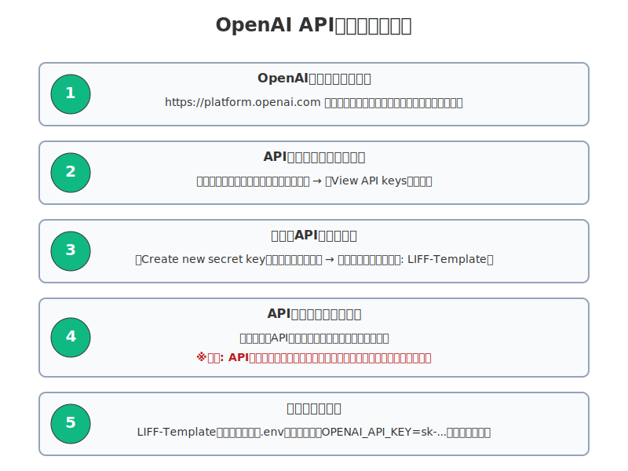
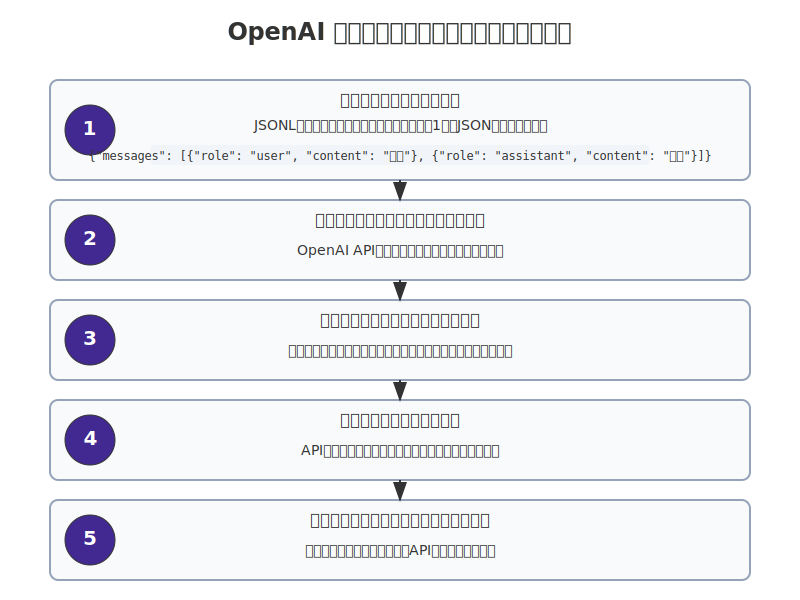
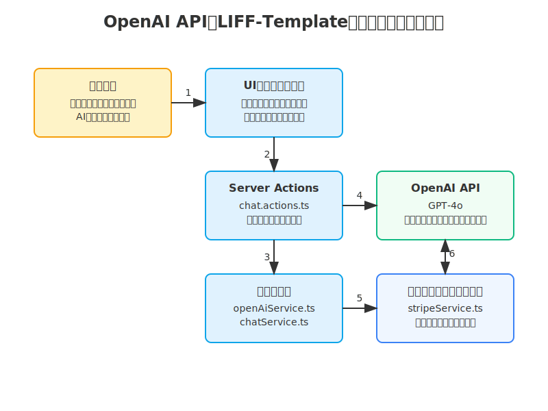

# 第2章 OpenAIについて

## 2.1 OpenAI APIの概要

OpenAI APIは、GPT-4oなどの大規模言語モデル（LLM）を活用したAI機能をアプリケーションに統合するためのインターフェースです。LIFF-Templateプロジェクトでは、OpenAI APIを使用してAIチャット機能を実装しています。

OpenAI APIの主な特徴：
- テキスト生成、要約、翻訳、質問応答などの自然言語処理タスクの実行
- プログラムコードの生成と修正
- 特定のユースケースに合わせたモデルのファインチューニング
- 様々なプログラミング言語からのアクセス（JavaScript/TypeScript、Python、Rubyなど）
- 最新モデル（GPT-4o）によるマルチモーダル機能

## 2.2 OpenAIのAPIキーの取得方法

OpenAI APIを使用するには、APIキーが必要です。以下の手順でAPIキーを取得できます。



*図: OpenAI APIキー取得の5ステップ*

### 2.2.1 OpenAIアカウントの作成

1. [OpenAIのウェブサイト](https://openai.com/)にアクセスします。
2. 右上の「Sign up」ボタンをクリックします。
3. メールアドレス、パスワードを入力して、アカウントを作成します。
4. メール認証を完了させます。

### 2.2.2 APIキーの作成

1. OpenAIアカウントにログインします。
2. 右上のプロフィールアイコンをクリックし、「API keys」を選択します。
3. 「Create new secret key」ボタンをクリックします。
4. キーの説明（オプション）を入力し、「Create secret key」をクリックします。
5. 生成されたAPIキーが表示されます。このキーは一度しか表示されないため、安全な場所に保存してください。

### 2.2.3 APIキーの管理

1. **使用制限の設定**: 予期しない使用量を防ぐために、APIキーに使用制限を設定することをお勧めします。
2. **キーのローテーション**: セキュリティのために、定期的にAPIキーを更新することをお勧めします。
3. **アクセス制限**: 必要に応じて、特定のIPアドレスからのみアクセスを許可するなどの制限を設定できます。

### 2.2.4 プロジェクトでのAPIキーの設定

LIFF-Templateプロジェクトでは、OpenAI APIキーを環境変数として設定します：

1. プロジェクトのルートディレクトリに`.env.local`ファイルを作成します（既に存在する場合は編集します）。
2. 以下の行を追加します：
   ```
   OPENAI_API_KEY=your_api_key_here
   ```
3. `your_api_key_here`を実際のAPIキーに置き換えます。

環境変数は`src/env.ts`ファイルで型安全に定義されており、`@t3-oss/env-nextjs`を使用して管理されています。

## 2.3 ファインチューニングについて

ファインチューニングは、OpenAIの事前学習済みモデルを特定のタスクやドメインに適応させるプロセスです。これにより、一般的な言語モデルをより特化した用途に最適化できます。

### 2.3.1 ファインチューニングの利点

- **特定ドメインへの適応**: 特定の業界や分野の専門用語や知識に対応
- **一貫した出力スタイル**: 特定のトーンや形式で一貫した応答を生成
- **効率的なプロンプト使用**: 長いプロンプトを使わずに望ましい出力を得られる
- **コスト削減**: 短いプロンプトでより良い結果を得られるため、APIコストを削減
- **ブランドボイスの統一**: 企業や製品の一貫したコミュニケーションスタイルを維持

### 2.3.2 ファインチューニングの手順



*図: OpenAIファインチューニングの5ステップワークフロー*

#### 1. トレーニングデータの準備

ファインチューニングには、以下の形式のJSONLファイルが必要です：

```jsonl
{"messages": [{"role": "system", "content": "システムメッセージ"}, {"role": "user", "content": "ユーザーの質問1"}, {"role": "assistant", "content": "望ましい応答1"}]}
{"messages": [{"role": "system", "content": "システムメッセージ"}, {"role": "user", "content": "ユーザーの質問2"}, {"role": "assistant", "content": "望ましい応答2"}]}
```

各行は、会話の例を表すJSONオブジェクトです。

#### 2. トレーニングファイルのアップロード

OpenAI APIを使用してトレーニングファイルをアップロードします：

```javascript
const { OpenAI } = require('openai');
const fs = require('fs');

const openai = new OpenAI({
  apiKey: process.env.OPENAI_API_KEY,
});

async function uploadFile() {
  const response = await openai.files.create({
    file: fs.createReadStream('training_data.jsonl'),
    purpose: 'fine-tune',
  });
  
  console.log('File ID:', response.id);
  return response.id;
}
```

#### 3. ファインチューニングジョブの作成

ファイルをアップロードした後、ファインチューニングジョブを作成します：

```javascript
async function createFineTuningJob(fileId) {
  const response = await openai.fineTuning.jobs.create({
    training_file: fileId,
    model: 'gpt-4o', // 最新のGPT-4oモデルを使用
  });
  
  console.log('Job ID:', response.id);
  return response.id;
}
```

#### 4. ジョブのステータス確認

ファインチューニングジョブのステータスを確認します：

```javascript
async function checkJobStatus(jobId) {
  const response = await openai.fineTuning.jobs.retrieve(jobId);
  console.log('Status:', response.status);
  return response;
}
```

#### 5. ファインチューニング済みモデルの使用

ファインチューニングが完了すると、新しいモデル識別子が提供されます。このモデルを使用して、APIリクエストを行います：

```javascript
async function useFineTunedModel(fineTunedModel) {
  const response = await openai.chat.completions.create({
    model: fineTunedModel,
    messages: [
      { role: 'system', content: 'システムメッセージ' },
      { role: 'user', content: 'ユーザーの質問' }
    ],
  });
  
  console.log(response.choices[0].message.content);
}
```

### 2.3.3 ファインチューニングのベストプラクティス

- **多様なトレーニングデータ**: 様々なケースをカバーする多様なトレーニングデータを用意する
- **データの品質**: 高品質で一貫性のあるトレーニングデータを使用する
- **適切なモデル選択**: ユースケースに適したベースモデルを選択する
- **ハイパーパラメータの調整**: 学習率やエポック数などのハイパーパラメータを調整する
- **評価**: ファインチューニング済みモデルを評価し、必要に応じて改善する

## 2.4 LIFF-TemplateでのOpenAI実装



*図: OpenAI APIとLIFF-Templateの統合アーキテクチャ*

LIFF-Templateプロジェクトでは、`openAiService.ts`ファイルにOpenAI APIとの統合が実装されています。

### 2.4.1 OpenAIサービスの構造

`src/server/services/openAiService.ts`ファイルには、OpenAI APIとの通信を担当するサービスが定義されています：

```typescript
export const openAiService = {
  /**
   * チャットメッセージを送信し、AIからの応答を取得します
   * @param messages チャット履歴
   * @param model 使用するモデル
   * @returns AIからの応答
   */
  async sendMessage(messages: ChatMessage[], model: string = 'gpt-4o'): Promise<ChatResponse> {
    try {
      const completion = await openai.chat.completions.create({
        model: model,
        messages: messages,
        temperature: 0.7,
        max_tokens: 1000,
      });

      const response = completion.choices[0]?.message?.content;
      if (!response) {
        throw new Error('AIからの応答が空でした');
      }

      return {
        message: response,
      };
    } catch (error) {
      console.error('OpenAI API Error:', error);
      return {
        message: '',
        error: 'AIとの通信中にエラーが発生しました',
      };
    }
  },

  // 他のメソッド省略
};
```

このサービスは、OpenAI APIクライアントを初期化し、チャットメッセージを送信するためのメソッドを提供します。デフォルトでは最新の`gpt-4o`モデルを使用しています。

### 2.4.2 利用可能なモデル

LIFF-Templateプロジェクトでは、以下のモデルが利用可能です：

```typescript
export const AVAILABLE_MODELS = {
  'gpt-4o': 'GPT-4o',
  'ft:gpt-4o-2024-08-06:personal::BC8R5f5J': 'カスタムGPT-4o',
  'ft:gpt-4o-2024-08-06:personal::BG2IVbFe': 'カスタムGPT-4o:20250328',
};
```

これらには、標準のGPT-4oモデルと、特定のユースケース向けにファインチューニングされたカスタムモデルが含まれています。

### 2.4.3 サブスクリプションによるアクセス制御

LIFF-Templateプロジェクトでは、高度なAI機能へのアクセスは有料サブスクリプションによって制限されています。これは`chat.actions.ts`ファイルで実装されており、LIFFアクセストークンを使用してユーザー認証とサブスクリプション確認を行っています：

```typescript
export async function startChat(data: z.infer<typeof startChatSchema>) {
  const validatedData = startChatSchema.parse(data);
  
  try {
    // サブスクリプション状態を確認
    const hasSubscription = await userService.hasActiveSubscription(validatedData.liffAccessToken);
    if (!hasSubscription) {
      return { 
        message: '', 
        error: '⚠️ この機能は有料会員のみご利用いただけます。サブスクリプションに登録してください。', 
        requiresSubscription: true 
      };
    }
    
    // LIFFアクセストークンからLINEプロフィールを取得
    const lineProfile = await lineAuthService.getLineProfile(validatedData.liffAccessToken);
    const userId = lineProfile.userId;
    
    // チャットサービスを使用してメッセージを送信
    return chatService.startChat(
      userId,
      validatedData.systemPrompt,
      validatedData.userMessage,
      validatedData.model
    );
  } catch (error) {
    console.error('Failed to start chat:', error);
    return { message: '', error: 'ユーザー認証に失敗しました。再ログインしてください。' };
  }
}
```

このコードは、まずLIFFアクセストークンを使用してユーザーのサブスクリプション状態を確認し、サブスクリプションがない場合はエラーメッセージを返します。サブスクリプションがある場合は、LINEプロフィールからユーザーIDを取得し、チャットサービスを使用してメッセージを送信します。

### 2.4.4 チャットサービスとの統合

OpenAIサービスは、`ChatService`クラスによって使用され、チャットセッションとメッセージの管理を担当します：

```typescript
class ChatService {
  private supabaseService: SupabaseService;

  constructor() {
    this.supabaseService = new SupabaseService();
  }

  /**
   * 新しいチャットを開始する
   */
  async startChat(
    userId: string,
    systemPrompt: string,
    userMessage: string,
    model?: string
  ): Promise<{ message: string; error?: string; sessionId?: string; requiresSubscription?: boolean }> {
    try {
      const aiResponse = await openAiService.startChat(
        systemPrompt,
        userMessage,
        model
      );

      if (aiResponse.error) {
        return aiResponse;
      }

      const sessionId = uuidv4();
      const now = Date.now();
      
      const session: DbChatSession = {
        id: sessionId,
        user_id: userId,
        title: userMessage.substring(0, 50) + (userMessage.length > 50 ? '...' : ''),
        created_at: now,
        last_message_at: now,
        system_prompt: systemPrompt
      };
      
      await this.supabaseService.createChatSession(session);
      
      // ユーザーメッセージの保存
      const userDbMessage: DbChatMessage = {
        id: uuidv4(),
        user_id: userId,
        session_id: sessionId,
        role: ChatRole.USER,
        content: userMessage,
        created_at: now
      };
      
      await this.supabaseService.createChatMessage(userDbMessage);
      
      // AIの応答を保存
      const assistantDbMessage: DbChatMessage = {
        id: uuidv4(),
        user_id: userId,
        session_id: sessionId,
        role: ChatRole.ASSISTANT,
        content: aiResponse.message,
        model: model,
        created_at: now + 1 // 順序を保証するため
      };
      
      await this.supabaseService.createChatMessage(assistantDbMessage);

      return {
        ...aiResponse,
        sessionId,
      };
    } catch (error) {
      console.error('Failed to start chat:', error);
      return { message: '', error: 'チャットの開始に失敗しました' };
    }
  }
```

## 2.5 セキュリティ考慮事項

OpenAI APIを使用する際の主なセキュリティ考慮事項：

1. **APIキーの保護**: APIキーを公開リポジトリにコミットしないでください。環境変数として安全に管理してください。
2. **ユーザー入力のバリデーション**: ユーザー入力を適切に検証し、悪意のある入力を防止してください。
3. **レート制限**: APIの過剰な使用を防ぐために、レート制限を実装してください。
4. **コンテンツフィルタリング**: 不適切なコンテンツの生成を防ぐために、OpenAIのコンテンツフィルタリング機能を活用してください。
5. **エラーハンドリング**: APIエラーを適切に処理し、センシティブな情報が漏洩しないようにしてください。
6. **アクセス制御**: 有料機能へのアクセスを適切に制限し、不正アクセスを防止してください。

## 2.6 まとめ

OpenAI APIは、LIFF-Templateプロジェクトに強力なAIチャット機能を追加するための重要なコンポーネントです。APIキーの取得、ファインチューニング、適切な実装を通じて、ユーザーエクスペリエンスを向上させることができます。

プロジェクトでは、GPT-4oモデルをデフォルトとして使用し、サブスクリプションベースのアクセス制御を実装することで、高度なAI機能を収益化しています。また、チャット履歴の保存と取得機能により、ユーザーは過去の会話を継続することができます。

セキュリティのベストプラクティスに従い、APIキーを保護し、ユーザー入力を適切に検証することが重要です。また、ファインチューニングを活用することで、特定のユースケースに最適化されたAI応答を提供することができます。
