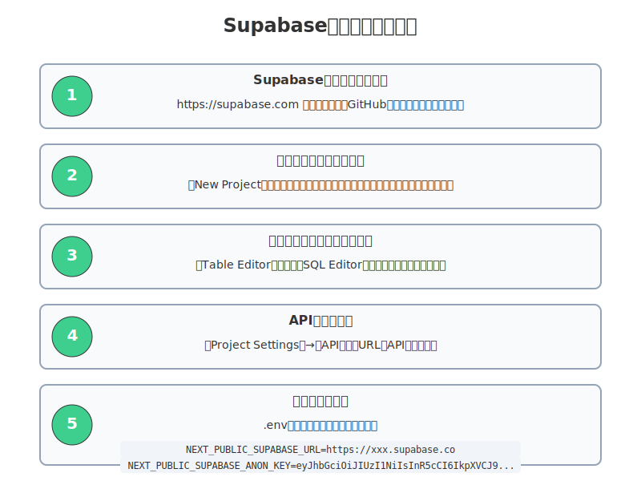
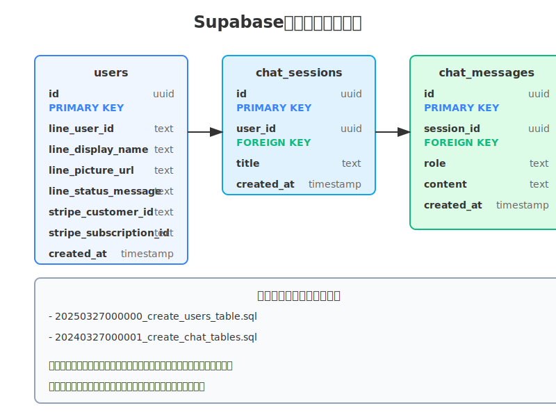
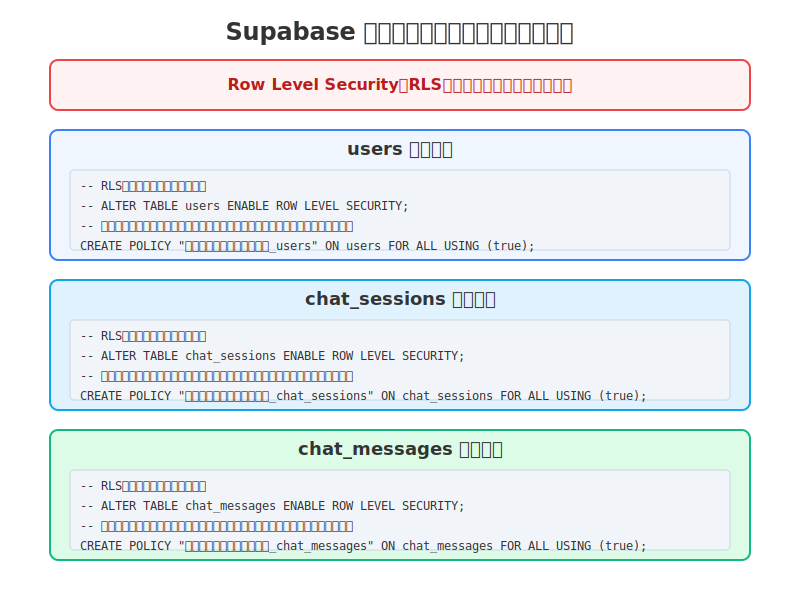

# 第４章 supabaseのセットアップ

## 4.1 Supabaseとは

Supabaseは、オープンソースのFirebase代替サービスで、PostgreSQLデータベースを基盤としています。リアルタイムデータベース、認証、ストレージ、サーバーレス関数などの機能を提供し、モダンなウェブアプリケーション開発を効率化します。

Supabaseの主な特徴：
- PostgreSQLデータベース
- リアルタイムサブスクリプション
- 認証システム
- ストレージ
- Row Level Security（RLS）の機能（現在のプロジェクトでは未使用）
- REST APIとGraphQL API
- サーバーレス関数

## 4.2 Supabaseアカウントの作成とプロジェクトのセットアップ



*図: Supabaseプロジェクトのセットアップ手順*

### 4.2.1 アカウント作成

1. [Supabaseのウェブサイト](https://supabase.com/)にアクセスします。
2. 「Start your project」ボタンをクリックします。
3. GitHubアカウントでログインするか、メールアドレスとパスワードで新規登録します。

### 4.2.2 新規プロジェクトの作成

1. ダッシュボードで「New Project」ボタンをクリックします。
2. 以下の情報を入力します：
   - プロジェクト名
   - データベースパスワード
   - リージョン（アプリケーションのユーザーに近いリージョンを選択）
   - 料金プラン（無料プランまたは有料プラン）
3. 「Create new project」ボタンをクリックします。
4. プロジェクトの作成には数分かかります。

### 4.2.3 APIキーの取得

プロジェクトが作成されたら、APIキーを取得します：

1. プロジェクトのダッシュボードで「Settings」→「API」を選択します。
2. 以下の情報をメモします：
   - Project URL
   - API Key（`anon`キーと`service_role`キー）

これらの情報は、アプリケーションからSupabaseに接続するために必要です。

## 4.3 環境変数の設定

LIFF-Templateプロジェクトでは、Supabase接続情報を環境変数として設定します：

1. プロジェクトのルートディレクトリに`.env.local`ファイルを作成します（既に存在する場合は編集します）。
2. 以下の行を追加します：
   ```
   NEXT_PUBLIC_SUPABASE_URL=your_project_url
   NEXT_PUBLIC_SUPABASE_ANON_KEY=your_anon_key
   SUPABASE_SERVICE_ROLE_KEY=your_service_role_key
   ```
3. `your_project_url`、`your_anon_key`、`your_service_role_key`を実際の値に置き換えます。

これらの環境変数は、`src/env.ts`ファイルで型安全に定義されています：

```typescript
export const env = createEnv({
  server: {
    SUPABASE_SERVICE_ROLE_KEY: z.string().min(1),
    // ...
  },
  client: {
    NEXT_PUBLIC_SUPABASE_URL: z.string().url(),
    NEXT_PUBLIC_SUPABASE_ANON_KEY: z.string().min(1),
    // ...
  },
  // ...
});
```

## 4.4 データベースのセットアップ

LIFF-Templateプロジェクトでは、マイグレーションファイルを使用してデータベーススキーマを定義しています。



*図: LIFF-Templateのデータベース構造とテーブル間の関連性*

### 4.4.1 マイグレーションファイルの概要

`supabase/migrations`ディレクトリには、以下のマイグレーションファイルが含まれています：

1. `20250327000000_create_users_table.sql`: ユーザーテーブルの作成とRLSポリシーの設定
2. `20240327000001_create_chat_tables.sql`: チャットセッションとメッセージテーブルの作成

### 4.4.2 ユーザーテーブルの作成

`20250327000000_create_users_table.sql`ファイルには、ユーザーテーブルの作成とRLSポリシーの設定が含まれています：

```sql
CREATE TABLE IF NOT EXISTS users (
  id TEXT PRIMARY KEY,
  created_at BIGINT NOT NULL,
  updated_at BIGINT NOT NULL,
  line_user_id TEXT NOT NULL UNIQUE,
  line_display_name TEXT NOT NULL,
  line_picture_url TEXT,
  line_status_message TEXT,
  stripe_customer_id TEXT,
  stripe_subscription_id TEXT
);

CREATE POLICY "開発環境用全許可ポリシー_users" ON users
  FOR ALL USING (true);

CREATE INDEX IF NOT EXISTS users_line_user_id_idx ON users (line_user_id);
CREATE INDEX IF NOT EXISTS users_stripe_customer_id_idx ON users (stripe_customer_id);
CREATE INDEX IF NOT EXISTS users_stripe_subscription_id_idx ON users (stripe_subscription_id);
```

このマイグレーションファイルは、以下の操作を行います：
- ユーザーテーブルの作成（id、created_at、updated_at、line_user_id、line_display_name、line_picture_url、line_status_message、stripe_customer_id、stripe_subscription_idカラム）
- 開発環境用の全許可ポリシーの作成
- インデックスの作成（line_user_id、stripe_customer_id、stripe_subscription_idカラム）

### 4.4.3 チャットテーブルの作成

`20240327000001_create_chat_tables.sql`ファイルには、チャットセッションとメッセージテーブルの作成とRLSポリシーの設定が含まれています：

```sql
CREATE TABLE IF NOT EXISTS chat_sessions (
  id TEXT PRIMARY KEY,
  user_id TEXT NOT NULL,
  title TEXT NOT NULL,
  system_prompt TEXT,
  last_message_at BIGINT NOT NULL,
  created_at BIGINT NOT NULL
);

CREATE TABLE IF NOT EXISTS chat_messages (
  id TEXT PRIMARY KEY,
  user_id TEXT NOT NULL,
  session_id TEXT NOT NULL REFERENCES chat_sessions(id) ON DELETE CASCADE,
  role TEXT NOT NULL,
  content TEXT NOT NULL,
  model TEXT,
  created_at BIGINT NOT NULL
);

CREATE POLICY "開発環境用全許可ポリシー_chat_sessions" ON chat_sessions
  FOR ALL USING (true);

CREATE POLICY "開発環境用全許可ポリシー_chat_messages" ON chat_messages
  FOR ALL USING (true);

CREATE INDEX IF NOT EXISTS chat_sessions_user_id_idx ON chat_sessions (user_id);
CREATE INDEX IF NOT EXISTS chat_sessions_created_at_idx ON chat_sessions (created_at);
CREATE INDEX IF NOT EXISTS chat_messages_session_id_idx ON chat_messages (session_id);
CREATE INDEX IF NOT EXISTS chat_messages_user_id_idx ON chat_messages (user_id);
CREATE INDEX IF NOT EXISTS chat_messages_created_at_idx ON chat_messages (created_at);
```

このマイグレーションファイルは、以下の操作を行います：
- チャットセッションテーブルの作成（id、user_id、title、system_prompt、last_message_at、created_atカラム）
- チャットメッセージテーブルの作成（id、user_id、session_id、role、content、model、created_atカラム）
- 開発環境用の全許可ポリシーの作成
- インデックスの作成（user_id、created_at、session_idカラム）

### 4.4.3 マイグレーションの実行

Supabaseプロジェクトでマイグレーションを実行するには、以下の方法があります：

1. **Supabase CLIを使用する方法**：
   ```bash
   supabase db push
   ```

2. **SQLエディタを使用する方法**：
   - Supabaseダッシュボードで「SQL Editor」を選択
   - マイグレーションファイルの内容をコピー＆ペースト
   - 「Run」ボタンをクリック

## 4.5 Row Level Security（RLS）について



*図: LIFF-Templateプロジェクトの現在の開発環境ポリシー*

Supabaseでは、Row Level Security（RLS）を使用して、ユーザーごとにデータアクセスを制限できます。LIFF-Templateプロジェクトでは現在RLSは有効化されていませんが、本番環境への移行時には有効化を検討できます。

### 4.5.1 現在の開発環境設定

現在のマイグレーションファイルでは、RLSは有効化されておらず、開発を容易にするために全許可ポリシーのみが実装されています：

```sql
-- RLSは現在無効化されています
-- ALTER TABLE users ENABLE ROW LEVEL SECURITY;
-- ALTER TABLE chat_sessions ENABLE ROW LEVEL SECURITY;
-- ALTER TABLE chat_messages ENABLE ROW LEVEL SECURITY;

-- 開発環境用の全許可ポリシー
CREATE POLICY "開発環境用全許可ポリシー_users" ON users
  FOR ALL USING (true);

CREATE POLICY "開発環境用全許可ポリシー_chat_sessions" ON chat_sessions
  FOR ALL USING (true);

CREATE POLICY "開発環境用全許可ポリシー_chat_messages" ON chat_messages
  FOR ALL USING (true);
```

### 4.5.2 本番環境向けRLS実装の検討事項

本番環境ではセキュリティを強化するために、RLSを有効化し、以下のようなポリシーを実装することを検討できます：

```sql
-- RLSを有効化する
ALTER TABLE users ENABLE ROW LEVEL SECURITY;
ALTER TABLE chat_sessions ENABLE ROW LEVEL SECURITY;
ALTER TABLE chat_messages ENABLE ROW LEVEL SECURITY;

-- ユーザー固有のデータアクセスポリシーを設定
CREATE POLICY "ユーザー所有データのみ許可_users" ON users
  FOR ALL USING (line_user_id = current_setting('app.user_id', true)::text);

CREATE POLICY "ユーザー所有データのみ許可_chat_sessions" ON chat_sessions
  FOR ALL USING (user_id = current_setting('app.user_id', true)::text);

CREATE POLICY "ユーザー所有データのみ許可_chat_messages" ON chat_messages
  FOR ALL USING (user_id = current_setting('app.user_id', true)::text);
```

### 4.5.3 RLSポリシーの管理

Supabaseダッシュボードで、RLSポリシーを管理できます：

1. 「Authentication」→「Policies」を選択
2. テーブルを選択
3. 既存のポリシーを編集または新しいポリシーを追加

## 4.6 Supabaseクライアントの初期化

LIFF-Templateプロジェクトでは、`supabaseService.ts`ファイルでSupabaseクライアントを初期化しています：

```typescript
import { createClient } from '@supabase/supabase-js';
import { env } from '@/env';
import { DbChatMessage, DbChatSession } from '@/types/chat';

export class SupabaseService {
  supabase;

  constructor() {
    // 環境変数からSupabase URLとサービスロールキーを取得
    const supabaseUrl = env.NEXT_PUBLIC_SUPABASE_URL;
    const supabaseServiceRole = env.SUPABASE_SERVICE_ROLE;

    // 管理者権限を持つSupabaseクライアントの初期化
    this.supabase = createClient(supabaseUrl, supabaseServiceRole, {
      auth: {
        autoRefreshToken: false,
        persistSession: false,
      },
    });
  }

  // 以下、データアクセスメソッド
  // ...
}
```

このサービスは、環境変数からSupabase URLとサービスロールキーを取得し、Supabaseクライアントを初期化します。サービスロールキーは、サーバーサイドでのみ使用され、RLSポリシーをバイパスする権限を持ちます。

## 4.7 データ変換ユーティリティ

LIFF-Templateプロジェクトでは、データベースのスネークケース（snake_case）とアプリケーションのキャメルケース（camelCase）の間でデータを変換するユーティリティ関数を提供しています。`src/types/chat.ts`ファイルには、チャット関連のデータ型と変換関数が定義されています：

```typescript
// データベース型定義（スネークケース）
export interface DbChatSession {
  id: string;
  user_id: string;
  title: string;
  system_prompt?: string;
  last_message_at: number;
  created_at: number;
}

export interface DbChatMessage {
  id: string;
  user_id: string;
  session_id: string;
  role: string;
  content: string;
  model?: string;
  created_at: number;
}

// アプリケーション型定義（キャメルケース）
export interface ChatSession {
  id: string;
  userId: string;
  title: string;
  systemPrompt?: string;
  lastMessageAt: number;
  createdAt: number;
}

export interface ChatMessage {
  id: string;
  userId: string;
  sessionId: string;
  role: string;
  content: string;
  model?: string;
  createdAt: number;
}

// 変換関数
export function toChatSession(dbSession: DbChatSession): ChatSession {
  return {
    id: dbSession.id,
    userId: dbSession.user_id,
    title: dbSession.title,
    systemPrompt: dbSession.system_prompt,
    lastMessageAt: dbSession.last_message_at,
    createdAt: dbSession.created_at,
  };
}

export function toDbChatSession(session: ChatSession): DbChatSession {
  return {
    id: session.id,
    user_id: session.userId,
    title: session.title,
    system_prompt: session.systemPrompt,
    last_message_at: session.lastMessageAt,
    created_at: session.createdAt,
  };
}

export function toChatMessage(dbMessage: DbChatMessage): ChatMessage {
  return {
    id: dbMessage.id,
    userId: dbMessage.user_id,
    sessionId: dbMessage.session_id,
    role: dbMessage.role,
    content: dbMessage.content,
    model: dbMessage.model,
    createdAt: dbMessage.created_at,
  };
}

export function toDbChatMessage(message: ChatMessage): DbChatMessage {
  return {
    id: message.id,
    user_id: message.userId,
    session_id: message.sessionId,
    role: message.role,
    content: message.content,
    model: message.model,
    created_at: message.createdAt,
  };
}
```

これらの関数は、データベースとアプリケーション間でデータを変換する際に使用されます。

## 4.8 リポジトリパターンの実装

LIFF-Templateプロジェクトでは、リポジトリパターンを使用してデータアクセスロジックをカプセル化しています。

### 4.8.1 チャットリポジトリ

`chatRepository.ts`ファイルには、チャットセッションとメッセージへのアクセスを提供するリポジトリが定義されています：

```typescript
import { v4 as uuidv4 } from 'uuid';
import { SupabaseService } from './supabaseService';
import {
  ChatMessage,
  ChatSession,
  DbChatSession,
  toChatMessage,
  toChatSession,
  toDbChatMessage,
  toDbChatSession,
} from '@/types/chat';

export class ChatRepository {
  private supabaseService: SupabaseService;

  constructor() {
    this.supabaseService = new SupabaseService();
  }

  async createSession(
    userId: string,
    title: string,
    systemPrompt?: string
  ): Promise<ChatSession> {
    const now = Date.now();
    const sessionId = uuidv4();

    const session: ChatSession = {
      id: sessionId,
      userId,
      title,
      systemPrompt,
      lastMessageAt: now,
      createdAt: now,
    };

    await this.supabaseService.createChatSession(toDbChatSession(session));
    return session;
  }

  async getSessionById(sessionId: string): Promise<ChatSession | null> {
    const dbSession = await this.supabaseService.getChatSessionById(sessionId);
    return dbSession ? toChatSession(dbSession) : null;
  }

  async getUserSessions(userId: string): Promise<ChatSession[]> {
    const dbSessions = await this.supabaseService.getUserChatSessions(userId);
    return dbSessions.map(toChatSession);
  }

  async updateSession(
    sessionId: string,
    updates: Partial<Omit<ChatSession, 'id' | 'userId' | 'createdAt'>>
  ): Promise<void> {
    const dbUpdates: Partial<DbChatSession> = {};

    if (updates.title) dbUpdates.title = updates.title;
    if (updates.systemPrompt !== undefined) dbUpdates.system_prompt = updates.systemPrompt;
    if (updates.lastMessageAt) dbUpdates.last_message_at = updates.lastMessageAt;

    await this.supabaseService.updateChatSession(sessionId, dbUpdates);
  }

  async deleteSession(sessionId: string): Promise<void> {
    await this.supabaseService.deleteChatSession(sessionId);
  }

  async createMessage(message: Omit<ChatMessage, 'id'>): Promise<ChatMessage> {
    const messageId = uuidv4();
    const fullMessage: ChatMessage = {
      ...message,
      id: messageId,
    };

    await this.supabaseService.createChatMessage(toDbChatMessage(fullMessage));

    await this.updateSession(message.sessionId, {
      lastMessageAt: message.createdAt,
    });

    return fullMessage;
  }

  async getSessionMessages(sessionId: string): Promise<ChatMessage[]> {
    const dbMessages = await this.supabaseService.getChatMessagesBySessionId(sessionId);
    return dbMessages.map(toChatMessage);
  }
}

export const chatRepository = new ChatRepository();
```

このリポジトリは、以下の機能を提供します：
- チャットセッションの作成、取得、更新、削除
- チャットメッセージの作成と取得
- ユーザーごとのチャットセッション一覧の取得

### 4.8.2 ユーザーリポジトリ

`userRepository.ts`ファイルには、ユーザー情報へのアクセスを提供するリポジトリが定義されています：

```typescript
import { v4 as uuidv4 } from 'uuid';
import { SupabaseService } from './supabaseService';
import { User, UserCreateInput, UserUpdateInput } from '@/types/user';

export class UserRepository {
  private supabaseService: SupabaseService;

  constructor() {
    this.supabaseService = new SupabaseService();
  }

  async findByLineUserId(lineUserId: string): Promise<User | null> {
    const user = await this.supabaseService.getUserByLineId(lineUserId);
    return user;
  }

  async create(input: UserCreateInput): Promise<User | null> {
    const now = Date.now();
    const user: User = {
      id: uuidv4(),
      createdAt: now,
      updatedAt: now,
      lineUserId: input.lineUserId,
      lineDisplayName: input.lineDisplayName,
      linePictureUrl: input.linePictureUrl,
      lineStatusMessage: input.lineStatusMessage,
      stripeCustomerId: null,
      stripeSubscriptionId: null,
    };

    try {
      await this.supabaseService.saveUserProfile(
        user.lineUserId,
        {
          displayName: user.lineDisplayName,
          pictureUrl: user.linePictureUrl,
          statusMessage: user.lineStatusMessage,
        }
      );
      return user;
    } catch (error) {
      console.error('Failed to create user:', error);
      return null;
    }
  }

  async update(id: string, input: UserUpdateInput): Promise<boolean> {
    try {
      await this.supabaseService.saveUserProfile(
        input.lineUserId || id,
        {
          displayName: input.lineDisplayName,
          pictureUrl: input.linePictureUrl,
          statusMessage: input.lineStatusMessage,
        }
      );
      return true;
    } catch (error) {
      console.error('Failed to update user:', error);
      return false;
    }
  }

  async updateStripeCustomerId(lineUserId: string, stripeCustomerId: string): Promise<boolean> {
    try {
      // Implement this method
      return true;
    } catch (error) {
      console.error('Failed to update Stripe customer ID:', error);
      return false;
    }
  }

  async updateStripeSubscriptionId(
    lineUserId: string,
    stripeSubscriptionId: string
  ): Promise<boolean> {
    try {
      // Implement this method
      return true;
    } catch (error) {
      console.error('Failed to update Stripe subscription ID:', error);
      return false;
    }
  }
}

export const userRepository = new UserRepository();
```

このリポジトリは、以下の機能を提供します：
- LINE ユーザーIDによるユーザー情報の取得
- 新規ユーザーの作成
- ユーザー情報の更新
- Stripe顧客IDとサブスクリプションIDの更新

## 4.9 LINE認証とSupabaseの統合

LIFF-Templateプロジェクトでは、LINE認証とSupabaseを統合しています。ユーザーがLINEでログインすると、LINEユーザー情報がusersテーブルに保存され、そのユーザーIDがチャットセッションとメッセージに関連付けられます。

### 4.9.1 ユーザープロフィールの保存

`userService.ts`ファイルでは、LINEプロフィール情報をSupabaseのusersテーブルに保存します：

```typescript
import { LineAuthService } from './lineAuthService';
import { userRepository } from './userRepository';
import { User } from '@/types/user';

export class UserService {
  private lineAuthService: LineAuthService;

  constructor() {
    this.lineAuthService = new LineAuthService();
  }

  async getUserFromLiffToken(liffAccessToken: string): Promise<User | null> {
    try {
      // LINEプロフィール情報を取得
      const lineProfile = await this.lineAuthService.getLineProfile(liffAccessToken);
      
      // ユーザーをLINE IDで検索
      let user = await userRepository.findByLineUserId(lineProfile.userId);
      
      // ユーザーが存在しない場合は新規作成
      if (!user) {
        user = await userRepository.create({
          lineUserId: lineProfile.userId,
          lineDisplayName: lineProfile.displayName,
          linePictureUrl: lineProfile.pictureUrl,
          lineStatusMessage: lineProfile.statusMessage,
        });
      }
      
      return user;
    } catch (error) {
      console.error('Failed to get user from LIFF token:', error);
      return null;
    }
  }

  // サブスクリプション状態の確認
  async hasActiveSubscription(liffAccessToken: string): Promise<boolean> {
    const user = await this.getUserFromLiffToken(liffAccessToken);
    if (!user || !user.stripeCustomerId) return false;

    // Stripeサービスを使用してサブスクリプション状態を確認
    // ...
    
    return false; // 実装例
  }
}

export const userService = new UserService();
```

### 4.9.2 ユーザー認証フロー

1. ユーザーがLINEでログインすると、LIFFアクセストークンが取得されます。
2. `userService.getUserFromLiffToken`メソッドがLIFFアクセストークンを使用してLINEプロフィール情報を取得します。
3. LINEユーザーIDを使用してSupabaseのusersテーブルからユーザー情報を検索します。
4. ユーザーが存在しない場合は、新しいユーザーレコードが作成されます。
5. ユーザー情報がアプリケーションに返され、チャットセッションやメッセージの作成時にユーザーIDが関連付けられます。

### 4.9.3 サブスクリプション管理の統合

ユーザーテーブルには、Stripeの顧客IDとサブスクリプションIDを保存するフィールドがあります：

```sql
stripe_customer_id TEXT,
stripe_subscription_id TEXT
```

これらのフィールドは、ユーザーがサブスクリプションを購入した際に更新され、アプリケーション内でユーザーのサブスクリプション状態を確認するために使用されます。

## 4.10 チャットデータの管理

LIFF-Templateプロジェクトでは、チャットデータの管理にリポジトリパターンを使用しています。

### 4.10.1 チャットセッションの管理

チャットセッションは、ユーザーとAIの会話の単位です。各セッションには複数のメッセージが含まれます。

```typescript
// チャットセッションの作成
async createSession(userId: string, title: string, systemPrompt?: string): Promise<ChatSession> {
  const now = Date.now();
  const sessionId = uuidv4();

  const session: ChatSession = {
    id: sessionId,
    userId,
    title,
    systemPrompt,
    lastMessageAt: now,
    createdAt: now,
  };

  await this.supabaseService.createChatSession(toDbChatSession(session));
  return session;
}

// ユーザーのチャットセッション一覧の取得
async getUserSessions(userId: string): Promise<ChatSession[]> {
  const dbSessions = await this.supabaseService.getUserChatSessions(userId);
  return dbSessions.map(toChatSession);
}
```

### 4.10.2 チャットメッセージの管理

チャットメッセージは、ユーザーまたはAIの発言を表します。各メッセージはセッションに関連付けられています。

```typescript
// チャットメッセージの作成
async createMessage(message: Omit<ChatMessage, 'id'>): Promise<ChatMessage> {
  const messageId = uuidv4();
  const fullMessage: ChatMessage = {
    ...message,
    id: messageId,
  };

  await this.supabaseService.createChatMessage(toDbChatMessage(fullMessage));

  // メッセージ作成時にセッションの最終メッセージ時間を更新
  await this.updateSession(message.sessionId, {
    lastMessageAt: message.createdAt,
  });

  return fullMessage;
}

// セッションのメッセージ一覧の取得
async getSessionMessages(sessionId: string): Promise<ChatMessage[]> {
  const dbMessages = await this.supabaseService.getChatMessagesBySessionId(sessionId);
  return dbMessages.map(toChatMessage);
}
```

### 4.10.3 サーバーアクションとの統合

チャット機能は、Next.jsのサーバーアクションを通じてクライアントから利用されます：

```typescript
import { chatRepository } from '@/server/services/chatRepository';
import { userService } from '@/server/services/userService';
import { openAiService } from '@/server/services/openAiService';

// 新しいチャットセッションの作成
export async function createChatSession(liffAccessToken: string, title: string) {
  const user = await userService.getUserFromLiffToken(liffAccessToken);
  if (!user) throw new Error('ユーザーが見つかりません');

  return chatRepository.createSession(user.lineUserId, title);
}

// チャットメッセージの送信と応答の取得
export async function sendChatMessage(
  liffAccessToken: string,
  sessionId: string,
  content: string
) {
  const user = await userService.getUserFromLiffToken(liffAccessToken);
  if (!user) throw new Error('ユーザーが見つかりません');

  // サブスクリプション状態の確認
  const hasSubscription = await userService.hasActiveSubscription(liffAccessToken);
  if (!hasSubscription) {
    throw new Error('この機能を利用するにはサブスクリプションが必要です');
  }

  // ユーザーメッセージの保存
  const userMessage = await chatRepository.createMessage({
    userId: user.lineUserId,
    sessionId,
    role: 'user',
    content,
    createdAt: Date.now(),
  });

  // セッションの取得とメッセージ履歴の取得
  const session = await chatRepository.getSessionById(sessionId);
  const messages = await chatRepository.getSessionMessages(sessionId);

  // OpenAI APIを使用して応答を生成
  const aiResponse = await openAiService.generateChatResponse(
    messages,
    session?.systemPrompt
  );

  // AI応答の保存
  await chatRepository.createMessage({
    userId: user.lineUserId,
    sessionId,
    role: 'assistant',
    content: aiResponse.content,
    model: aiResponse.model,
    createdAt: Date.now(),
  });

  return {
    userMessage,
    aiResponse,
  };
}
```

## 4.11 Supabaseのローカル開発環境

Supabaseのローカル開発環境を設定するには、Supabase CLIを使用します：

### 4.11.1 Supabase CLIのインストール

```bash
npm install -g supabase
```

### 4.11.2 ローカル開発環境の起動

```bash
supabase start
```

これにより、Dockerコンテナを使用してローカルにSupabaseスタックが起動します。

### 4.11.3 環境変数の更新

ローカル開発環境のURLとキーを使用するように、`.env.local`ファイルを更新します：

```
NEXT_PUBLIC_SUPABASE_URL=http://localhost:54321
NEXT_PUBLIC_SUPABASE_ANON_KEY=your_local_anon_key
SUPABASE_SERVICE_ROLE=your_local_service_role_key
```

## 4.12 本番環境への移行

開発が完了したら、本番環境に移行する際に以下の点に注意してください：

### 4.12.1 RLSポリシーの見直し

開発環境用の全許可ポリシーを削除または無効化し、本番環境用のポリシーを有効化します：

```sql
-- 開発環境用ポリシーの削除
DROP POLICY IF EXISTS "開発環境用全許可ポリシー_users" ON users;
DROP POLICY IF EXISTS "開発環境用全許可ポリシー_chat_sessions" ON chat_sessions;
DROP POLICY IF EXISTS "開発環境用全許可ポリシー_chat_messages" ON chat_messages;

-- 本番環境用ポリシーの有効化
CREATE POLICY "ユーザー所有データのみ許可_users" ON users
  FOR ALL USING (line_user_id = current_setting('app.user_id', true)::text);

CREATE POLICY "ユーザー所有データのみ許可_chat_sessions" ON chat_sessions
  FOR ALL USING (user_id = current_setting('app.user_id', true)::text);

CREATE POLICY "ユーザー所有データのみ許可_chat_messages" ON chat_messages
  FOR ALL USING (user_id = current_setting('app.user_id', true)::text);
```

### 4.12.2 本番環境の環境変数の設定

Vercelなどのデプロイメントプラットフォームで、本番環境の環境変数を設定します：

```
NEXT_PUBLIC_SUPABASE_URL=your_production_project_url
NEXT_PUBLIC_SUPABASE_ANON_KEY=your_production_anon_key
SUPABASE_SERVICE_ROLE=your_production_service_role_key
```

### 4.12.3 データベースのバックアップ

定期的にデータベースのバックアップを作成することをお勧めします。Supabaseダッシュボードの「Database」→「Backups」から、バックアップを作成できます。

## 4.13 まとめ

Supabaseは、LIFF-Templateプロジェクトのバックエンドとして重要な役割を果たしています。PostgreSQLデータベース、Row Level Security、認証機能を提供し、LINE認証と統合することで、安全で効率的なデータ管理を実現しています。

新しいAIチャットアプリケーションでは、ユーザー情報、チャットセッション、チャットメッセージを管理するためのテーブルが設計され、リポジトリパターンを使用してデータアクセスロジックをカプセル化しています。これにより、保守性と拡張性の高いアプリケーションを構築できます。

Stripeとの統合により、サブスクリプションベースのアクセス制御も実現され、ユーザーテーブルにStripe関連の情報を保存することで、有料機能へのアクセスを管理しています。

開発環境から本番環境への移行時には、RLSポリシーの見直しや環境変数の設定など、セキュリティに関する考慮事項に注意することが重要です。
