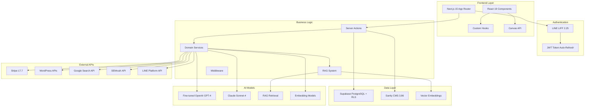
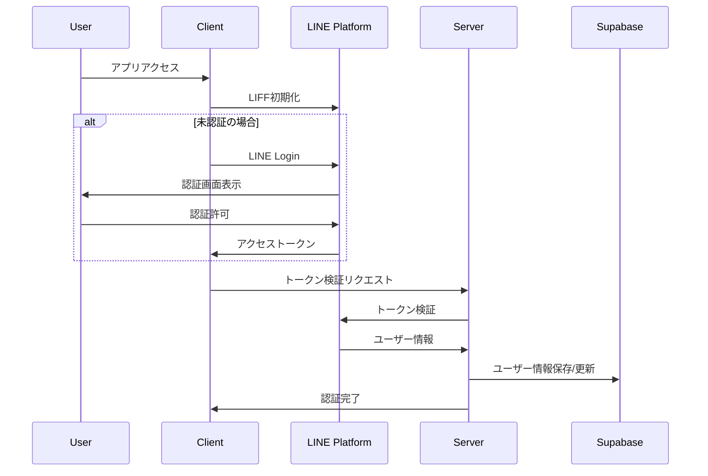
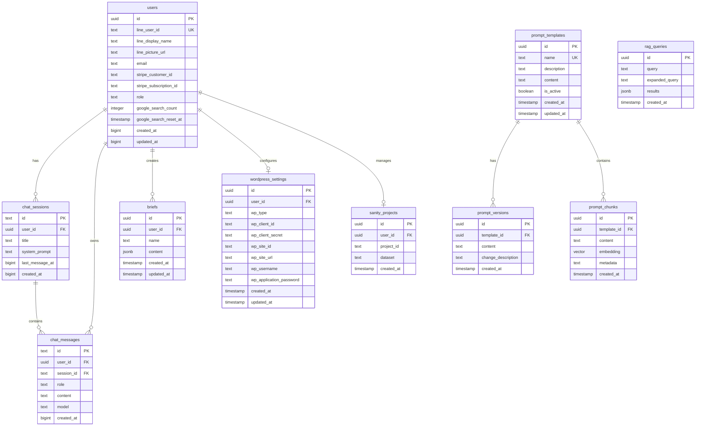

# Industry-Specific MC Training Platform

LINE認証をベースとした業界特化型AIマーケティング支援プラットフォーム。Fine-tuned AIモデル、SEMrush API連携、RAG（Retrieval-Augmented Generation）システム、動的ランディングページ作成、Canvas描画機能、WordPress連携、サブスクリプション決済を統合した包括的なSaaSアプリケーションです。

## 🚀 主要機能

### 📱 LINE LIFF認証
- LINE Loginによるシームレスな認証
- アクセストークンの自動リフレッシュ・メモリキャッシュ
- 管理者権限による階層化ユーザー管理
- Row Level Security（RLS）による厳格なデータ分離

### 🤖 高度なAIチャット機能
- **Fine-tuned AIモデル**：`ft:gpt-4.1-nano-2025-04-14` によるキーワード分類
- **多段階AIモデル処理**：4つの専門モデル（キーワード選定・広告文作成・広告文仕上げ・LP作成）
- **RAGシステム**：プロンプトテンプレートの検索拡張生成
- **SEMrush API統合**：競合広告分析・キーワードリサーチ
- **Google Custom Search API**：リアルタイム検索データ連携
- **Canvas描画機能**：リアルタイム描画・図形作成・チャット統合
- チャット履歴の永続化・検索機能

### 🎯 AI プロンプト管理・RAGシステム
- **管理者専用プロンプト管理**：リアルタイム編集・バージョン履歴・React Cache
- **動的変数システム**：事業者情報17項目の自動置換
- **RAG（検索拡張生成）**：プロンプトテンプレートの意味検索・ハイブリッド検索
- **4つの専門プロンプト**：
  - キーワード選定（Fine-tuned OpenAI）
  - 広告文作成（Claude）
  - 広告文仕上げ（Claude）
  - ランディングページドラフト作成（16パート構成・Claude）

### 🎨 ランディングページ作成・WordPress連携
- **WordPress.com / セルフホスト WordPress**：両方式対応
- **プレビュー機能**：リアルタイムプレビュー・下書きモード
- **OAuth認証**：WordPress.com 連携
- **Application Password**：セルフホスト WordPress 対応

### 🖼️ Canvas描画機能
- **リアルタイム描画**：ペン・図形・テキストツール
- **履歴管理**：undo/redo・自動保存
- **チャット統合**：描画内容の直接チャット挿入
- **エクスポート機能**：PNG/JPG/SVG形式対応

### 💳 サブスクリプション・権限管理
- **Stripe Checkout**：サブスクリプション管理
- **使用量制限**：Google検索回数制限・プラン別機能制御
- **管理者ダッシュボード**：ユーザー・プロンプト管理

## 🏗️ システムアーキテクチャ（2025年7月最新版）



## 🔄 認証フロー



## 🛠️ 技術スタック

### **フロントエンド**
- **Next.js 15.3.1** - React フレームワーク（App Router + Turbopack）
- **React 19.0.0** - UIライブラリ（Server Components対応）
- **TypeScript 5.x** - strict mode による型安全性
- **Tailwind CSS 4.x** - PostCSS統合スタイリング
- **Radix UI** - アクセシビリティ対応UIコンポーネント
- **TipTap 3.0.7** - リッチテキストエディター
- **Canvas API** - 描画・図形作成機能

### **バックエンド・データベース・AI**
- **Supabase 2.49.1** - PostgreSQL + RLS + Vector Embeddings
- **OpenAI API 4.90** - GPT-4 + Fine-tuned モデル
- **Anthropic Claude** - Sonnet-4 via @ai-sdk/anthropic 1.2.12
- **RAGシステム** - ベクトル検索・ハイブリッド検索
- **@t3-oss/env-nextjs 0.12.0** - 型安全な環境変数管理

### **外部API統合**
- **SEMrush API** - 競合分析・広告データ
- **Google Custom Search API** - リアルタイム検索
- **LINE LIFF 2.25.1** - LINE認証プラットフォーム
- **Stripe 17.7.0** - サブスクリプション・決済管理

### **開発・デプロイ**
- **Vercel** - ホスティング・自動デプロイ
- **Husky 9.1.7 + lint-staged 16.1.2** - Git hooks によるコード品質管理
- **ESLint 9 + Prettier 3.5.3** - 統合リンター・フォーマッター
- **tsc-watch 6.2.1** - TypeScript監視・ホットリロード

## 📊 データベーススキーマ



## 🚀 環境構築手順

### 1. 前提条件
- Node.js 18.x 以上
- npm または yarn
- Supabase アカウント
- LINE Developers アカウント
- Stripe アカウント（決済機能使用時）

### 2. プロジェクトセットアップ

```bash
# リポジトリクローン
git clone <repository-url>
cd industry-specific-mc-training

# 依存関係インストール
npm install

# 環境変数設定
cp .env.example .env.local
```

### 3. 環境変数設定

`.env.local` ファイルに以下を設定：

```bash
# LINE LIFF設定
NEXT_PUBLIC_LIFF_ID=your_liff_id
NEXT_PUBLIC_LIFF_CHANNEL_ID=your_channel_id
LINE_CHANNEL_ID=your_channel_id
LINE_CHANNEL_SECRET=your_channel_secret

# Supabase設定
NEXT_PUBLIC_SUPABASE_URL=your_supabase_url
NEXT_PUBLIC_SUPABASE_ANON_KEY=your_supabase_anon_key
SUPABASE_SERVICE_ROLE=your_service_role_key

# Stripe設定（オプション）
STRIPE_SECRET_KEY=your_stripe_secret_key
STRIPE_PUBLISHABLE_KEY=your_stripe_publishable_key
STRIPE_PRODUCT_ID=your_product_id
STRIPE_PRICE_ID=your_price_id

# OpenAI API
OPENAI_API_KEY=your_openai_api_key

# Google検索API
GOOGLE_CUSTOM_SEARCH_KEY=your_google_search_key
GOOGLE_CSE_ID=your_custom_search_engine_id

# SEMrush API（オプション）
SEMRUSH_API_KEY=your_semrush_api_key

# サイトURL
NEXT_PUBLIC_SITE_URL=http://localhost:3000
```

### 4. データベースセットアップ

```bash
# Supabaseマイグレーション実行
npx supabase db push
```

### 5. 開発サーバー起動

```bash
npm run dev
```

### 6. ngrok設定（開発時）

LINE LIFFの開発には HTTPS が必要です：

```bash
# トンネル作成（プロジェクトに含まれているコマンド）
npm run ngrok
```

## 📝 WordPress連携設定

### WordPress.com連携
1. [WordPress.com Developer](https://developer.wordpress.com/apps/) でアプリケーション作成
2. Client ID / Client Secret 取得
3. リダイレクトURL設定: `{your_domain}/api/wordpress/oauth/callback`

### セルフホストWordPress連携
1. WordPress管理画面 → ユーザー → プロフィール
2. 「アプリケーションパスワード」で新しいパスワード生成
3. サイトURL、ユーザー名、Application Passwordを設定

## 📁 プロジェクト構造（リファクタリング後・2025年7月）

```
├── app/                       # Next.js App Router（メイン）
│   ├── admin/                # 管理者機能（権限制御）
│   │   ├── prompts/         # プロンプト管理システム
│   │   └── layout.tsx       # 管理者レイアウト
│   ├── api/                 # API Routes
│   │   ├── line/           # LINE認証API
│   │   ├── wordpress/      # WordPress連携API  
│   │   ├── user/           # ユーザー管理API
│   │   └── ad-form/        # LP作成API
│   ├── chat/               # チャット機能
│   │   ├── components/     # チャット専用コンポーネント
│   │   │   ├── CanvasPanel.tsx    # Canvas描画パネル
│   │   │   ├── InputArea.tsx      # AIモデル選択・入力
│   │   │   ├── MessageArea.tsx    # メッセージ表示
│   │   │   └── SessionSidebar.tsx # セッション管理
│   │   └── page.tsx        # チャットメインページ
│   ├── business-info/      # 事業情報入力
│   ├── setup/              # 初期設定ウィザード
│   └── subscription/       # サブスクリプション管理
└── src/                    # ソースコード（統合済み）
    ├── components/         # 共通コンポーネント
    │   └── ui/            # shadcn/ui コンポーネント
    ├── domain/            # ドメインドリブン設計
    │   ├── errors/        # カスタムエラークラス
    │   ├── interfaces/    # ビジネスインターフェース
    │   ├── models/        # ドメインモデル
    │   └── services/      # ドメインサービス
    ├── hooks/             # React カスタムフック
    ├── lib/               # ユーティリティ・定数
    ├── server/            # サーバーサイドロジック
    │   ├── handler/actions/ # Server Actions
    │   ├── middleware/      # 認証・権限ミドルウェア
    │   └── services/        # 外部API・データアクセス
    └── types/             # TypeScript型定義
```

## 🔧 主要なAPIエンドポイント

| エンドポイント | 機能 | 新機能 |
|---|---|---|
| `/api/line/callback` | LINE認証コールバック | - |
| `/api/refresh` | トークンリフレッシュ | - |
| `/api/user/current` | 現在のユーザー情報・権限 | - |
| `/api/user/search-count` | Google検索使用量確認 | - |
| `/api/wordpress/test-connection` | WordPress接続テスト | - |
| `/api/wordpress/oauth/start` | WordPress.com OAuth開始 | - |
| `/api/wordpress/oauth/callback` | WordPress.com OAuth コールバック | - |
| `/api/ad-form/create-landing-page` | ランディングページ作成 | - |
| `/api/admin/rebuild-chunks` | RAGチャンク再構築 | ✨ 新機能 |
| `/api/rag/*` | RAG検索・拡張生成 | ✨ 新機能 |

## 🛡️ セキュリティ機能

- **Row Level Security (RLS)** - データベースレベルでのマルチテナント分離
- **管理者権限制御** - `/admin`, `/setup`, `/debug`, `/studio` への階層化アクセス
- **JWT Token管理** - 自動リフレッシュ + 5分TTLメモリキャッシュ
- **CSRF保護** - 状態トークンによる保護
- **環境変数管理** - @t3-oss/env-nextjs による型安全な機密情報管理
- **使用量制限** - Google検索API制限・プラン別機能ゲート

## 📱 デプロイメント

### Vercel デプロイ
1. Vercel アカウント作成
2. プロジェクト接続
3. 環境変数設定
4. 自動デプロイ実行

### 環境固有設定
- **開発環境**: ngrok + ローカル開発
- **ステージング**: Vercel プレビュー環境
- **本番環境**: Vercel 本番デプロイ

## 🏗️ 開発・デバッグ・管理機能（2025年7月最新版）

### 🔧 開発コマンド
```bash
# 開発サーバー（TypeScript監視 + Turbopack）
npm run dev

# RAGシステム管理
npm run rag:sample    # サンプルデータ初期化
npm run rag:convert   # CSVデータ変換・チャンク化
npm run rag:stats     # RAGデータ統計表示
npm run rag:reset     # RAGデータリセット
npm run rag:test      # CSV解析テスト

# ngrok（LINE LIFF開発用）
npm run ngrok
```

### 🛠️ 管理者機能
- `/admin` - 管理者ダッシュボード
- `/admin/prompts` - AIプロンプト管理（バージョン履歴・リアルタイム編集）
- `/admin/prompts/[id]` - 個別プロンプト編集

### ⚙️ セットアップ機能
- `/setup` - 初期設定ウィザード
- `/setup/wordpress` - WordPress連携設定
- `/business-info` - 事業情報入力（17項目・プロンプト変数用）

### 🎨 チャット・Canvas機能
- `/chat` - AIチャット（4モデル選択・RAG検索）
- Canvas描画パネル - リアルタイム描画・図形・チャット統合

### 📊 サブスクリプション
- `/subscription` - Stripe決済・プラン管理
- `/subscription/success` - 決済完了
- `/subscription/cancel` - 決済キャンセル

## 📈 最新の改善・リファクタリング（2025年7月）

### ✨ 新機能追加
- **Canvas描画機能** - リアルタイム描画・図形作成・チャット統合
- **RAGシステム** - プロンプトテンプレートの検索拡張生成
- **4つのAIモデル統合** - 専門化されたモデル群による高精度処理
- **管理者プロンプト管理** - バージョン履歴・React Cache・リアルタイム編集

### 🏗️ アーキテクチャ改善
- **ディレクトリ構造統合** - `app/`と`src/`の適切な分離・重複解消
- **ドメインドリブン設計** - Clean Architecture準拠
- **型安全性向上** - strict TypeScript・Zod validation
- **パフォーマンス最適化** - React 19・Server Components・Turbopack

### 🔧 開発効率改善
- **モデル名整合性** - `gpt-4.1-nano` → `ad_copy_finishing` 統一
- **コード品質向上** - ESLint 9・Prettier 3.5.3・Husky統合
- **デバッグ機能強化** - 開発環境限定ログ・TODOコメント解消

## 🤝 コントリビューション

1. フィーチャーブランチ作成
2. 変更実装・TypeScript型チェック・ESLint
3. Husky pre-commit hooks による自動テスト・フォーマット
4. プルリクエスト作成

## 📄 ライセンス

このプロジェクトは私的利用目的で作成されています。