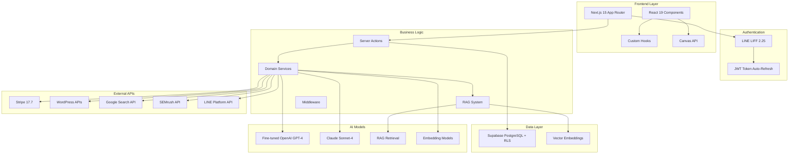
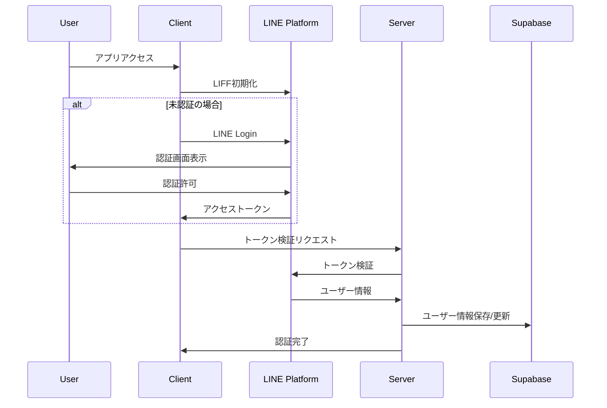
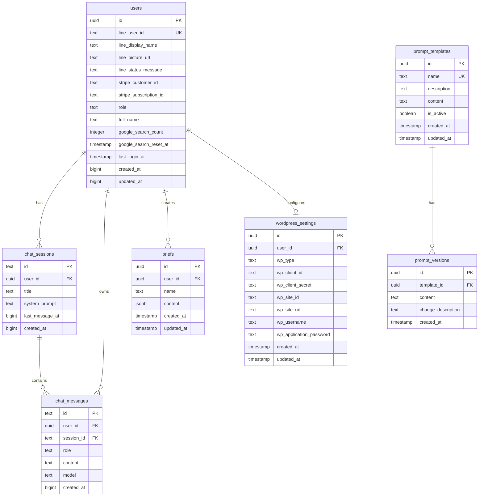

# Industry-Specific MC Training Platform

LINE認証をベースとした業界特化型AIマーケティング支援プラットフォーム。Fine-tuned AIモデル、3つの専門プロンプト、Canvas描画機能、WordPress連携、サブスクリプション決済を統合した包括的なSaaSアプリケーションです。

## 🚀 主要機能

### 📱 LINE LIFF認証
- LINE Loginによるシームレスな認証
- アクセストークンの自動リフレッシュ・メモリキャッシュ
- 管理者権限による階層化ユーザー管理
- Row Level Security（RLS）による厳格なデータ分離

### 🤖 AIマーケティング支援機能
- **Fine-tuned AIモデル**：`ft:gpt-4.1-nano-2025-04-14` によるキーワード分類
- **3つの専門プロンプト**：広告文作成・仕上げ、16パートLP作成（5W2H準拠）
- **プロンプト管理**：管理者専用リアルタイム編集・バージョン履歴・18項目動的変数置換
- **外部API統合**：SEMrush競合分析、Google検索（使用量制限付き）
- **チャット機能**：履歴永続化・セッション管理・AIモデル選択

### 🎨 ランディングページ作成・WordPress連携
- **WordPress.com / セルフホスト WordPress**：両方式対応
- **プレビュー機能**：リアルタイムプレビュー・下書きモード
- **OAuth認証**：WordPress.com 連携
- **Application Password**：セルフホスト WordPress 対応

### 🖼️ Canvas描画機能
- **TipTap 3.0.7**：マークダウン・テーブル・リンク・画像・コードハイライト
- **AI統合**：チャット返信の直接挿入・見出しナビゲーション・多形式エクスポート

### 💳 サブスクリプション・権限管理
- **Stripe Checkout**：サブスクリプション管理
- **使用量制限**：Google検索回数制限・プラン別機能制御
- **管理者ダッシュボード**：ユーザー・プロンプト管理

## 🏗️ システムアーキテクチャ（2025年8月最新版）



## 🔄 認証フロー



## 🛠️ 技術スタック

**フロントエンド**: Next.js 15.3.1 + React 19 + TypeScript 5 + Tailwind CSS 4 + Radix UI + TipTap 3.0.7
**バックエンド**: Supabase 2.49.1（PostgreSQL + RLS）+ プロンプト管理システム
**AI**: OpenAI GPT-4（Fine-tuned）+ Anthropic Claude Sonnet-4
**外部API**: SEMrush + Google Search + LINE LIFF 2.25.1 + Stripe 17.7 + WordPress API
**開発**: Vercel + Husky + ESLint 9 + Prettier + tsc-watch + ngrok

## 📊 データベーススキーマ



## 📋 環境変数設定（全27項目）

### サーバーサイド環境変数
- **データベース**: DBPASS, SUPABASE_SERVICE_ROLE
- **決済**: STRIPE_ENABLED, STRIPE_SECRET_KEY, STRIPE_PRICE_ID
- **AI**: OPENAI_API_KEY, ANTHROPIC_API_KEY
- **検索**: GOOGLE_CUSTOM_SEARCH_KEY, GOOGLE_CSE_ID
- **LINE**: LINE_CHANNEL_ID, LINE_CHANNEL_SECRET
- **監視**: SENTRY_DSN, SENTRY_ORG, SENTRY_PROJECT
- **Webhook**: BASE_WEBHOOK_URL, RELAY_BEARER_TOKEN

### クライアントサイド環境変数
- **LINE**: NEXT_PUBLIC_LIFF_ID, NEXT_PUBLIC_LIFF_CHANNEL_ID
- **データベース**: NEXT_PUBLIC_SUPABASE_URL, NEXT_PUBLIC_SUPABASE_ANON_KEY
- **サイト**: NEXT_PUBLIC_SITE_URL
- **監視**: NEXT_PUBLIC_SENTRY_DSN
- **決済**: NEXT_PUBLIC_STRIPE_ENABLED

## 🚀 環境構築手順

### 1. 前提条件
- Node.js 18.x 以上
- npm または yarn
- Supabase アカウント
- LINE Developers アカウント
- Stripe アカウント（決済機能使用時）

### クイックスタート
```bash
git clone <repository-url> && cd industry-specific-mc-training
npm install
cp .env.example .env.local  # 環境変数設定（27項目）
npx supabase db push       # DBマイグレーション
npm run dev               # 開発サーバー起動
npm run ngrok             # LINE LIFF用HTTPSトンネル（別ターミナル）
```

### WordPress連携設定
**WordPress.com**: [Developer Console](https://developer.wordpress.com/apps/) でClient ID/Secret取得
**セルフホスト**: 管理画面からApplication Password生成

## 📁 プロジェクト構造（リファクタリング後・2025年8月）

```
├── app/                       # Next.js App Router（メイン）
│   ├── admin/                # 管理者機能（権限制御）
│   │   ├── prompts/         # プロンプト管理システム
│   │   └── layout.tsx       # 管理者レイアウト
│   ├── api/                 # API Routes
│   │   ├── line/           # LINE認証API
│   │   ├── wordpress/      # WordPress連携API  
│   │   ├── user/           # ユーザー管理API
│   │   └── ad-form/        # LP作成API
│   ├── chat/               # チャット機能
│   │   ├── components/     # チャット専用コンポーネント
│   │   │   ├── CanvasPanel.tsx    # Canvas描画パネル
│   │   │   ├── InputArea.tsx      # AIモデル選択・入力
│   │   │   ├── MessageArea.tsx    # メッセージ表示
│   │   │   └── SessionSidebar.tsx # セッション管理
│   │   └── page.tsx        # チャットメインページ
│   ├── business-info/      # 事業情報入力
│   ├── setup/              # 初期設定ウィザード
│   └── subscription/       # サブスクリプション管理
└── src/                    # ソースコード（統合済み）
    ├── components/         # 共通コンポーネント
    │   └── ui/            # shadcn/ui コンポーネント
    ├── domain/            # ドメインドリブン設計
    │   ├── errors/        # カスタムエラークラス
    │   ├── interfaces/    # ビジネスインターフェース
    │   ├── models/        # ドメインモデル
    │   └── services/      # ドメインサービス
    ├── hooks/             # React カスタムフック
    ├── lib/               # ユーティリティ・定数
    ├── server/            # サーバーサイドロジック
    │   ├── handler/actions/ # Server Actions
    │   ├── middleware/      # 認証・権限ミドルウェア
    │   └── services/        # 外部API・データアクセス
    └── types/             # TypeScript型定義
```

## 🔧 主要なAPIエンドポイント

| エンドポイント | 機能 | 新機能 |
|---|---|---|
| `/api/line/callback` | LINE認証コールバック | - |
| `/api/refresh` | トークンリフレッシュ | - |
| `/api/user/current` | 現在のユーザー情報・権限 | - |
| `/api/user/search-count` | Google検索使用量確認 | - |
| `/api/wordpress/test-connection` | WordPress接続テスト | - |
| `/api/wordpress/oauth/start` | WordPress.com OAuth開始 | - |
| `/api/wordpress/oauth/callback` | WordPress.com OAuth コールバック | - |
| `/api/ad-form/create-landing-page` | ランディングページ作成 | - |
| `/api/admin/rebuild-chunks` | RAGチャンク再構築 | ✨ 新機能 |
| `/api/rag/*` | RAG検索・拡張生成 | ✨ 新機能 |

## 🛡️ セキュリティ機能

- **Row Level Security (RLS)** - データベースレベルでのマルチテナント分離
- **管理者権限制御** - `/admin`, `/setup`, `/debug`, `/studio` への階層化アクセス
- **JWT Token管理** - 自動リフレッシュ + 5分TTLメモリキャッシュ
- **CSRF保護** - 状態トークンによる保護
- **環境変数管理** - @t3-oss/env-nextjs による型安全な機密情報管理
- **使用量制限** - Google検索API制限・プラン別機能ゲート

## 📱 デプロイメント

### Vercel デプロイ
1. Vercel アカウント作成
2. プロジェクト接続
3. 環境変数設定
4. 自動デプロイ実行

### 環境固有設定
- **開発環境**: ngrok + ローカル開発
- **ステージング**: Vercel プレビュー環境
- **本番環境**: Vercel 本番デプロイ

**主要ページ**: `/chat`（AIチャット）, `/admin`（プロンプト管理）, `/business-info`（事業情報入力）, `/subscription`（決済管理）

## 📈 2025年8月最新アップデート

**新機能**: Canvas描画（TipTap 3.0.7）、プロンプト管理システム、WordPress連携強化、管理者ダッシュボード
**アーキテクチャ**: Clean Architecture準拠、型安全性向上（27項目環境変数管理）
**開発効率**: ESLint 9 + Prettier統合、自動品質管理

## 🤝 コントリビューション

1. フィーチャーブランチ作成
2. 変更実装・TypeScript型チェック・ESLint
3. Husky pre-commit hooks による自動テスト・フォーマット
4. プルリクエスト作成

## 📄 ライセンス

このプロジェクトは私的利用目的で作成されています。