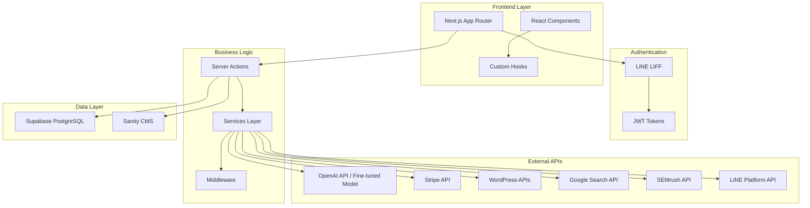
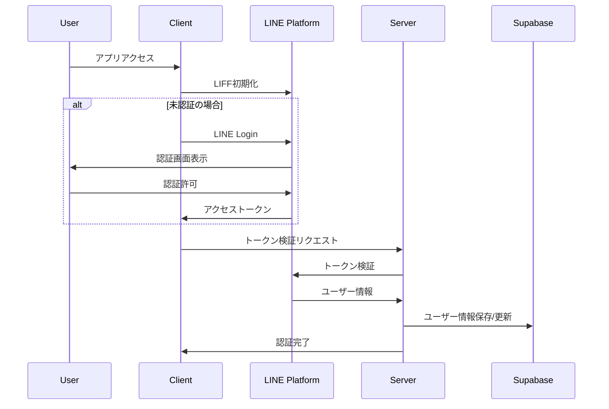
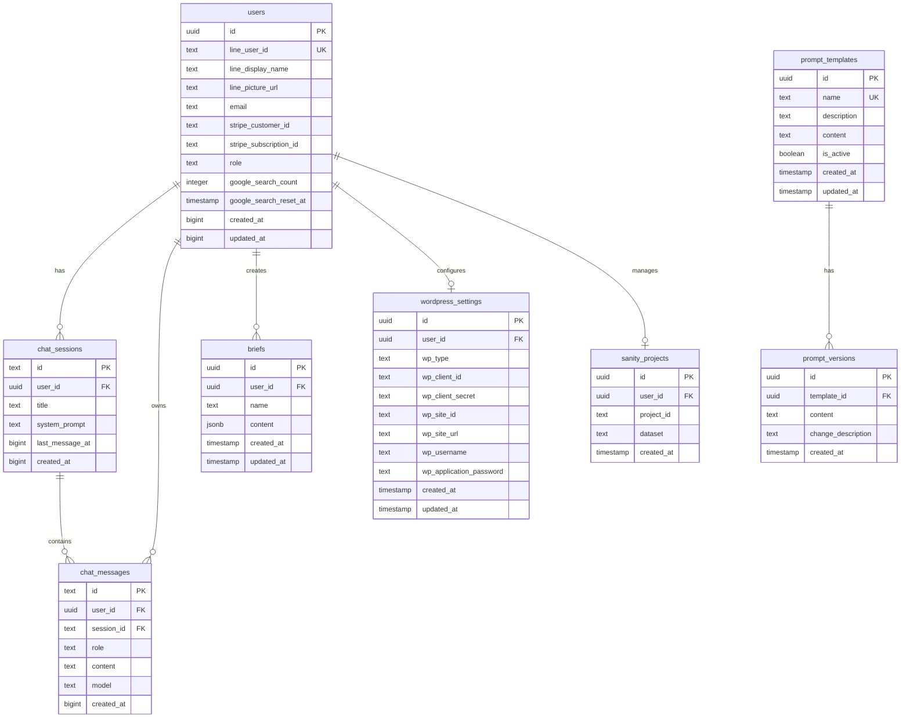

# Industry-Specific MC Training Platform

LINE認証をベースとした業界特化型AI マーケティング支援プラットフォーム。Fine-tuned AIモデル、SEMrush API連携、プロンプト管理機能、動的ランディングページ作成、WordPress連携、サブスクリプション決済を統合した包括的なSaaSアプリケーションです。

## 🚀 主要機能

### 📱 LINE LIFF認証
- LINE Loginによるシームレスな認証
- アクセストークンの自動リフレッシュ・メモリキャッシュ
- 管理者権限による階層化ユーザー管理
- Row Level Security（RLS）による厳格なデータ分離

### 🤖 高度なAIチャット機能
- **Fine-tuned AIモデル**：`ft:gpt-4.1-nano-2025-04-14` によるキーワード分類
- **複数AIモデル連携**：段階的処理による高精度な広告文生成
- **SEMrush API統合**：競合広告分析・キーワードリサーチ
- **Google Custom Search API**：リアルタイム検索データ連携
- チャット履歴の永続化・検索機能

### 🎯 AI プロンプト管理システム
- **管理者専用プロンプト管理**：リアルタイム編集・バージョン履歴
- **動的変数システム**：事業者情報17項目の自動置換
- **3つの専門プロンプト**：
  - 広告文作成（Google広告対応）
  - ランディングページドラフト作成（16パート構成）
  - 広告文仕上げ・改善

### 🎨 ランディングページ作成・WordPress連携
- **Sanity CMS**：ヘッドレスCMS による柔軟なコンテンツ管理
- **WordPress.com / セルフホスト WordPress**：両方式対応
- **プレビュー機能**：リアルタイムプレビュー・下書きモード
- **OAuth認証**：WordPress.com 連携
- **Application Password**：セルフホスト WordPress 対応

### 💳 サブスクリプション・権限管理
- **Stripe Checkout**：サブスクリプション管理
- **使用量制限**：Google検索回数制限・プラン別機能制御
- **管理者ダッシュボード**：ユーザー・プロンプト管理

## 🏗️ システムアーキテクチャ



## 🔄 認証フロー



## 🛠️ 技術スタック

### **フロントエンド**
- **Next.js 15.3.1** - React フレームワーク（App Router + Turbopack）
- **React 19.0.0** - UIライブラリ（Server Components対応）
- **TypeScript 5.x** - strict mode による型安全性
- **Tailwind CSS 4.x** - PostCSS統合スタイリング
- **Radix UI** - アクセシビリティ対応UIコンポーネント

### **バックエンド・データベース**
- **Supabase** - PostgreSQL + RLS + リアルタイム機能
- **Sanity CMS 3.86** - ヘッドレスCMS + プレビュー機能
- **@t3-oss/env-nextjs** - 型安全な環境変数管理

### **AI・API統合**
- **OpenAI API 4.90** - GPT-4 + Fine-tuned モデル
- **SEMrush API** - 競合分析・広告データ
- **Google Custom Search API** - リアルタイム検索
- **LINE LIFF 2.25** - LINE認証プラットフォーム

### **決済・認証**
- **Stripe 17.7** - サブスクリプション・決済管理
- **JWT Token管理** - 自動リフレッシュ + メモリキャッシュ

### **開発・デプロイ**
- **Vercel** - ホスティング・自動デプロイ
- **Husky + lint-staged** - Git hooks によるコード品質管理
- **ESLint 9 + Prettier** - 統合リンター・フォーマッター

## 📊 データベーススキーマ



## 🚀 環境構築手順

### 1. 前提条件
- Node.js 18.x 以上
- npm または yarn
- Supabase アカウント
- LINE Developers アカウント
- Stripe アカウント（決済機能使用時）

### 2. プロジェクトセットアップ

```bash
# リポジトリクローン
git clone <repository-url>
cd industry-specific-mc-training

# 依存関係インストール
npm install

# 環境変数設定
cp .env.example .env.local
```

### 3. 環境変数設定

`.env.local` ファイルに以下を設定：

```bash
# LINE LIFF設定
NEXT_PUBLIC_LIFF_ID=your_liff_id
NEXT_PUBLIC_LIFF_CHANNEL_ID=your_channel_id
LINE_CHANNEL_ID=your_channel_id
LINE_CHANNEL_SECRET=your_channel_secret

# Supabase設定
NEXT_PUBLIC_SUPABASE_URL=your_supabase_url
NEXT_PUBLIC_SUPABASE_ANON_KEY=your_supabase_anon_key
SUPABASE_SERVICE_ROLE=your_service_role_key

# Stripe設定（オプション）
STRIPE_SECRET_KEY=your_stripe_secret_key
STRIPE_PUBLISHABLE_KEY=your_stripe_publishable_key
STRIPE_PRODUCT_ID=your_product_id
STRIPE_PRICE_ID=your_price_id

# OpenAI API
OPENAI_API_KEY=your_openai_api_key

# Google検索API
GOOGLE_CUSTOM_SEARCH_KEY=your_google_search_key
GOOGLE_CSE_ID=your_custom_search_engine_id

# SEMrush API（オプション）
SEMRUSH_API_KEY=your_semrush_api_key

# Sanity CMS
NEXT_PUBLIC_SANITY_PROJECT_ID=your_sanity_project_id
NEXT_PUBLIC_SANITY_DATASET=production
SANITY_STUDIO_READ_TOKEN=your_sanity_read_token
SANITY_WEBHOOK_SECRET=your_webhook_secret

# サイトURL
NEXT_PUBLIC_SITE_URL=http://localhost:3000
```

### 4. データベースセットアップ

```bash
# Supabaseマイグレーション実行
npx supabase db push
```

### 5. 開発サーバー起動

```bash
npm run dev
```

### 6. ngrok設定（開発時）

LINE LIFFの開発には HTTPS が必要です：

```bash
# トンネル作成（プロジェクトに含まれているコマンド）
npm run ngrok
```

## 📝 WordPress連携設定

### WordPress.com連携
1. [WordPress.com Developer](https://developer.wordpress.com/apps/) でアプリケーション作成
2. Client ID / Client Secret 取得
3. リダイレクトURL設定: `{your_domain}/api/wordpress/oauth/callback`

### セルフホストWordPress連携
1. WordPress管理画面 → ユーザー → プロフィール
2. 「アプリケーションパスワード」で新しいパスワード生成
3. サイトURL、ユーザー名、Application Passwordを設定

## 🔧 主要なAPIエンドポイント

| エンドポイント | 機能 |
|---|---|
| `/api/line/callback` | LINE認証コールバック |
| `/api/refresh` | トークンリフレッシュ |
| `/api/user/current` | 現在のユーザー情報・権限 |
| `/api/user/search-count` | Google検索使用量確認 |
| `/api/wordpress/test-connection` | WordPress接続テスト |
| `/api/wordpress/oauth/start` | WordPress.com OAuth開始 |
| `/api/wordpress/oauth/callback` | WordPress.com OAuth コールバック |
| `/api/ad-form/create-landing-page` | ランディングページ作成 |
| `/api/sanity/settings` | Sanity CMS 設定管理 |
| `/api/draft/enable` | プレビューモード有効化 |
| `/api/draft/disable` | プレビューモード無効化 |

## 🛡️ セキュリティ機能

- **Row Level Security (RLS)** - データベースレベルでのマルチテナント分離
- **管理者権限制御** - `/admin`, `/setup`, `/debug`, `/studio` への階層化アクセス
- **JWT Token管理** - 自動リフレッシュ + 5分TTLメモリキャッシュ
- **CSRF保護** - 状態トークンによる保護
- **環境変数管理** - @t3-oss/env-nextjs による型安全な機密情報管理
- **使用量制限** - Google検索API制限・プラン別機能ゲート

## 📱 デプロイメント

### Vercel デプロイ
1. Vercel アカウント作成
2. プロジェクト接続
3. 環境変数設定
4. 自動デプロイ実行

### 環境固有設定
- **開発環境**: ngrok + ローカル開発
- **ステージング**: Vercel プレビュー環境
- **本番環境**: Vercel 本番デプロイ

## 🏗️ 開発・デバッグ機能

### デバッグページ
- `/debug/draft-mode` - Sanityプレビューモード管理
- `/debug/wordpress-export` - WordPress出力テスト

### 管理者機能
- `/admin` - 管理者ダッシュボード
- `/admin/prompts` - AIプロンプト管理
- `/studio` - Sanity CMS スタジオ

### セットアップ機能
- `/setup` - 初期設定ウィザード
- `/setup/sanity` - Sanity CMS 設定
- `/setup/wordpress` - WordPress連携設定

## 🤝 コントリビューション

1. フィーチャーブランチ作成
2. 変更実装・TypeScript型チェック
3. Husky pre-commit hooks による自動テスト
4. プルリクエスト作成

## 📄 ライセンス

このプロジェクトは私的利用目的で作成されています。