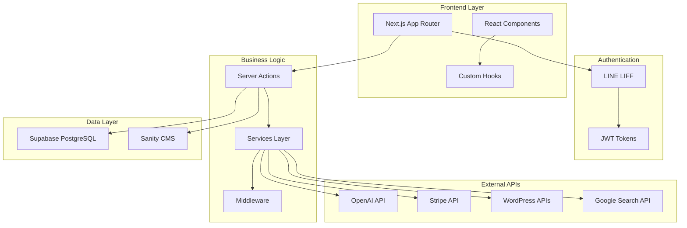
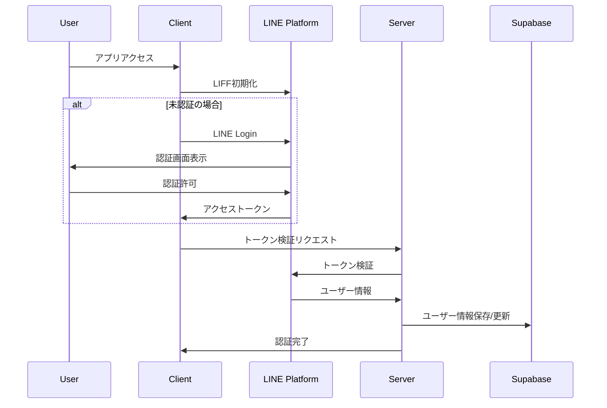
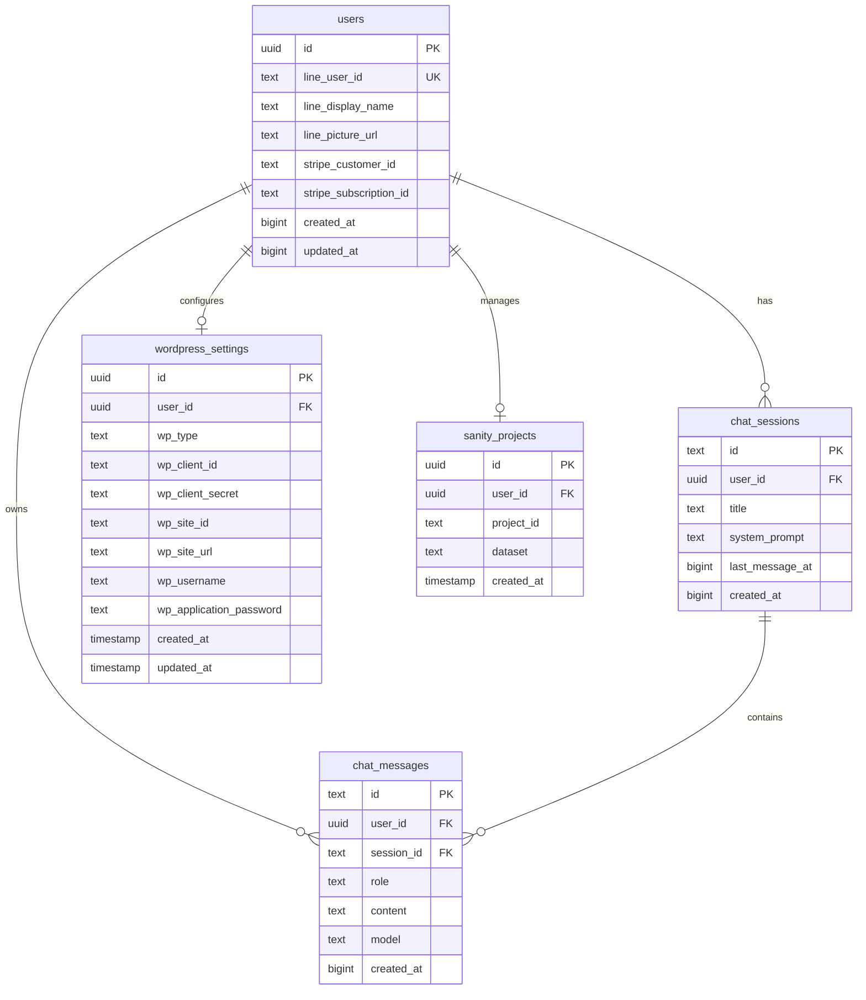

# Industry-Specific MC Training Platform

LINE認証をベースとした業界特化型マーケティング支援プラットフォーム。AI駆動のチャット機能、動的ランディングページ作成、WordPress連携、サブスクリプション決済を統合したSaaSアプリケーションです。

## 🚀 主要機能

### 📱 LINE LIFF認証
- LINE Loginによるシームレスな認証
- アクセストークンの自動リフレッシュ
- マルチテナント対応のユーザー管理

### 🤖 AIチャット機能
- OpenAI API連携（複数モデル対応）
- 広告文作成専用AIモデル
- チャット履歴の永続化
- Google検索API連携

### 🎨 ランディングページ作成
- 見出し・説明文からの自動生成
- WordPress.com / セルフホストWordPress両対応
- リアルタイムプレビュー機能
- 設定編集・管理機能

### 💳 サブスクリプション管理
- Stripe Checkout連携
- 自動課金・解約処理
- プラン変更対応

## 🏗️ システムアーキテクチャ



## 🔄 認証フロー



## 🛠️ 技術スタック

### **フロントエンド**
- **Next.js 15.3.1** - React フレームワーク（App Router）
- **React 19.0.0** - UIライブラリ
- **TypeScript** - 型安全性
- **Tailwind CSS** - スタイリング
- **Radix UI** - UIコンポーネント

### **バックエンド・データベース**
- **Supabase** - PostgreSQL + 認証・リアルタイム機能
- **Sanity CMS** - ヘッドレスCMS

### **認証・決済**
- **LINE LIFF** - LINE認証プラットフォーム
- **Stripe** - 決済・サブスクリプション管理

### **外部API**
- **OpenAI API** - AI機能
- **Google Custom Search API** - 検索機能
- **WordPress REST API** - WordPress連携

### **開発・デプロイ**
- **Vercel** - ホスティング・デプロイ
- **Turbopack** - 高速バンドラ
- **ESLint + Prettier** - コード品質管理

## 📊 データベーススキーマ



## 🚀 環境構築手順

### 1. 前提条件
- Node.js 18.x 以上
- npm または yarn
- Supabase アカウント
- LINE Developers アカウント
- Stripe アカウント（決済機能使用時）

### 2. プロジェクトセットアップ

```bash
# リポジトリクローン
git clone <repository-url>
cd industry-specific-mc-training

# 依存関係インストール
npm install

# 環境変数設定
cp .env.example .env.local
```

### 3. 環境変数設定

`.env.local` ファイルに以下を設定：

```bash
# LINE LIFF設定
NEXT_PUBLIC_LIFF_ID=your_liff_id
NEXT_PUBLIC_LIFF_CHANNEL_ID=your_channel_id
LINE_CHANNEL_ID=your_channel_id
LINE_CHANNEL_SECRET=your_channel_secret

# Supabase設定
NEXT_PUBLIC_SUPABASE_URL=your_supabase_url
NEXT_PUBLIC_SUPABASE_ANON_KEY=your_supabase_anon_key
SUPABASE_SERVICE_ROLE=your_service_role_key

# Stripe設定（オプション）
STRIPE_SECRET_KEY=your_stripe_secret_key
STRIPE_PUBLISHABLE_KEY=your_stripe_publishable_key
STRIPE_PRODUCT_ID=your_product_id
STRIPE_PRICE_ID=your_price_id

# OpenAI API
OPENAI_API_KEY=your_openai_api_key

# サイトURL
NEXT_PUBLIC_SITE_URL=http://localhost:3000
```

### 4. データベースセットアップ

```bash
# Supabaseマイグレーション実行
npx supabase db push
```

### 5. 開発サーバー起動

```bash
npm run dev
```

### 6. ngrok設定（開発時）

LINE LIFFの開発には HTTPS が必要です：

```bash
# ngrokインストール
npm install -g ngrok

# トンネル作成
ngrok http --region=jp --subdomain=industry-specific-mc-training 3000
```

## 📝 WordPress連携設定

### WordPress.com連携
1. [WordPress.com Developer](https://developer.wordpress.com/apps/) でアプリケーション作成
2. Client ID / Client Secret 取得
3. リダイレクトURL設定: `{your_domain}/api/wordpress/oauth/callback`

### セルフホストWordPress連携
1. WordPress管理画面 → ユーザー → プロフィール
2. 「アプリケーションパスワード」で新しいパスワード生成
3. サイトURL、ユーザー名、Application Passwordを設定

## 🔧 主要なAPIエンドポイント

| エンドポイント | 機能 |
|---|---|
| `/api/callback` | LINE認証コールバック |
| `/api/refresh` | トークンリフレッシュ |
| `/api/user/current` | 現在のユーザー情報 |
| `/api/wordpress/test-connection` | WordPress接続テスト |
| `/api/ad-form/create-landing-page` | ランディングページ作成 |
| `/api/wordpress/oauth/start` | WordPress.com OAuth開始 |

## 🛡️ セキュリティ機能

- **Row Level Security (RLS)** - データベースレベルでのマルチテナント分離
- **JWT Token管理** - 自動リフレッシュ機能付き
- **CSRF保護** -状態トークンによる保護
- **環境変数管理** - 機密情報の安全な管理

## 📱 デプロイメント

### Vercel デプロイ
1. Vercel アカウント作成
2. プロジェクト接続
3. 環境変数設定
4. 自動デプロイ実行

### 環境固有設定
- **開発環境**: ngrok + ローカル開発
- **ステージング**: Vercel プレビュー環境
- **本番環境**: Vercel 本番デプロイ

## 🤝 コントリビューション

1. フィーチャーブランチ作成
2. 変更実装
3. テスト実行
4. プルリクエスト作成

## 📄 ライセンス

このプロジェクトは私的利用目的で作成されています。