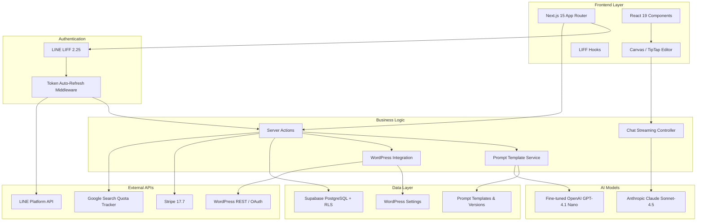
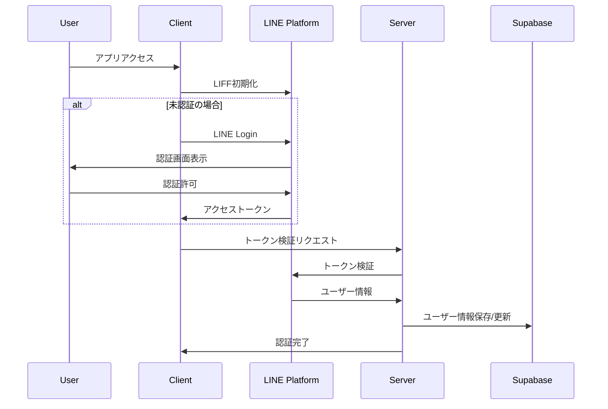
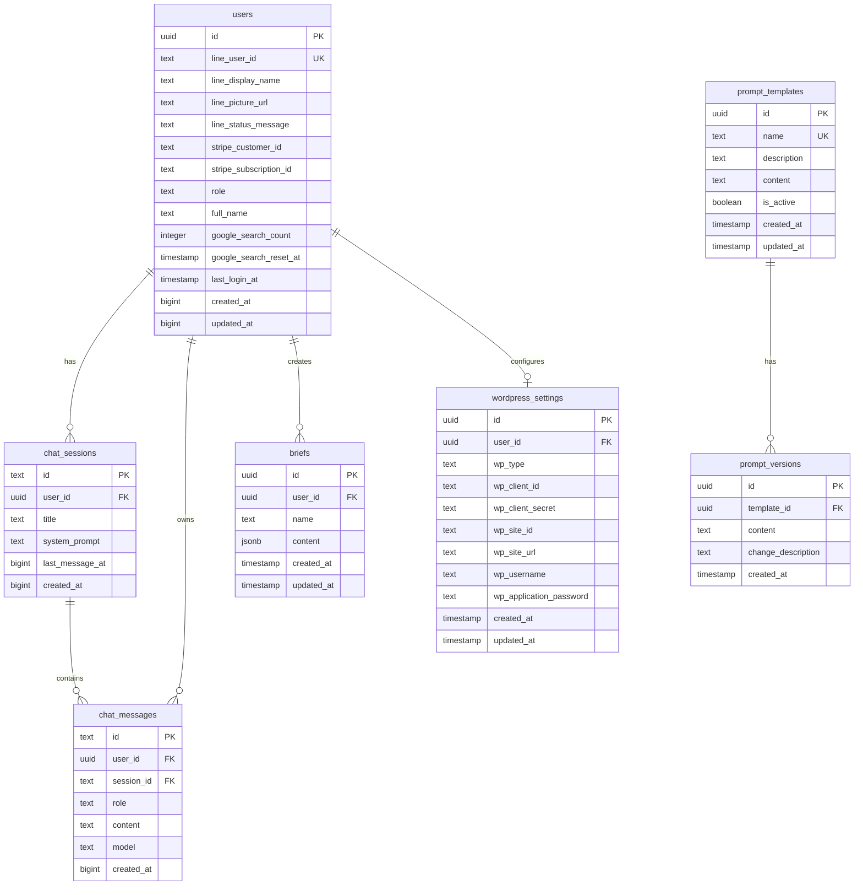

# Industry-Specific MC Training Platform

LINE認証をベースとした業界特化型AIマーケティング支援プラットフォーム。Fine-tuned AIモデル、広告/LP/ブログ向けテンプレート群、Canvas描画機能、WordPress連携、サブスクリプション決済を統合した包括的なSaaSアプリケーションです。

## 🚀 主要機能

### 📱 LINE LIFF認証

- LINE Loginによるシームレスな認証
- アクセストークンの自動リフレッシュ・メモリキャッシュ
- 管理者権限による階層化ユーザー管理
- Row Level Security（RLS）による厳格なデータ分離

### 🤖 AIマーケティング支援機能

- **Fine-tuned AIモデル**：`ft:gpt-4.1-nano-2025-04-14` によるキーワード分類
- **テンプレート体系**：広告文（作成/仕上げ）、16パートLP草案/改善、7ステップのブログ作成フローなど複数の業務特化プロンプトを提供
- **プロンプト管理**：管理者専用リアルタイム編集・バージョン履歴・変数付きテンプレート管理
- **外部API統合**：Google検索回数トラッキング（※検索API本体は廃止済み）
- **チャット機能**：Anthropic Claude Sonnet-4.5（`claude-sonnet-4-5-20250929`）とのストリーミング会話、セッション管理、AIモデル選択

### 🎨 ランディングページ作成・WordPress連携

- **WordPress.com / セルフホスト WordPress**：両方式対応
- **プレビュー機能**：リアルタイムプレビュー・下書きモード
- **OAuth認証**：WordPress.com 連携
- **Application Password**：セルフホスト WordPress 対応

### 🖼️ Canvas描画機能

- **TipTap 3.0.7**：マークダウン・テーブル・リンク・画像・コードハイライト
- **AI統合**：チャット返信の直接挿入・見出しナビゲーション・多形式エクスポート

### 💳 サブスクリプション・権限管理

- **Stripe Checkout**：サブスクリプション管理
- **使用量制限**：Google検索回数制限・プラン別機能制御
- **管理者ダッシュボード**：ユーザー・プロンプト管理

## 🏗️ システムアーキテクチャ（2025年8月最新版）



## 🔄 認証フロー



## 🛠️ 技術スタック

**フロントエンド**: Next.js 15.4.7 + React 19 + TypeScript 5 + Tailwind CSS 4 + Radix UI + TipTap 3.0.7
**バックエンド**: Supabase 2.49.1（PostgreSQL + RLS）+ プロンプトテンプレート/WordPress連携サービス
**AI**: OpenAI GPT-4.1 Nano（Fine-tuned）+ Anthropic Claude Sonnet-4.5（`claude-sonnet-4-5-20250929`）
**外部API**: Google Custom Search（回数カウントのみ）+ LINE LIFF 2.25.1 + Stripe 17.7 + WordPress REST API
**開発**: Vercel + Husky + ESLint 9 + Prettier + tsc-watch + ngrok

## 📊 データベーススキーマ



## 📋 環境変数設定（全19項目）

`src/env.ts` で型定義されているサーバー/クライアント環境変数は以下の19項目です。`.env.example` はリポジトリに含まれないため、`.env.local` を手動で作成して設定してください。

| 種別 | 変数名 | 必須 | 用途 |
| ---- | ------ | ---- | ---- |
| Server | `DBPASS` | ✅ | Supabase から接続されるデータベースパスワード |
| Server | `SUPABASE_SERVICE_ROLE` | ✅ | サーバーサイド処理で使用する Service Role キー |
| Server | `STRIPE_ENABLED` | 任意 | Stripe を有効化するフラグ（`true/false`） |
| Server | `STRIPE_SECRET_KEY` | ✅（決済有効時） | Stripe シークレットキー |
| Server | `STRIPE_PRICE_ID` | ✅（決済有効時） | Stripe サブスクリプションの Price ID |
| Server | `OPENAI_API_KEY` | ✅ | Fine-tuned モデル利用時の OpenAI キー |
| Server | `ANTHROPIC_API_KEY` | ✅ | Claude ストリーミング用 API キー |
| Server | `GOOGLE_CUSTOM_SEARCH_KEY` | ✅ | Google Custom Search API キー（回数カウントで利用） |
| Server | `GOOGLE_CSE_ID` | ✅ | Google Custom Search Engine ID |
| Server | `LINE_CHANNEL_ID` | ✅ | LINE Login 用チャネル ID |
| Server | `LINE_CHANNEL_SECRET` | ✅ | LINE Login 用チャネルシークレット |
| Server | `BASE_WEBHOOK_URL` | ✅ | ログ転送先（Lark Base など）の Webhook URL |
| Server | `RELAY_BEARER_TOKEN` | ✅ | `/api/log-relay` の Bearer 認証トークン |
| Client | `NEXT_PUBLIC_LIFF_ID` | ✅ | LIFF アプリ ID |
| Client | `NEXT_PUBLIC_LIFF_CHANNEL_ID` | ✅ | LIFF Channel ID |
| Client | `NEXT_PUBLIC_SUPABASE_URL` | ✅ | Supabase プロジェクト URL |
| Client | `NEXT_PUBLIC_SUPABASE_ANON_KEY` | ✅ | Supabase anon キー |
| Client | `NEXT_PUBLIC_SITE_URL` | ✅ | サイト公開 URL |
| Client | `NEXT_PUBLIC_STRIPE_ENABLED` | 任意 | クライアント側の Stripe 有効化フラグ |

### 追加で利用できる任意設定

- `WORDPRESS_COM_CLIENT_ID`, `WORDPRESS_COM_CLIENT_SECRET`, `WORDPRESS_COM_REDIRECT_URI`: WordPress.com OAuth を利用する場合に必要。
- `OAUTH_STATE_COOKIE_NAME`, `OAUTH_TOKEN_COOKIE_NAME`: WordPress OAuth 状態管理用クッキー名をカスタマイズする際に利用。
- `COOKIE_SECRET`: WordPress OAuth コールバックで安全にトークンを保存するために必須。
- `RELAY_PROJECT_ID`: `/api/log-relay` の自己ループ防止用に設定可能。

## 🚀 環境構築手順

### 1. 前提条件

- Node.js 18.x 以上
- npm または yarn
- Supabase アカウント
- LINE Developers アカウント
- Stripe アカウント（決済機能使用時）

### クイックスタート

```bash
git clone <repository-url> && cd industry-specific-mc-training
npm install
# .env.local を作成し上記19項目を設定
npx supabase db push       # DBマイグレーション
npm run dev               # 開発サーバー起動
npm run ngrok             # LINE LIFF用HTTPSトンネル（別ターミナル）
```

### WordPress連携設定

**WordPress.com**: [Developer Console](https://developer.wordpress.com/apps/) でClient ID/Secret取得
**セルフホスト**: 管理画面からApplication Password生成

## 📁 プロジェクト構造（リファクタリング後・2025年8月）

```
├── app/                       # Next.js App Router（メイン）
│   ├── admin/                # 管理者機能（権限制御）
│   │   ├── prompts/         # プロンプト管理システム
│   │   └── layout.tsx       # 管理者レイアウト
│   ├── api/                 # API Routes
│   │   ├── admin/         # 管理者専用API（プロンプト・統計）
│   │   ├── auth/          # ロール確認・キャッシュクリア
│   │   ├── chat/          # AnthropicストリーミングAPI
│   │   ├── line/          # LINE認証API
│   │   ├── log-relay/     # Vercel Log Drain 中継
│   │   ├── refresh/       # LINEトークンリフレッシュ
│   │   ├── user/          # ユーザー情報API
│   │   └── wordpress/     # WordPress連携API
│   ├── chat/               # チャット機能
│   │   ├── components/     # チャット専用コンポーネント
│   │   │   ├── CanvasPanel.tsx    # Canvas描画パネル
│   │   │   ├── InputArea.tsx      # AIモデル選択・入力
│   │   │   ├── MessageArea.tsx    # メッセージ表示
│   │   │   └── SessionSidebar.tsx # セッション管理
│   │   └── page.tsx        # チャットメインページ
│   ├── analytics/          # アナリティクス表示
│   ├── business-info/      # 事業情報入力
│   ├── setup/              # 初期設定ウィザード
│   └── subscription/       # サブスクリプション管理
└── src/                    # ソースコード（統合済み）
    ├── components/         # 共通コンポーネント
    │   └── ui/            # shadcn/ui コンポーネント
    ├── domain/            # ドメインドリブン設計
    │   ├── errors/        # カスタムエラークラス
    │   ├── interfaces/    # ビジネスインターフェース
    │   ├── models/        # ドメインモデル
    │   └── services/      # ドメインサービス
    ├── hooks/             # React カスタムフック
    ├── lib/               # ユーティリティ・定数
    ├── server/            # サーバーサイドロジック
    │   ├── handler/actions/ # Server Actions
    │   ├── middleware/      # 認証・権限ミドルウェア
    │   └── services/        # 外部API・データアクセス
    └── types/             # TypeScript型定義
```

## 🔧 主要なAPIエンドポイント

### 管理者向け

| エンドポイント | メソッド | 主な役割 | 認証 |
| -------------- | -------- | -------- | ---- |
| `/api/admin/prompts` | GET | 全プロンプトテンプレートの一覧取得 | LINEアクセス/リフレッシュトークン + 管理者ロール |
| `/api/admin/prompts/[id]` | GET/POST | 個別テンプレートの閲覧・更新 | LINEアクセス/リフレッシュトークン + 管理者ロール |
| `/api/admin/wordpress/stats` | GET | WordPress連携状況の集計 | LINEアクセス/リフレッシュトークン + 管理者ロール |

### 認証・ユーザー

| エンドポイント | メソッド | 主な役割 | 認証 |
| -------------- | -------- | -------- | ---- |
| `/api/line/callback` | GET | LINE OAuth コールバック・トークン保存 | 公開（state チェックあり） |
| `/api/refresh` | POST | LINE リフレッシュトークンから再発行 | リフレッシュトークン Cookie |
| `/api/auth/check-role` | GET | 現在のユーザーロール確認 | LINE アクセストークン Cookie |
| `/api/auth/clear-cache` | POST | クライアントへキャッシュクリア通知 | 任意（特権操作不要） |
| `/api/user/current` | GET | ログインユーザー情報・ロール取得 | LINE アクセス/リフレッシュトークン Cookie |
| `/api/user/search-count` | GET | Google検索機能の提供終了通知（410返却） | 任意 |

### WordPress連携

| エンドポイント | メソッド | 主な役割 | 認証 |
| -------------- | -------- | -------- | ---- |
| `/api/wordpress/settings` | POST | WordPress.com/セルフホスト設定の保存 | LINE アクセス/リフレッシュトークン Cookie |
| `/api/wordpress/status` | GET | WordPress接続状態の確認 | LINE アクセス/リフレッシュトークン Cookie |
| `/api/wordpress/test-connection` | GET/POST | WordPress接続テストの実行 | LINE アクセス/リフレッシュトークン Cookie |
| `/api/wordpress/posts` | GET | WordPress投稿一覧の取得 | LINE アクセス/リフレッシュトークン Cookie + WP 認証 |
| `/api/wordpress/oauth/start` | GET | WordPress.com OAuth リダイレクト開始 | 公開（WordPress OAuth 環境変数必須） |
| `/api/wordpress/oauth/callback` | GET | WordPress.com OAuth コールバック処理 | LINE アクセス/リフレッシュトークン Cookie |

### その他

| エンドポイント | メソッド | 主な役割 | 認証 |
| -------------- | -------- | -------- | ---- |
| `/api/chat/anthropic/stream` | POST | Claude Sonnet-4 とのSSEストリーミング | Authorization Bearer（LIFFアクセストークン） |
| `/api/log-relay` | POST/GET/HEAD/OPTIONS | Vercel Log Drain の受け口・Bearer検証・Webhook転送 | `Authorization: Bearer ${RELAY_BEARER_TOKEN}` |

## 🛡️ セキュリティ機能

- **Row Level Security (RLS)** - データベースレベルでのマルチテナント分離
- **認可ミドルウェア** - `/login`・`/unauthorized`・`/` 以外のページは LIFF アクセストークン必須、`/admin/*` は管理者ロール限定、`/analytics` `/business-info` `/setup` `/subscription` などは認証済みユーザー専用
- **JWT Token管理** - 自動リフレッシュ + 5分TTLメモリキャッシュ
- **CSRF保護** - 状態トークンによる保護
- **環境変数管理** - @t3-oss/env-nextjs による型安全な機密情報管理
- **使用量制限** - Google検索API制限・プラン別機能ゲート

## 📱 デプロイメント

### Vercel デプロイ

1. Vercel アカウント作成
2. プロジェクト接続
3. 環境変数設定
4. 自動デプロイ実行

### 環境固有設定

- **開発環境**: ngrok + ローカル開発
- **ステージング**: Vercel プレビュー環境
- **本番環境**: Vercel 本番デプロイ

**主要ページ**: `/chat`（AIチャット）, `/admin`（プロンプト管理）, `/business-info`（事業情報入力）, `/subscription`（決済管理）

## 📈 2025年8月最新アップデート

**新機能**: Canvas描画（TipTap 3.0.7）、多段ブログ作成フロー、プロンプト管理システム、WordPress連携強化、管理者ダッシュボード
**アーキテクチャ**: Clean Architecture準拠、型安全性向上（19項目の型付き環境変数管理）
**開発効率**: ESLint 9 + Prettier統合、自動品質管理

## 🤝 コントリビューション

1. フィーチャーブランチ作成
2. 変更実装・TypeScript型チェック・ESLint
3. Husky pre-commit hooks による自動テスト・フォーマット
4. プルリクエスト作成

## 📄 ライセンス

このプロジェクトは私的利用目的で作成されています。
