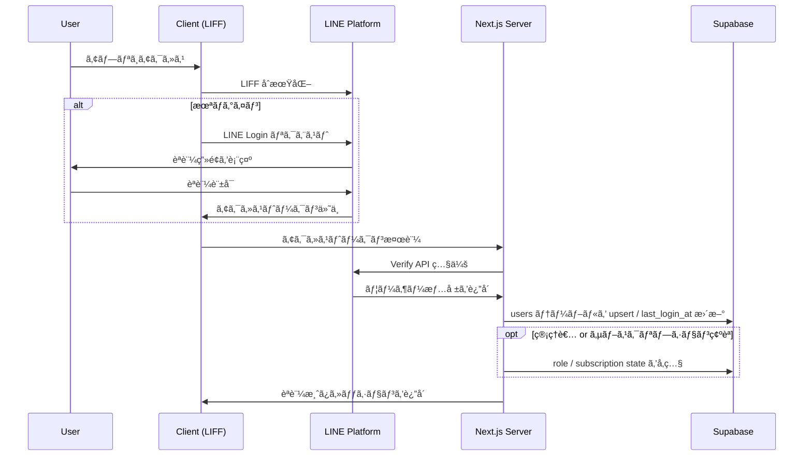
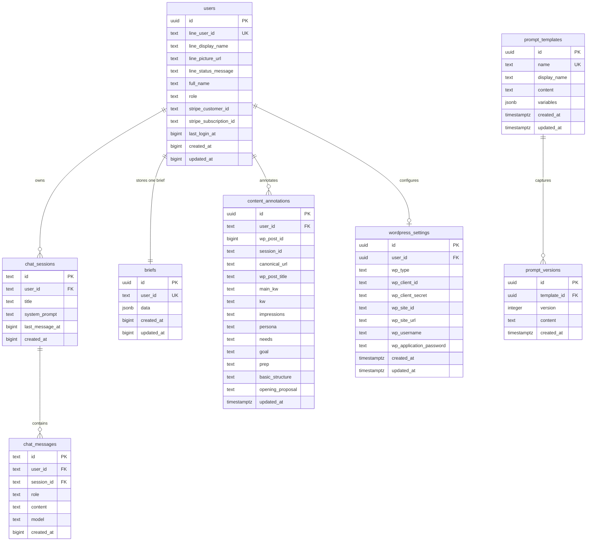

# Industry-Specific MC Training Platform

LINE LIFF を入りå£ã«ã€æ¥­ç•Œç‰¹åŒ–ã®ãƒãƒ¼ã‚±ãƒ†ã‚£ãƒ³ã‚°ã‚³ãƒ³ãƒ†ãƒ³ãƒ„を一括生æˆãƒ»ç®¡ç†ã™ã‚‹ SaaS アプリケーションã§ã™ã€‚Next.js 15 App Router を基盤ã«ã€ãƒãƒ«ãƒãƒ™ãƒ³ãƒ€ãƒ¼ AIã€WordPress 連æºã€Stripe サブスクリプションã€Supabase ã«ã‚ˆã‚‹å …牢ãªãƒ‡ãƒ¼ã‚¿ç®¡ç†ã‚’çµ±åˆã—ã¦ã„ã¾ã™ã€‚

## 🧭 プロダクト概è¦
- LIFF ã§ãƒ­ã‚°ã‚¤ãƒ³ã—ãŸãƒ¦ãƒ¼ã‚¶ãƒ¼å‘ã‘ã«ã€åºƒå‘Šï¼LPï¼ãƒ–ログ制作を支æ´ã™ã‚‹ AI ワークスペースをæä¾›
- Anthropic Claude Sonnet 4.5 㨠OpenAI ã® Fine-tuned モデル `ft:gpt-4.1-nano-2025-04-14:personal::BZeCVPK2` を用途ã«å¿œã˜ã¦åˆ‡ã‚Šæ›¿ãˆ
- WordPress.com / 自社ホスティングをå•ã‚ãªã„投稿å–å¾—ã¨ã€Supabase ã¸ã®ã‚³ãƒ³ãƒ†ãƒ³ãƒ„注釈ä¿å­˜
- Stripe を用ã„ãŸæœ‰æ–™ãƒ—ラン管ç†ã¨ã€ãƒ­ãƒ¼ãƒ«ï¼ã‚µãƒ–スクリプション連動ã«ã‚ˆã‚‹æ©Ÿèƒ½åˆ¶å¾¡
- 管ç†è€…å‘ã‘ã®ãƒ—ロンプトテンプレート編集・ユーザー権é™ç®¡ç† UI を内蔵

## 🚀 主ãªæ©Ÿèƒ½

### LINE LIFF èªè¨¼ã¨ãƒ¦ãƒ¼ã‚¶ãƒ¼ç®¡ç†
- LIFF v2.25 を利用ã—ãŸã‚·ãƒ¼ãƒ ãƒ¬ã‚¹ãª LINE ログインã¨è‡ªå‹•ãƒˆãƒ¼ã‚¯ãƒ³ãƒªãƒ•ãƒ¬ãƒƒã‚·ãƒ¥
- サーãƒãƒ¼ã‚µã‚¤ãƒ‰ã® `authMiddleware` ã§ã‚¢ã‚¯ã‚»ã‚¹ãƒˆãƒ¼ã‚¯ãƒ³æ¤œè¨¼ãƒ»ãƒ­ãƒ¼ãƒ«åˆ¤å®šã‚’一元管ç†
- Supabase `users` テーブルã«ãƒ—ロフィール・サブスクリプション ID・ロール・最終ログインをä¿å­˜

### AI コンテンツ支æ´ãƒ¯ãƒ¼ã‚¯ã‚¹ãƒšãƒ¼ã‚¹
- `app/chat` é…下㮠ChatLayout ã§ã€ã‚»ãƒƒã‚·ãƒ§ãƒ³ç®¡ç†ãƒ»ãƒ¢ãƒ‡ãƒ«é¸æŠãƒ»AI 応答ストリーミングを統åˆ
- `MODEL_CONFIGS` ã«å®šç¾©ã—㟠7 ステップã®ãƒ–ログ作æˆãƒ•ãƒ­ãƒ¼ï¼ˆãƒ‹ãƒ¼ã‚ºæ•´ç†ã€œæœ¬æ–‡ä½œæˆï¼‰ã¨åºƒå‘Šï¼LP テンプレートをæä¾›
- `POST /api/chat/anthropic/stream` ã«ã‚ˆã‚‹ SSE 㧠Claude 応答をリアルタイムæç”»
- セッションサイドãƒãƒ¼ã«æ¤œç´¢ãƒãƒ¼ã‚’追加ã—ã€`search_chat_sessions` RPC（全文検索 + `pg_trgm` é¡ä¼¼æ¤œç´¢ï¼‰ã§ã‚¿ã‚¤ãƒˆãƒ«ã‚„æ­£è¦åŒ–済㿠WordPress URL を横断検索
- ステップæ¯ã®ãƒ—ロンプト変数㸠`content_annotations` 㨠事業者ブリーフ (`briefs`) ã‚’ãƒãƒ¼ã‚¸ã—ã€æ–‡è„ˆã®å†åˆ©ç”¨ã‚’最å°åŒ–

### キャンãƒã‚¹ç·¨é›†ã¨é¸æŠç¯„囲リライト
- TipTap 3 ベース㮠`CanvasPanel` ã« Markdown レンダリングï¼è¦‹å‡ºã—アウトラインï¼ãƒãƒ¼ã‚¸ãƒ§ãƒ³å±¥æ­´ã‚’実装
- `POST /api/chat/canvas/stream` ã§é¸æŠç¯„囲ã¨æŒ‡ç¤ºã‚’é€ä¿¡ã—ã€Claude ã® Tool Use ã«ã‚ˆã‚‹å…¨æ–‡å·®ã—替ãˆã‚’é©ç”¨
- é¸æŠãƒ†ã‚­ã‚¹ãƒˆã®å±¥æ­´ãƒ»ãƒ—レビュー・Web 検索トリガー（Claude ツール `web_search_20250305`）をサãƒãƒ¼ãƒˆ

### WordPress 連æºã¨ã‚³ãƒ³ãƒ†ãƒ³ãƒ„注釈
- WordPress.com OAuth ã¨ã‚»ãƒ«ãƒ•ãƒ›ã‚¹ãƒˆç‰ˆ Application Password ã®ä¸¡å¯¾å¿œï¼ˆ`app/setup/wordpress`）
- `WordPressService` ㌠REST API ã®å€™è£œ URL を試行ã—ã€æŠ•ç¨¿æƒ…報を正è¦åŒ–
- `app/analytics` ã®ä¸€è¦§ã§æŠ•ç¨¿ã¨ Supabase `content_annotations` ã‚’çªãåˆã‚ã›ã€æœªç´ä»˜ã‘ã®æ³¨é‡ˆã‚‚表示
- `AnnotationPanel` ã§ã‚»ãƒƒã‚·ãƒ§ãƒ³å˜ä½ã®ãƒ¡ãƒ¢ãƒ»ã‚­ãƒ¼ãƒ¯ãƒ¼ãƒ‰ãƒ»ãƒšãƒ«ã‚½ãƒŠãƒ»PREP 等をä¿å­˜ã—ã€ãƒ–ログ生æˆæ™‚ã«å†åˆ©ç”¨

### Google Search Console 連æº
- `/setup/gsc` 㧠OAuth èªè¨¼çŠ¶æ…‹ãƒ»æ¥ç¶šã‚¢ã‚«ã‚¦ãƒ³ãƒˆãƒ»ãƒ—ロパティをå¯è¦–化ã—ã€ãƒ—ロパティé¸æŠã‚„連æºè§£é™¤ã‚’実行
- `app/api/gsc/oauth/*` ㌠Google OAuth 2.0 ã®é–‹å§‹ï¼ã‚³ãƒ¼ãƒ«ãƒãƒƒã‚¯ã«å¯¾å¿œã—ã€Supabase `gsc_credentials` テーブルã¸ãƒªãƒ•ãƒ¬ãƒƒã‚·ãƒ¥ãƒˆãƒ¼ã‚¯ãƒ³ã‚’ä¿å­˜
- `/api/gsc/status`, `/api/gsc/properties`, `/api/gsc/property`, `/api/gsc/disconnect` ã§é€£æºçŠ¶æ…‹ã®ç¢ºèªãƒ»ãƒ—ロパティå–得・é¸æŠæ›´æ–°ãƒ»æ¥ç¶šè§£é™¤ã‚’æä¾›
- å–å¾—ã—㟠Search Console 指標ã¯ä»Šå¾Œ WordPress 投稿ã®åˆ†æビューã¨çµ±åˆã•ã‚Œã‚‹äºˆå®šï¼ˆ`SetupDashboard` ã‹ã‚‰é€²å…¥ï¼‰

### サブスクリプションã¨æ¨©é™
- Stripe v17.7 㧠Checkout / Billing Portal / Subscription 状態確èªã‚’実装（`SubscriptionService`）
- `SubscriptionService` ã¨ã‚«ã‚¹ã‚¿ãƒ ãƒ•ãƒƒã‚¯ `useSubscriptionStatus` 㧠UI å´ã‹ã‚‰æœ‰åŠ¹ãƒ—ランを判定
- `authMiddleware` ㌠`requiresSubscription` ã‚’è¿”ã—ã€æœ‰æ–™æ©Ÿèƒ½ã¸ã‚¢ã‚¯ã‚»ã‚¹åˆ¶å¾¡ã‚’é©ç”¨
- ユーザー権é™ï¼ˆ`trial` / `paid` / `admin` / `unavailable`）を Supabase å´ã§ç®¡ç†ã—ã€LIFF ログイン時ã«è‡ªå‹•åŒæœŸï¼ˆ`trial` ã¯ãƒãƒ£ãƒƒãƒˆé€ä¿¡ãŒ1æ—¥3å›ã¾ã§ã€`paid` ã¯ç„¡åˆ¶é™ï¼‰

### 管ç†è€…ダッシュボード
- `/admin` ã§ãƒ—ロンプトテンプレートã€ãƒ¦ãƒ¼ã‚¶ãƒ¼æƒ…å ±ã®ç®¡ç† UI ã‚’æä¾›
- `/admin/prompts` ã‹ã‚‰ãƒ†ãƒ³ãƒ—レート編集ã¨ãƒãƒ¼ã‚¸ãƒ§ãƒ³ä¿å­˜ã€æš—黙パラメータ（content 系変数）説æ˜ã‚’表示
- `/admin/users` ã§ã¯ãƒ­ãƒ¼ãƒ«åˆ‡ã‚Šæ›¿ãˆå¾Œã« `POST /api/auth/clear-cache` を呼ã³å‡ºã—ã€ã‚­ãƒ£ãƒƒã‚·ãƒ¥ã‚’å³æ™‚無効化

### 事業者情報ブリーフ
- `/business-info` ã§ã‚µãƒ¼ãƒ“ス概è¦ã‚„ 5W2Hã€æ±ºæ¸ˆæ–¹æ³•ãªã©ã‚’入力ã—ã€`briefs` テーブル㫠JSON ã¨ã—ã¦ä¿å­˜
- ブリーフã¯ãƒ—ロンプトテンプレートã®å¤‰æ•°ã¸æµç”¨ã•ã‚Œã€åºƒå‘Šæ–‡ã‚„ LP ã®ã‚³ãƒ³ãƒ†ã‚­ã‚¹ãƒˆã‚’自動補完

### セットアップå°ç·š
- `/setup/wordpress` 㧠WordPress 連æºã®åˆæœŸè¨­å®šã‚’案内
- `/setup/gsc` 㧠Google Search Console OAuth 連æºã¨ãƒ—ロパティé¸æŠã‚’管ç†
- `/subscription` ã§ãƒ—ラン購入ã€`/analytics` 㧠WordPress 投稿ã¨æ³¨é‡ˆã‚’ç…§åˆ

## ğŸ—ï¸ ã‚·ã‚¹ãƒ†ãƒ ã‚¢ãƒ¼ã‚­ãƒ†ã‚¯ãƒãƒ£


```mermaid
graph TB
  subgraph Client["Next.js 15 (App Router)"]
    LIFFProvider["LIFF Provider & Auth Hooks"]
    ChatUI["Chat Layout / Session Sidebar"]
    Canvas["CanvasPanel (TipTap)"]
    Annotation["AnnotationPanel"]
    Analytics["Analytics Table"]
    BusinessForm["Business Info Form"]
    AdminUI["Admin Dashboards"]
  end

  subgraph Server["Next.js Route Handlers & Server Actions"]
    AuthMiddleware["authMiddleware"]
    ChatStream["/api/chat/anthropic/stream"]
    CanvasStream["/api/chat/canvas/stream"]
    WordPressAPI["/api/wordpress/*"]
    AdminAPI["/api/admin/*"]
    SubscriptionAPI["/api/refresh, /api/user/*"]
    ServerActions["server/handler/actions/*"]
  end

  subgraph Data["Supabase PostgreSQL"]
    UsersTable["users"]
    SessionsTable["chat_sessions"]
    MessagesTable["chat_messages"]
    BriefsTable["briefs"]
    AnnotationsTable["content_annotations"]
    PromptsTable["prompt_templates"]
    VersionsTable["prompt_versions"]
    WordpressTable["wordpress_settings"]
  end

  subgraph External["External Services"]
    LINE["LINE Platform (LIFF / Verify)"]
    Anthropic["Anthropic Claude"]
    OpenAI["OpenAI GPT-4.1 nano FT"]
    Stripe["Stripe Subscriptions"]
    WordPress["WordPress REST API"]
  end

  LIFFProvider --> AuthMiddleware
  ChatUI --> ChatStream
  Canvas --> CanvasStream
  Annotation --> ServerActions
  Analytics --> WordPressAPI
  BusinessForm --> ServerActions
  AdminUI --> AdminAPI

  ServerActions --> UsersTable
  ServerActions --> BriefsTable
  ServerActions --> AnnotationsTable
  ChatStream --> MessagesTable
  ChatStream --> SessionsTable
  WordPressAPI --> WordpressTable
  AdminAPI --> PromptsTable
  AdminAPI --> VersionsTable

  AuthMiddleware --> LINE
  ChatStream --> Anthropic
  CanvasStream --> Anthropic
  ChatStream --> OpenAI
  SubscriptionAPI --> Stripe
  WordPressAPI --> WordPress
```

## 🔄 èªè¨¼ãƒ•ãƒ­ãƒ¼


```mermaid
sequenceDiagram
    participant U as User
    participant C as Client (LIFF)
    participant L as LINE Platform
    participant S as Next.js Server
    participant DB as Supabase

    U->>C: アプリã¸ã‚¢ã‚¯ã‚»ã‚¹
    C->>L: LIFF åˆæœŸåŒ–
    alt 未ログイン
        C->>L: LINE Login リクエスト
        L->>U: èªè¨¼ç”»é¢ã‚’表示
        U->>L: èªè¨¼è¨±å¯
        L->>C: アクセストークン付ä¸
    end
    C->>S: アクセストークン検証
    S->>L: Verify API 照会
    L->>S: ユーザー情報を返å´
    S->>DB: users テーブルを upsert / last_login_at 更新
    opt 管ç†è€… or サブスクリプション確èª
        S->>DB: role / subscription state ã‚’å‚ç…§
    end
    S->>C: èªè¨¼æ¸ˆã¿ã‚»ãƒƒã‚·ãƒ§ãƒ³ã‚’è¿”å´
```

## ğŸ› ï¸ æŠ€è¡“ã‚¹ã‚¿ãƒƒã‚¯
- **フロントエンド**: Next.js 15.4.7 (App Router), React 19, TypeScript 5.9, Tailwind CSS v4, Radix UI, shadcn/ui, lucide-react
- **エディタ**: TipTap 3.7.x + lowlight ãƒã‚¤ãƒ©ã‚¤ãƒˆã€ã‚«ã‚¹ã‚¿ãƒ  UI コンãƒãƒ¼ãƒãƒ³ãƒˆç¾¤
- **ãƒãƒƒã‚¯ã‚¨ãƒ³ãƒ‰**: Next.js Route Handlers & Server Actions, Supabase JS 2.75 (PostgreSQL + RLS)
- **AI**: Anthropic Claude Sonnet 4.5（SSE ストリーミング）, OpenAI Chat Completions（Fine-tuned モデルå«ã‚€ï¼‰
- **èªè¨¼**: LINE LIFF 2.25.1, Vercel Edge Cookie ストア, 独自ミドルウェアã«ã‚ˆã‚‹ãƒ­ãƒ¼ãƒ«åˆ¤å®š
- **決済**: Stripe 17.7（Checkout / Billing Portal / Subscription API）
- **開発ツール**: TypeScript strict, ESLint 9, Prettier 3, tsc-watch, Husky, ngrok

## 📊 データベーススキーãƒï¼ˆä¸»è¦ãƒ†ãƒ¼ãƒ–ル）


```mermaid
erDiagram
    users {
        uuid id PK
        text line_user_id UK
        text line_display_name
        text line_picture_url
        text line_status_message
        text full_name
        text role
        text stripe_customer_id
        text stripe_subscription_id
        bigint last_login_at
        bigint created_at
        bigint updated_at
    }

    chat_sessions {
        text id PK
        text user_id FK
        text title
        text system_prompt
        bigint last_message_at
        bigint created_at
    }

    chat_messages {
        text id PK
        text user_id FK
        text session_id FK
        text role
        text content
        text model
        bigint created_at
    }

    briefs {
        uuid id PK
        text user_id UK
        jsonb data
        bigint created_at
        bigint updated_at
    }

    content_annotations {
        uuid id PK
        text user_id FK
        bigint wp_post_id
        text session_id
        text canonical_url
        text wp_post_title
        text main_kw
        text kw
        text impressions
        text persona
        text needs
        text goal
        text prep
        text basic_structure
        text opening_proposal
        timestamptz updated_at
    }

    wordpress_settings {
        uuid id PK
        uuid user_id FK
        text wp_type
        text wp_client_id
        text wp_client_secret
        text wp_site_id
        text wp_site_url
        text wp_username
        text wp_application_password
        timestamptz created_at
        timestamptz updated_at
    }

    prompt_templates {
        uuid id PK
        text name UK
        text display_name
        text content
        jsonb variables
        timestamptz created_at
        timestamptz updated_at
    }

    prompt_versions {
        uuid id PK
        uuid template_id FK
        integer version
        text content
        timestamptz created_at
    }

    users ||--o{ chat_sessions : owns
    chat_sessions ||--o{ chat_messages : contains
    users ||--|| briefs : "stores one brief"
    users ||--o{ content_annotations : annotates
    users ||--o| wordpress_settings : configures
    prompt_templates ||--o{ prompt_versions : captures
```

## 📋 環境変数（19 項目）

`src/env.ts` ã§å³æ ¼ã«ãƒãƒªãƒ‡ãƒ¼ã‚·ãƒ§ãƒ³ã•ã‚Œã‚‹ã‚µãƒ¼ãƒãƒ¼ï¼ã‚¯ãƒ©ã‚¤ã‚¢ãƒ³ãƒˆç’°å¢ƒå¤‰æ•°ã§ã™ã€‚`.env.local` を手動ã§ç”¨æ„ã—ã¦ãã ã•ã„。

| 種別 | 変数å | å¿…é ˆ | 用途 |
| ---- | ------ | ---- | ---- |
| Server | `DBPASS` | ✅ | Supabase ã‹ã‚‰ã‚¢ã‚¯ã‚»ã‚¹ã•ã‚Œã‚‹ Postgres password |
| Server | `SUPABASE_SERVICE_ROLE` | ✅ | サーãƒãƒ¼ã‚µã‚¤ãƒ‰ç‰¹æ¨©æ“作用 Service Role キー |
| Server | `STRIPE_ENABLED` | ä»»æ„ | Stripe 機能ã®æœ‰åŠ¹åŒ–フラグ（`true` / `false`） |
| Server | `STRIPE_SECRET_KEY` | ✅（Stripe 無効ã§ã‚‚ダミー値必須） | Stripe API 呼ã³å‡ºã—用シークレット |
| Server | `STRIPE_PRICE_ID` | ✅（Stripe 無効ã§ã‚‚ダミー値必須） | サブスクリプションã§ä½¿ç”¨ã™ã‚‹ Price ID |
| Server | `OPENAI_API_KEY` | ✅ | Fine-tuned モデル利用時㮠OpenAI キー |
| Server | `ANTHROPIC_API_KEY` | ✅ | Claude ストリーミング用 API キー |
| Server | `LINE_CHANNEL_ID` | ✅ | LINE Login 用ãƒãƒ£ãƒãƒ« ID |
| Server | `LINE_CHANNEL_SECRET` | ✅ | LINE Login 用ãƒãƒ£ãƒãƒ«ã‚·ãƒ¼ã‚¯ãƒ¬ãƒƒãƒˆ |
| Server | `GOOGLE_OAUTH_CLIENT_ID` | ä»»æ„（GSC 連æºåˆ©ç”¨æ™‚ã¯å¿…須） | Google Search Console OAuth 用クライアント ID |
| Server | `GOOGLE_OAUTH_CLIENT_SECRET` | ä»»æ„（GSC 連æºåˆ©ç”¨æ™‚ã¯å¿…須） | Google Search Console OAuth 用クライアントシークレット |
| Server | `GOOGLE_SEARCH_CONSOLE_REDIRECT_URI` | ä»»æ„（GSC 連æºåˆ©ç”¨æ™‚ã¯å¿…須） | Google OAuth ã®ãƒªãƒ€ã‚¤ãƒ¬ã‚¯ãƒˆå…ˆï¼ˆ`https://<host>/api/gsc/oauth/callback` ãªã©ï¼‰ |
| Server | `GSC_OAUTH_STATE_COOKIE_NAME` | ä»»æ„ | GSC OAuth state 用 Cookie å（未設定時㯠`gsc_oauth_state`） |
| Client | `NEXT_PUBLIC_LIFF_ID` | ✅ | LIFF アプリ ID |
| Client | `NEXT_PUBLIC_LIFF_CHANNEL_ID` | ✅ | LIFF Channel ID |
| Client | `NEXT_PUBLIC_SUPABASE_URL` | ✅ | Supabase プロジェクト URL |
| Client | `NEXT_PUBLIC_SUPABASE_ANON_KEY` | ✅ | Supabase anon キー |
| Client | `NEXT_PUBLIC_SITE_URL` | ✅ | サイトã®å…¬é–‹ URL |
| Client | `NEXT_PUBLIC_STRIPE_ENABLED` | ä»»æ„ | クライアントå´ã§ã® Stripe 有効化フラグ（未設定時㯠`STRIPE_ENABLED` を継承） |

### 追加ã§åˆ©ç”¨ã§ãã‚‹ä»»æ„設定
- `WORDPRESS_COM_CLIENT_ID`, `WORDPRESS_COM_CLIENT_SECRET`, `WORDPRESS_COM_REDIRECT_URI`: WordPress.com OAuth 連æºã§å¿…é ˆ
- `OAUTH_STATE_COOKIE_NAME`, `OAUTH_TOKEN_COOKIE_NAME`, `COOKIE_SECRET`: WordPress / Google Search Console OAuth ã®ã‚»ã‚­ãƒ¥ã‚¢ãª Cookie 管ç†
- `GOOGLE_OAUTH_CLIENT_ID`, `GOOGLE_OAUTH_CLIENT_SECRET`, `GOOGLE_SEARCH_CONSOLE_REDIRECT_URI`: Google Search Console 連æºã‚’利用ã™ã‚‹å ´åˆã®ã¿è¨­å®š
- `FEATURE_RPC_V2`: `true` ã§æ–°ã—ã„ Supabase RPC 経路を有効化（`FEATURE_FLAGS.USE_RPC_V2`）

## 🚀 セットアップ手順

### å¿…è¦æ¡ä»¶
- Node.js 18 以上
- npm
- Supabase プロジェクト（Service Role キーå–得済ã¿ï¼‰
- LINE Developers アカウント（LIFF & Login 設定）
- Stripe アカウント（サブスクリプション利用時）

### クイックスタート

```bash
git clone <repository-url>
cd industry-specific-mc-training
npm install
# .env.local ã«ä¸Šè¨˜ç’°å¢ƒå¤‰æ•°ã‚’設定
npx supabase db push       # ãƒã‚¤ã‚°ãƒ¬ãƒ¼ã‚·ãƒ§ãƒ³é©ç”¨
npm run dev                # tsc-watch + next dev --turbopack
# LIFF 実機確èªãŒå¿…è¦ãªå ´åˆã¯åˆ¥ã‚¿ãƒ¼ãƒŸãƒŠãƒ«ã§
npm run ngrok
```

### ローカル開発ã®ãƒã‚¤ãƒ³ãƒˆ
- `npm run lint` 㧠ESLint + Next/Tailwind ルールを検証（Husky pre-commit ã§ã‚‚実行）
- `npm run build` → `npm run start` ã§æœ¬ç•ªãƒ“ルドã®å¥å…¨æ€§ã‚’ãƒã‚§ãƒƒã‚¯
- Supabase ã¸ã®å¤‰æ›´ã¯ `supabase/migrations/` ã« SQL を追加ã—ã€ãƒ­ãƒ¼ãƒ«ãƒãƒƒã‚¯æ‰‹é †ã‚’コメントã«æ®‹ã™
- LIFF 連æºã®å‹•ä½œç¢ºèªã¯ ngrok ãªã©ã§ https 公開ã—ãŸä¸Šã§ LINE Developers ã®ã‚³ãƒ¼ãƒ«ãƒãƒƒã‚¯ URL ã‚’æ›´æ–°

## 📠プロジェクト構æˆ

```
├── app/
│   ├── chat/                # AI ãƒãƒ£ãƒƒãƒˆãƒ¯ãƒ¼ã‚¯ã‚¹ãƒšãƒ¼ã‚¹ï¼ˆCanvas / Annotation / Step UI）
│   ├── analytics/           # WordPress 投稿 + 注釈ダッシュボード
│   ├── business-info/       # 事業者情報フォーム（Server Components + Actions）
│   ├── setup/               # WordPress / GSC ç­‰ã®åˆæœŸã‚»ãƒƒãƒˆã‚¢ãƒƒãƒ—å°ç·š
│   ├── subscription/        # サブスクリプション購入ページ
│   ├── login/               # ログインページ
│   ├── unauthorized/        # 未èªå¯ãƒ¦ãƒ¼ã‚¶ãƒ¼å‘ã‘ページ
│   ├── unavailable/         # 利用ä¸å¯ãƒ¦ãƒ¼ã‚¶ãƒ¼å‘ã‘ページ（role ㌠unavailable ã®å ´åˆï¼‰
│   ├── wordpress-import/    # WordPress 記事ã®ä¸€æ‹¬ã‚¤ãƒ³ãƒãƒ¼ãƒˆãƒšãƒ¼ã‚¸
│   ├── admin/               # 管ç†è€…å‘ã‘機能（プロンプト・ユーザー管ç†ï¼‰
│   ├── api/                 # Route Handlers（chat, wordpress, admin, auth, user, line）
│   └── layout.tsx ãªã©      # App Router ルートレイアウト
├── src/
│   ├── components/          # å†åˆ©ç”¨å¯èƒ½ãª UI（shadcn/ui, AnnotationFormFields 等）
│   ├── domain/              # フロントå‘ã‘サービス層（ChatService / SubscriptionService）
│   ├── hooks/               # LIFF / サブスクリプション / UI ユーティリティ
│   ├── lib/                 # 定数・プロンプト管ç†ãƒ»Supabase クライアント生æˆ
│   ├── server/
│   │   ├── handler/actions/ # Server Actions 経由ã®ãƒ“ジãƒã‚¹ãƒ­ã‚¸ãƒƒã‚¯
│   │   ├── middleware/      # èªè¨¼ãƒ»ãƒ­ãƒ¼ãƒ«åˆ¤å®šãƒŸãƒ‰ãƒ«ã‚¦ã‚§ã‚¢
│   │   └── services/        # Stripe / WordPress / Supabase / LLM ãªã©ã®çµ±åˆå±¤
│   └── types/               # 共通å‹å®šç¾©ï¼ˆchat, prompt, annotation, wordpress 等）
├── scripts/                 # ユーティリティスクリプト（DB 統計・Vercel 統計）
├── claudedocs/              # プロジェクト分æレãƒãƒ¼ãƒˆ
├── supabase/migrations/     # データベースãƒã‚¤ã‚°ãƒ¬ãƒ¼ã‚·ãƒ§ãƒ³
└── config files             # eslint.config.mjs, next.config.ts, tailwind/postcss 設定
```

## 🔧 主㪠API エンドãƒã‚¤ãƒ³ãƒˆ

| エンドãƒã‚¤ãƒ³ãƒˆ | メソッド | æ¦‚è¦ | èªè¨¼ |
| -------------- | -------- | ---- | ---- |
| `/api/chat/anthropic/stream` | POST | Claude ã¨ã®ãƒãƒ£ãƒƒãƒˆ SSE ストリーム | `Authorization: Bearer <LIFF>` |
| `/api/chat/canvas/stream` | POST | Canvas 編集リクエスト（é¸æŠç¯„囲差ã—替ãˆï¼‰ | `Authorization: Bearer <LIFF>` |
| `/api/chat/canvas/load-wordpress` | POST | WordPress記事をCanvasã«èª­ã¿è¾¼ã¿ | `Authorization: Bearer <LIFF>` |
| `/api/refresh` | POST | LINE リフレッシュトークンã‹ã‚‰ã‚¢ã‚¯ã‚»ã‚¹ãƒˆãƒ¼ã‚¯ãƒ³å†ç™ºè¡Œ | Cookie (`line_refresh_token`) |
| `/api/user/current` | GET | ログインユーザーã®ãƒ—ロファイル・ロール情報 | Cookie (`line_access_token`) |
| `/api/auth/check-role` | GET | ロールã®ã‚µãƒ¼ãƒãƒ¼æ¤œè¨¼ | Cookie |
| `/api/auth/clear-cache` | POST | Edge キャッシュクリア通知 | ä»»æ„ |
| `/api/auth/line-oauth-init` | GET | LINE OAuth state生æˆã‚¨ãƒ³ãƒ‰ãƒã‚¤ãƒ³ãƒˆ | Cookie |
| `/api/line/callback` | GET | LINE OAuth コールãƒãƒƒã‚¯ | 公開（state ãƒã‚§ãƒƒã‚¯ã‚り） |
| `/api/wordpress/settings` | GET/POST | WordPress 設定ã®å–得・ä¿å­˜ï¼ˆserver action ã¨å…±æœ‰ï¼‰ | Cookie |
| `/api/wordpress/status` | GET | WordPress æ¥ç¶šçŠ¶æ³ã®ç¢ºèª | Cookie |
| `/api/wordpress/posts` | GET | WordPress 投稿一覧ã®å–å¾— | Cookie + WP èªè¨¼ |
| `/api/wordpress/test-connection` | POST | WordPress æ¥ç¶šãƒ†ã‚¹ãƒˆ | Cookie |
| `/api/wordpress/oauth/start` | GET | WordPress.com OAuth リダイレクト開始 | 公開（環境変数必須） |
| `/api/wordpress/oauth/callback` | GET | WordPress.com OAuth コールãƒãƒƒã‚¯ | Cookie |
| `/api/admin/prompts` | GET | プロンプトテンプレート一覧（管ç†è€…専用） | Cookie + admin ロール |
| `/api/admin/prompts/[id]` | POST | テンプレート更新・ãƒãƒ¼ã‚¸ãƒ§ãƒ³ç”Ÿæˆ | Cookie + admin ロール |
| `/api/wordpress/bulk-import-posts` | POST | WordPress 記事ã®ä¸€æ‹¬ã‚¤ãƒ³ãƒãƒ¼ãƒˆ | Bearer + admin ロール |

サーãƒãƒ¼ã‚¢ã‚¯ã‚·ãƒ§ãƒ³ (`src/server/handler/actions/*`) ã§ã¯ã€ãƒ–リーフä¿å­˜ãƒ»WordPress 投稿å–得・注釈 upsert・Stripe セッション作æˆãªã©ã‚’å‹å®‰å…¨ã«å‡¦ç†ã—ã¦ã„ã¾ã™ã€‚

## ğŸ›¡ï¸ ã‚»ã‚­ãƒ¥ãƒªãƒ†ã‚£ã¨é‹ç”¨ã®æ³¨æ„点
- Supabase ã§ã¯ä¸»è¦ãƒ†ãƒ¼ãƒ–ル㫠RLS ã‚’é©ç”¨æ¸ˆã¿ï¼ˆé–‹ç™ºãƒãƒªã‚·ãƒ¼ãŒæ®‹ã‚‹ç®‡æ‰€ã¯é‹ç”¨å‰ã«è¦‹ç›´ã™ï¼‰
- `authMiddleware` ãŒãƒ­ãƒ¼ãƒ«ãƒ»ã‚µãƒ–スクリプションを検証ã—ã€`requiresSubscription` ã§ãƒ—レミアム機能をä¿è­·
- WordPress アプリケーションパスワードや OAuth トークン㯠HTTP-only Cookie ã«ä¿å­˜ï¼ˆæœ¬ç•ªã§ã¯å®‰å…¨ãª KMS / Secrets 管ç†ã‚’æ¨å¥¨ï¼‰
- SSE 㯠20 秒ã”ã¨ã® ping 㨠5 分アイドルタイムアウトã§æ¥ç¶šç¶­æŒã‚’調整
- `AnnotationPanel` ã® URL æ­£è¦åŒ–ã§å†…部ï¼ãƒ­ãƒ¼ã‚«ãƒ«ãƒ›ã‚¹ãƒˆã¸ã®èª¤ç™»éŒ²ã‚’防止

## 📱 デプロイã¨é‹ç”¨
- Vercel を想定（Edge Runtime 㨠Node.js Runtime をルートã”ã¨ã«åˆ‡ã‚Šåˆ†ã‘）
- デプロイå‰ãƒã‚§ãƒƒã‚¯: `npm run lint` → `npm run build`
- 環境変数㯠Vercel Project Settings ã¸å映ã—ã€æœ¬ç•ªã¯ Stripe 本番キー・WordPress 本番サイトã«åˆ‡ã‚Šæ›¿ãˆ
- Supabase ãƒã‚¤ã‚°ãƒ¬ãƒ¼ã‚·ãƒ§ãƒ³ã¯ `npx supabase db push` ã§åŒæœŸã€ãƒ­ãƒ¼ãƒ«ãƒãƒƒã‚¯æ‰‹é †ï¼ˆã‚³ãƒ¡ãƒ³ãƒˆï¼‰ã‚’常ã«æ›´æ–°

### GitHub Actions シークレット設定
週次レãƒãƒ¼ãƒˆç”¨ã®ãƒ¯ãƒ¼ã‚¯ãƒ•ãƒ­ãƒ¼ã§ä½¿ç”¨ã™ã‚‹ã‚·ãƒ¼ã‚¯ãƒ¬ãƒƒãƒˆã‚’ GitHub Repository Settings → Secrets and variables → Actions ã§è¨­å®šã—ã¦ãã ã•ã„。

| シークレットå | 用途 | å¿…é ˆ |
| ------------- | ---- | ---- |
| `CI_WEBHOOK_URL` | CI ビルドçµæœé€šçŸ¥ç”¨ Lark Webhook URL | ä»»æ„ |
| `DB_STATS_WEBHOOK_URL` | データベース統計レãƒãƒ¼ãƒˆç”¨ Lark Webhook URL | ä»»æ„ |
| `VERCEL_STATS_WEBHOOK_URL` | Vercel 統計レãƒãƒ¼ãƒˆç”¨ Lark Webhook URL | ä»»æ„ |
| `VERCEL_TOKEN` | Vercel API アクセストークン（Settings → Tokens ã§ä½œæˆï¼‰ | Vercel レãƒãƒ¼ãƒˆç”¨ |
| `VERCEL_PROJECT_ID` | Vercel プロジェクト ID（`prj_` ã§å§‹ã¾ã‚‹ï¼‰ | Vercel レãƒãƒ¼ãƒˆç”¨ |
| `VERCEL_TEAM_ID` | Vercel ãƒãƒ¼ãƒ  ID（`team_` ã§å§‹ã¾ã‚‹ã€ã‚ªãƒ—ション） | Vercel レãƒãƒ¼ãƒˆç”¨ï¼ˆã‚ªãƒ—ション） |

**Vercel API トークンã®å–得方法:**
1. Vercel Dashboard → Settings → Tokens
2. 「Create Tokenã€ã‚’クリック
3. トークンåを入力ã—ã€ã‚¹ã‚³ãƒ¼ãƒ—を設定（`Full Account` ã¾ãŸã¯ `Project` スコープ）
4. 生æˆã•ã‚ŒãŸãƒˆãƒ¼ã‚¯ãƒ³ã‚’ `VERCEL_TOKEN` シークレットã«è¨­å®š

**Vercel プロジェクト ID ã®å–得方法:**
- Vercel Dashboard → プロジェクト → Settings → General ã®ã€ŒProject IDã€ã‚’確èª
- ã¾ãŸã¯ã€`.vercel/project.json` ファイル㮠`projectId` フィールドを確èª

## 🤠コントリビューション
1. フィーãƒãƒ£ãƒ¼ãƒ–ランãƒã‚’作æˆ
2. 変更を実装ã—ã€`npm run lint` ã®çµæœã‚’確èª
3. å¿…è¦ã«å¿œã˜ã¦ Supabase ãƒã‚¤ã‚°ãƒ¬ãƒ¼ã‚·ãƒ§ãƒ³ã‚’追加ã—ã€ãƒ­ãƒ¼ãƒ«ãƒãƒƒã‚¯æ‰‹é †ã‚’æ˜è¨˜
4. 変更内容を簡潔ã«ã¾ã¨ã‚㟠PR を作æˆï¼ˆãƒ¦ãƒ¼ã‚¶ãƒ¼å½±éŸ¿ãƒ»ç’°å¢ƒå¤‰æ•°ãƒ»ã‚¹ã‚¯ãƒªãƒ¼ãƒ³ã‚·ãƒ§ãƒƒãƒˆã‚’添付）

## 📄 ライセンス

ã“ã®ãƒªãƒã‚¸ãƒˆãƒªã¯ç§çš„利用目的ã§é‹ç”¨ã•ã‚Œã¦ã„ã¾ã™ã€‚å†é…布や商用利用ã¯äº‹å‰ç›¸è«‡ã®ã†ãˆã§ãŠé¡˜ã„ã„ãŸã—ã¾ã™ã€‚
