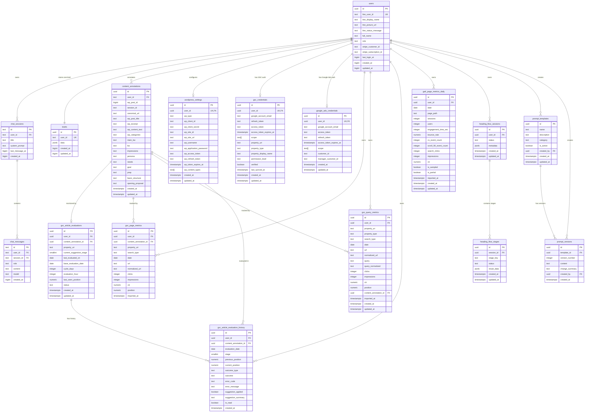

# GrowMate - AIマーケティング支援プラットフォーム

LINE LIFF を入り口に、業界特化のマーケティングコンテンツを一括生成・管理する SaaS アプリケーションです。Next.js 15 App Router を基盤に、マルチベンダー AI、WordPress 連携、Stripe サブスクリプション、Supabase による堅牢なデータ管理を統合しています。

## 🧭 プロダクト概要

- LIFF でログインしたユーザー向けに、広告／LP／ブログ制作を支援する AI ワークスペースを提供
- Anthropic Claude Sonnet 4.5 と OpenAI の Fine-tuned モデル `ft:gpt-4.1-nano-2025-04-14:personal::BZeCVPK2` を用途に応じて切り替え
- WordPress.com / 自社ホスティングを問わない投稿取得と、Supabase へのコンテンツ注釈保存
- Stripe を用いた有料プラン管理と、ロール／サブスクリプション連動による機能制御
- 管理者向けのプロンプトテンプレート編集・ユーザー権限管理 UI を内蔵

## 🚀 主な機能

### LINE LIFF 認証とユーザー管理

- LIFF v2.25 を利用したシームレスな LINE ログインと自動トークンリフレッシュ
- サーバーサイドの `authMiddleware` でアクセストークン検証・ロール判定を一元管理
- Supabase `users` テーブルにプロフィール・サブスクリプション ID・ロール・最終ログインを保存

### スタッフ招待と閲覧

- 招待リンクの発行・削除・状態取得を `src/hooks/useEmployeeInvitation.ts` と `src/components/InviteDialog.tsx` で管理
- API は `app/api/employee/route.ts` と `app/api/employee/invite/*` が担当し、招待リンクは `app/invite/[token]/page.tsx` で受け付け
- オーナーのスタッフ閲覧は `app/page.tsx` の閲覧モード切替（Cookie付与）と `src/server/middleware/auth.middleware.ts` の判定で実現

### AI コンテンツ支援ワークスペース

- `app/chat` 配下の ChatLayout で、セッション管理・モデル選択・AI 応答ストリーミングを統合
- `MODEL_CONFIGS` に定義した 7 ステップのブログ作成フロー（ニーズ整理〜本文作成）と広告／LP テンプレートを提供
- `POST /api/chat/anthropic/stream` による SSE で Claude 応答をリアルタイム描画
- セッションサイドバーに検索バーを追加し、`search_chat_sessions` RPC（全文検索 + `pg_trgm` 類似検索）でタイトルや正規化済み WordPress URL を横断検索
- `search_chat_sessions` は `get_accessible_user_ids` によるオーナー/スタッフ共有アクセスを考慮
- ステップ毎のプロンプト変数へ `content_annotations` と 事業者ブリーフ (`briefs`) をマージし、文脈の再利用を最小化

### キャンバス編集と選択範囲リライト

- TipTap 3 ベースの `CanvasPanel` に Markdown レンダリング／見出しアウトライン／バージョン履歴を実装
- `POST /api/chat/canvas/stream` で選択範囲と指示を送信し、Claude の Tool Use による全文差し替えを適用
- 選択テキストの履歴・プレビュー・Web 検索トリガー（Claude ツール `web_search_20250305`）をサポート

### WordPress 連携とコンテンツ注釈

- WordPress.com OAuth とセルフホスト版 Application Password の両対応（`app/setup/wordpress`）
- `WordPressService` が REST API の候補 URL を試行し、投稿情報を正規化
- `app/analytics` の一覧で投稿と Supabase `content_annotations` を突き合わせ、未紐付けの注釈も表示
- `AnnotationPanel` でセッション単位のメモ・キーワード・ペルソナ・PREP 等を保存し、ブログ生成時に再利用

### Google Search Console 連携

- `/setup/gsc` で OAuth 認証状態・接続アカウント・プロパティを可視化し、プロパティ選択や連携解除を実行
- `app/api/gsc/oauth/*` が Google OAuth 2.0 の開始／コールバックに対応し、Supabase `gsc_credentials` テーブルへリフレッシュトークンを保存
- GSC連携（状態確認・プロパティ取得・選択更新・接続解除）はサーバーアクション経由で処理（`src/components/GscSetupClient.tsx` / `src/server/actions/gscSetup.actions.ts` / `src/server/actions/gscDashboard.actions.ts` など）
- Search Console 日次指標は `gsc_page_metrics`、クエリ指標は `gsc_query_metrics` に保存し、WordPress 注釈 (`content_annotations`) と 1:N で紐付け可能（normalized_url でマッチング）。
- GSC インポートは 30 日単位で自動分割し、クエリ指標は 1,000 行 × 10 ページ = 最大 10,000 行を上限として取得。
- 記事ごとの順位評価と改善提案ステップを `gsc_article_evaluations` / `gsc_article_evaluation_history` で管理し、デフォルト30日間隔で「タイトル→書き出し→本文→ペルソナ」の順にエスカレーション。改善が確認できたらステージをリセット。
- 評価間隔は30日固定（将来のユーザー別設定拡張を見込んでサーバー側で取得関数を用意）。

### Google Ads 連携

- `/setup/google-ads` で OAuth 認証状態・接続アカウント・アカウント選択を管理（現在は管理者のみ利用可能）
- `app/api/google-ads/oauth/*` が Google OAuth 2.0 の開始／コールバックに対応し、Supabase `google_ads_credentials` テーブルへリフレッシュトークンを保存
- MCC（My Client Center）アカウントでログインした場合、配下のアカウント一覧を取得し、ユーザーが選択可能
- アカウントが1つの場合は自動的に選択、複数の場合は選択画面を表示
- 選択されたアカウントID（`customer_id`）は `google_ads_credentials` テーブルに保存され、今後のAPI呼び出しで使用
- Google Ads API の開発者トークン（`GOOGLE_ADS_DEVELOPER_TOKEN`）が必要（MCCアカウントの管理者が発行）

### サブスクリプションと権限

- Stripe v17.7 で Checkout / Billing Portal / Subscription 状態確認を実装（`SubscriptionService`）
- `SubscriptionService` とカスタムフック `useSubscriptionStatus` で UI 側から有効プランを判定
- `authMiddleware` が `requiresSubscription` を返し、有料機能へアクセス制御を適用
- ユーザー権限（`trial` / `paid` / `admin` / `unavailable`）を Supabase 側で管理し、LIFF ログイン時に自動同期（`trial` はチャット送信が1日3回まで、`paid` は無制限）
- オーナー/スタッフ共有アクセスでは、オーナーは読み取り中心の権限、スタッフはオーナーの参照を許可
- `role='owner'` の能力定義: 閲覧（可）/ 一般的な編集・保存（不可）/ 認証フロー（可）/ 一括インポート（WordPress・Google Search Console のみ可）
- 一括インポートの実行可否は `canRunBulkImport` に準拠（許可: `owner` / `paid(owner)` / `admin` / `trial`、拒否: `paid(staff)` / `unavailable` / `null`）

### 管理者ダッシュボード

- `/admin` でプロンプトテンプレート、ユーザー情報の管理 UI を提供
- `/admin/prompts` からテンプレート編集とバージョン保存、暗黙パラメータ（content 系変数）説明を表示
- `/admin/users` ではロール切り替え後に `POST /api/auth/clear-cache` を呼び出し、キャッシュを即時無効化

### 事業者情報ブリーフ

- `/business-info` でサービス概要や 5W2H、決済方法などを入力し、`briefs` テーブルに JSON として保存
- ブリーフはプロンプトテンプレートの変数へ流用され、広告文や LP のコンテキストを自動補完

### セットアップ導線

- `/setup/wordpress` で WordPress 連携の初期設定を案内
- `/setup/gsc` で Google Search Console OAuth 連携とプロパティ選択を管理
- `/setup/google-ads` で Google Ads OAuth 連携とアカウント選択を管理（管理者のみ）
- `/analytics` で WordPress 投稿と注釈を照合

## 🏗️ システムアーキテクチャ

```mermaid
graph TB
  subgraph Client["Next.js 15 (App Router)"]
    LIFFProvider["LIFF Provider & Auth Hooks"]
    ChatUI["Chat Layout / Session Sidebar"]
    Canvas["CanvasPanel (TipTap)"]
    Annotation["AnnotationPanel"]
    Analytics["Analytics Table"]
    BusinessForm["Business Info Form"]
    AdminUI["Admin Dashboards"]
    GscSetup["GSC Setup Dashboard"]
    GscDashboard["GSC Analytics Dashboard"]
    Ga4Dashboard["GA4 Analytics Dashboard"]
  end

  subgraph Server["Next.js Route Handlers & Server Actions"]
    AuthMiddleware["authMiddleware"]
    ChatStream["/api/chat/anthropic/stream"]
    CanvasStream["/api/chat/canvas/stream"]
    WordPressAPI["/api/wordpress/*"]
    AdminAPI["/api/admin/*"]
    SubscriptionAPI["/api/refresh, /api/user/*"]
    GscAPI["/api/gsc/*"]
    Ga4API["/api/ga4/*"]
    GscCron["/api/cron/gsc-evaluate"]
    ServerActions["server/actions/*"]
  end

  subgraph Data["Supabase PostgreSQL"]
    UsersTable["users"]
    SessionsTable["chat_sessions"]
    MessagesTable["chat_messages"]
    BriefsTable["briefs"]
    AnnotationsTable["content_annotations"]
    PromptsTable["prompt_templates"]
    VersionsTable["prompt_versions"]
    WordpressTable["wordpress_settings"]
    GscCredentials["gsc_credentials"]
    GscPageMetrics["gsc_page_metrics"]
    GscQueryMetrics["gsc_query_metrics"]
    GscEvaluations["gsc_article_evaluations"]
    GscHistory["gsc_article_evaluation_history"]
  end

  subgraph External["External Services"]
    LINE["LINE Platform (LIFF / Verify)"]
    Anthropic["Anthropic Claude"]
    OpenAI["OpenAI GPT-4.1 nano FT"]
    Stripe["Stripe Subscriptions"]
    WordPress["WordPress REST API"]
    GSC["Google Search Console API"]
    GA4["Google Analytics 4 API"]
  end

  LIFFProvider --> AuthMiddleware
  ChatUI --> ChatStream
  Canvas --> CanvasStream
  Annotation --> ServerActions
  Analytics --> WordPressAPI
  BusinessForm --> ServerActions
  AdminUI --> ServerActions
  GscSetup --> GscAPI
  GscDashboard --> GscAPI
  Ga4Dashboard --> Ga4API

  ServerActions --> UsersTable
  ServerActions --> BriefsTable
  ServerActions --> AnnotationsTable
  ChatStream --> MessagesTable
  ChatStream --> SessionsTable
  WordPressAPI --> WordpressTable
  AdminAPI --> PromptsTable
  AdminAPI --> VersionsTable
  GscAPI --> GscCredentials
  GscAPI --> GscPageMetrics
  GscAPI --> GscQueryMetrics
  GscAPI --> GscEvaluations
  GscCron --> GscEvaluations
  GscCron --> GscHistory

  AuthMiddleware --> LINE
  ChatStream --> Anthropic
  CanvasStream --> Anthropic
  ChatStream --> OpenAI
  SubscriptionAPI --> Stripe
  WordPressAPI --> WordPress
  GscAPI --> GSC
  Ga4API --> GA4
  GscCron --> GSC
```



## 🔄 認証フロー

### 1. LINE LIFF 認証フロー（基本認証）

**対象**: 全ユーザー
**目的**: アプリへの基本認証
**保存先**: `users` テーブル



### 2. WordPress OAuth 認証フロー

**対象**: 管理者のみ
**目的**: WordPress.com サイトとの連携（投稿取得・同期）
**保存先**: `wordpress_settings` テーブル
**必要な環境変数**: `WORDPRESS_COM_CLIENT_ID`, `WORDPRESS_COM_CLIENT_SECRET`, `WORDPRESS_COM_REDIRECT_URI`, `COOKIE_SECRET`



### 3. Google Search Console OAuth 認証フロー

**対象**: 全ユーザー
**目的**: Google Search Console データの取得・記事評価
**保存先**: `gsc_credentials` テーブル
**必要な環境変数**: `GOOGLE_OAUTH_CLIENT_ID`, `GOOGLE_OAUTH_CLIENT_SECRET`, `GOOGLE_SEARCH_CONSOLE_REDIRECT_URI`, `COOKIE_SECRET`



## 🛠️ 技術スタック

### フロントエンド

- **フレームワーク**: Next.js 15.5.12 (App Router), React 19.2.3, TypeScript 5.9.3
- **スタイリング**: Tailwind CSS v4, Radix UI, shadcn/ui, lucide-react, tw-animate-css
- **テーマ**: next-themes 0.4.6 (ダークモード対応)
- **エディタ**: TipTap 3.7.2 + lowlight 3.3.0 (シンタックスハイライト)
- **グラフ**: Recharts 3.5.0
- **通知**: Sonner 2.0.7 (Toast)
- **Markdown**: react-markdown 10.1.0

### バックエンド

- **API**: Next.js Route Handlers & Server Actions
- **データベース**: Supabase JS 2.75.0 (PostgreSQL + Row Level Security)
- **バリデーション**: Zod 4.1.12
- **ランタイム**: Node.js（LTS 推奨）

### AI・LLM

- **Anthropic**: Claude Sonnet 4.5 (SSE ストリーミング)
- **OpenAI**: GPT-4.1 nano (Fine-tuned モデル含む)

### 認証

- **LINE**: LIFF v2.25.1
- **OAuth 2.0**: WordPress.com, Google (Search Console, Google Ads)
- **セッション管理**: Vercel Edge Cookie ストア
- **アクセス制御**: 独自ミドルウェアによるロール判定

### 決済

- **Stripe**: 17.7.0 (Checkout, Billing Portal, Subscription API)

### 外部連携

- **WordPress REST API**: 投稿取得・同期
- **Google Search Console API**: 検索パフォーマンスデータ取得・記事評価
- **Google Analytics 4 API**: アナリティクスデータ取得
- **Google Ads API**: 広告パフォーマンスデータ取得（MCCアカウント対応）

### 開発ツール

- **型チェック**: TypeScript strict mode
- **リンター**: ESLint 9, eslint-config-next
- **フォーマッター**: Prettier 3.5.3
- **ビルド**: Turbopack（開発）/ Next.js build
- **依存関係解析**: Knip 5.77.1
- **ローカル公開**: ngrok (日本リージョン)

## 📊 データベーススキーマ（主要テーブル）



## 📋 環境変数（24 項目: 必須12項目、オプション12項目）

`src/env.ts` で厳格にバリデーションされる環境変数に加え、Route Handler で直接参照する `CRON_SECRET` を含みます。`.env.local` を手動で用意してください。

| 種別   | 変数名                               | 必須                                | 用途                                                                                        |
| ------ | ------------------------------------ | ----------------------------------- | ------------------------------------------------------------------------------------------- |
| Server | `SUPABASE_SERVICE_ROLE`              | ✅                                  | サーバーサイド特権操作用 Service Role キー                                                  |
| Server | `STRIPE_ENABLED`                     | 任意                                | Stripe 機能の有効化フラグ（`true` / `false`）                                               |
| Server | `STRIPE_SECRET_KEY`                  | ✅（Stripe 無効でもダミー値必須）   | Stripe API 呼び出し用シークレット                                                           |
| Server | `STRIPE_PRICE_ID`                    | ✅（Stripe 無効でもダミー値必須）   | サブスクリプションで使用する Price ID                                                       |
| Server | `OPENAI_API_KEY`                     | ✅                                  | Fine-tuned モデル利用時の OpenAI キー                                                       |
| Server | `ANTHROPIC_API_KEY`                  | ✅                                  | Claude ストリーミング用 API キー                                                            |
| Server | `LINE_CHANNEL_ID`                    | ✅                                  | LINE Login 用チャネル ID                                                                    |
| Server | `LINE_CHANNEL_SECRET`                | ✅                                  | LINE Login 用チャネルシークレット                                                           |
| Server | `GOOGLE_OAUTH_CLIENT_ID`             | 任意（GSC/GA4 連携利用時は必須）    | Google Search Console / GA4 OAuth 用クライアント ID                                         |
| Server | `GOOGLE_OAUTH_CLIENT_SECRET`         | 任意（GSC/GA4 連携利用時は必須）    | Google Search Console / GA4 OAuth 用クライアントシークレット                                |
| Server | `GOOGLE_SEARCH_CONSOLE_REDIRECT_URI` | 任意（GSC/GA4 連携利用時は必須）    | Google OAuth のリダイレクト先（`https://<host>/api/gsc/oauth/callback` など）               |
| Server | `GOOGLE_ADS_REDIRECT_URI`            | 任意（Google Ads 連携利用時は必須） | Google Ads OAuth のリダイレクト先（`https://<host>/api/google-ads/oauth/callback` など）    |
| Server | `GOOGLE_ADS_DEVELOPER_TOKEN`         | 任意（Google Ads 連携利用時は必須） | Google Ads API 開発者トークン（MCCアカウントの管理者が発行）                                |
| Server | `WORDPRESS_COM_CLIENT_ID`            | 任意（WordPress 連携利用時は必須）  | WordPress.com OAuth 用クライアント ID                                                       |
| Server | `WORDPRESS_COM_CLIENT_SECRET`        | 任意（WordPress 連携利用時は必須）  | WordPress.com OAuth 用クライアントシークレット                                              |
| Server | `WORDPRESS_COM_REDIRECT_URI`         | 任意（WordPress 連携利用時は必須）  | WordPress OAuth のリダイレクト先（`https://<host>/api/wordpress/oauth/callback` など）      |
| Server | `COOKIE_SECRET`                      | 任意                                | WordPress / Google Search Console / Google Ads OAuth のセキュアな Cookie 管理用シークレット |
| Server | `CRON_SECRET`                        | 任意（GSC評価バッチ利用時は必須）   | `/api/cron/gsc-evaluate` の Bearer 認証用シークレット                                       |
| Client | `NEXT_PUBLIC_LIFF_ID`                | ✅                                  | LIFF アプリ ID                                                                              |
| Client | `NEXT_PUBLIC_LIFF_CHANNEL_ID`        | ✅                                  | LIFF Channel ID                                                                             |
| Client | `NEXT_PUBLIC_SUPABASE_URL`           | ✅                                  | Supabase プロジェクト URL                                                                   |
| Client | `NEXT_PUBLIC_SUPABASE_ANON_KEY`      | ✅                                  | Supabase anon キー                                                                          |
| Client | `NEXT_PUBLIC_SITE_URL`               | ✅                                  | サイトの公開 URL                                                                            |
| Client | `NEXT_PUBLIC_STRIPE_ENABLED`         | 任意                                | クライアント側での Stripe 有効化フラグ（未設定時は `STRIPE_ENABLED` を継承）                |

## 🚀 セットアップ手順

### 必要条件

- **Node.js**: LTS 推奨
- **npm**: 9 以上
- **Supabase 接続情報**（管理者から取得）
- **LINE 接続情報**（管理者から取得）
- **Stripe アカウント**（サブスクリプション利用時）
- **ngrok アカウント**（LIFF ローカルテスト用、必須）

### 1. リポジトリのクローンと依存関係のインストール

```bash
# リポジトリをクローン
git clone <repository-url>
cd industry-specific-mc-training

# 依存関係をインストール
npm install
```

### 2. Supabase のセットアップ

#### 2.1 既存プロジェクトの接続情報を取得

**重要**: このプロジェクトは本番環境と開発環境でSupabaseプロジェクトを共有しています。新規にプロジェクトを作成する必要はありません。

1. プロジェクト管理者から以下の接続情報を取得してください：
   - **Project URL** (`https://xxxxx.supabase.co`)
   - **anon public key**
   - **service_role key**（秘密情報、サーバーサイド専用）

2. これらの情報を `.env.local` ファイルに設定します（詳細は「6. 環境変数の設定」を参照）

#### 2.2 データベーススキーマについて

- データベースマイグレーションは既に本番環境に適用済みです
- ローカル開発では、既存のスキーマをそのまま使用します
- **ローカルでのマイグレーション適用は不要です**（`npx supabase db push` は実行しないでください）

**注意事項:**

- 本番データと同じデータベースを使用するため、データ操作には十分注意してください
- テスト用のデータ作成時は、自分のユーザーIDに紐付けて作成し、他のユーザーのデータを誤って変更・削除しないようにしてください
- スキーマ変更が必要な場合は、必ずプロジェクト管理者に相談してください
- 直近のマイグレーション概要:
  - スタッフ招待ユーザーのチャット/注釈の所有者移行
  - `get_accessible_user_ids` 追加と `search_chat_sessions` / `get_sessions_with_messages` 更新
  - オーナー/スタッフ共有アクセス向け RLS 更新、オーナーの書き込み禁止
  - `content_annotations.session_id` の制約見直し（UNIQUE へ変更）

### 3. LINE の設定

**重要**: このプロジェクトは本番環境と開発環境でLINE Login ChannelおよびLIFFアプリを共有しています。新規に作成する必要はありません。

#### 3.1 既存のLINE接続情報を取得

プロジェクト管理者から以下の接続情報を取得してください：

- **LINE Channel ID**: LINE Login チャネルのチャネル ID
- **LINE Channel Secret**: LINE Login チャネルのチャネルシークレット
- **LIFF ID**: 既存のLIFFアプリのID（`<liff-id>` 形式）

これらの情報を `.env.local` ファイルに設定します（詳細は「5. 環境変数の設定」を参照）。

#### 3.2 LINE設定の注意事項

**注意事項:**

- 本番環境と同じLINE ChannelおよびLIFFアプリを使用します
- **LINE Developers Consoleでの設定変更は本番環境にも影響します**
- LIFF エンドポイント URL やコールバック URL の変更は行わないでください
- 設定変更が必要な場合は、必ずプロジェクト管理者に相談してください

### 4. Stripe の設定（サブスクリプション機能を使用する場合）

#### 4.1 Stripe アカウントの作成とキー取得

1. [Stripe Dashboard](https://dashboard.stripe.com/) にログイン
2. 「開発者」→「API キー」から以下を取得：
   - **シークレットキー**（`sk_test_...` または `sk_live_...`）

#### 4.2 サブスクリプション商品と Price ID の作成

1. Stripe Dashboard の「商品」→「商品を追加」
2. サブスクリプション商品を作成し、**Price ID** (`price_xxxxx`) をコピー

#### 4.3 Stripe を無効化する場合

- `STRIPE_ENABLED=false` を設定
- ただし、`STRIPE_SECRET_KEY` と `STRIPE_PRICE_ID` にはダミー値（例: `sk_test_dummy`）を設定する必要があります

### 5. Google Search Console / GA4 の設定（GSC/GA4 連携機能を使用する場合）

#### 5.1 Google Cloud Console での設定

**重要**: GSC/GA4 連携機能を使用する場合は、Google Cloud Console で OAuth 2.0 クライアント ID を作成する必要があります。GSC と GA4 は同じ OAuth クライアントを使用します。

##### 5.1.1 プロジェクトの作成または選択

1. [Google Cloud Console](https://console.cloud.google.com/) にログイン
2. プロジェクトを選択するか、新規プロジェクトを作成

##### 5.1.2 OAuth consent screen（同意画面）の設定

1. 「API とサービス」→「OAuth consent screen」に移動
2. **User Type** を選択：
   - **外部**（推奨）: テストユーザーを追加して開発・検証が可能
   - **内部**: Google Workspace 組織内のみ（通常は外部を選択）
3. **アプリ情報**を入力：
   - アプリ名: 例）`GrowMate GSC Integration`
   - ユーザーサポートメール: あなたのメールアドレス
   - デベロッパーの連絡先情報: あなたのメールアドレス
4. **スコープ**を追加：
   - 「スコープを追加または削除」をクリック
   - `https://www.googleapis.com/auth/webmasters.readonly` を追加（Search Console API の読み取り専用アクセス）
   - **GA4連携を使用する場合**: `https://www.googleapis.com/auth/analytics.readonly` も追加（GA4 Data API / Admin API の読み取り専用アクセス）
5. **テストユーザー**を追加（外部ユーザータイプの場合）：
   - 「テストユーザー」セクションで「ユーザーを追加」
   - GSC 連携をテストする Google アカウントのメールアドレスを追加
   - **重要**: テストユーザーとして登録されていないアカウントでは認証できません

##### 5.1.3 OAuth 2.0 クライアント ID の作成

1. 「API とサービス」→「認証情報」に移動
2. 「認証情報を作成」→「OAuth クライアント ID」を選択
3. **アプリケーションの種類**を「ウェブアプリケーション」に設定
4. **名前**を入力（例: `GrowMate GSC OAuth Client`）
5. **承認済みのリダイレクト URI**を追加：
   - **ローカル開発用**: `http://localhost:3000/api/gsc/oauth/callback`
   - **ngrok 利用時**: `https://your-static-domain.ngrok-free.dev/api/gsc/oauth/callback`（静的ドメイン）
   - **本番環境用**: `https://your-domain.com/api/gsc/oauth/callback`
   - **重要**: 使用する環境に応じて適切な URI を設定してください。ngrok の静的ドメインを使用すれば、URL は固定されるため一度設定すれば変更不要です
6. 「作成」をクリック
7. **クライアント ID** と **クライアントシークレット** をコピー（後で `.env.local` に設定します）

##### 5.1.4 必要な API の有効化

1. 「API とサービス」→「ライブラリ」に移動
2. 以下の API を検索して有効化：
   - **Google Search Console API**（GSC連携に必須）
   - **Google Analytics Data API**（GA4連携に必須）
   - **Google Analytics Admin API**（GA4連携に必須）

#### 5.2 環境変数の設定

作成した OAuth 2.0 クライアント ID とシークレットを `.env.local` に設定します：

```bash
# ────────────────────────────────────────────────────────
# Google Search Console / GA4 OAuth 設定（GSC/GA4連携利用時は必須）
# ────────────────────────────────────────────────────────
GOOGLE_OAUTH_CLIENT_ID=your_google_oauth_client_id
GOOGLE_OAUTH_CLIENT_SECRET=your_google_oauth_client_secret
GOOGLE_SEARCH_CONSOLE_REDIRECT_URI=http://localhost:3000/api/gsc/oauth/callback  # ローカル開発時
# GOOGLE_SEARCH_CONSOLE_REDIRECT_URI=https://your-static-domain.ngrok-free.dev/api/gsc/oauth/callback  # ngrok 利用時（静的ドメイン）
# GOOGLE_SEARCH_CONSOLE_REDIRECT_URI=https://your-domain.com/api/gsc/oauth/callback  # 本番環境
```

**redirect_uri の使い分け:**

- **ローカル開発**: `http://localhost:3000/api/gsc/oauth/callback` を使用（Google Cloud Console にも同じ URI を登録）
- **ngrok 利用時**: 静的ドメインを使用（例: `https://your-static-domain.ngrok-free.dev/api/gsc/oauth/callback`）。一度設定すれば変更不要
- **本番環境**: デプロイ先のドメインを使用（例: `https://your-domain.com/api/gsc/oauth/callback`）

**重要**:

- 開発環境と本番環境で異なる OAuth クライアント ID を使用することを推奨します
- Google Cloud Console の「承認済みのリダイレクト URI」と `.env.local` の `GOOGLE_SEARCH_CONSOLE_REDIRECT_URI` は完全に一致させる必要があります
- ngrok の静的ドメインを使用すれば URL は固定されるため、Google Cloud Console の設定変更は不要です

#### 5.3 期待される動作とトラブルシューティング

##### 正常な動作フロー

1. `/setup/gsc` にアクセスし、「Google Search Console と連携」ボタンをクリック
2. Google 認証画面が表示され、以下のスコープの許可を求められる：
   - `webmasters.readonly`（GSC連携用）
   - `analytics.readonly`（GA4連携用、GA4連携を使用する場合）
3. 認証完了後、`/api/gsc/oauth/callback` 経由でコールバックが処理される
4. プロパティ一覧が表示され、Search Console に登録されているプロパティ（サイト）を選択できる
5. プロパティ選択後、Supabase `gsc_credentials` テーブルに認証情報が保存される

##### よくあるエラーと対処法

##### エラー: `redirect_uri_mismatch`

- **原因**: Google Cloud Console の「承認済みのリダイレクト URI」と `.env.local` の `GOOGLE_SEARCH_CONSOLE_REDIRECT_URI` が一致していない
- **対処**: 両方の設定を確認し、完全に一致させる（プロトコル、ホスト、パスすべて）

##### エラー: `access_denied` または認証画面で「このアプリは確認されていません」

- **原因**: OAuth consent screen でテストユーザーとして登録されていないアカウントで認証しようとしている
- **対処**: Google Cloud Console の「OAuth consent screen」→「テストユーザー」に、使用する Google アカウントのメールアドレスを追加

##### エラー: プロパティ一覧が表示されない、または空のリスト

- **原因**:
  - Search Console API が有効化されていない
  - 認証した Google アカウントに Search Console プロパティへのアクセス権限がない
  - スコープが正しく設定されていない
- **対処**:
  - Google Cloud Console で Search Console API が有効化されているか確認
  - 認証に使用した Google アカウントで [Search Console](https://search.google.com/search-console) にアクセスし、プロパティが存在するか確認
  - OAuth consent screen のスコープに `webmasters.readonly` が含まれているか確認

##### エラー: `invalid_client`

- **原因**: クライアント ID またはシークレットが間違っている
- **対処**: `.env.local` の `GOOGLE_OAUTH_CLIENT_ID` と `GOOGLE_OAUTH_CLIENT_SECRET` を確認

##### 権限不足時のエラーメッセージ例

- `Error: The caller does not have permission` → Search Console API が有効化されていない、または認証したアカウントにプロパティへのアクセス権限がない
- `Error: Insufficient Permission` → OAuth consent screen のスコープ設定が不十分

### 6. Google Ads の設定（Google Ads 連携機能を使用する場合）

#### 6.1 Google Cloud Console での設定

**重要**: Google Ads 連携機能を使用する場合は、Google Cloud Console で OAuth 2.0 クライアント ID を作成する必要があります。GSC 連携と同じ OAuth クライアント ID を使用できますが、別途作成することも可能です。

##### 6.1.1 OAuth consent screen の設定

Google Ads 連携では、GSC 連携と同じ OAuth consent screen を使用できますが、以下のスコープを追加する必要があります：

1. 「API とサービス」→「OAuth consent screen」に移動
2. **スコープ**を追加：
   - `https://www.googleapis.com/auth/adwords`（Google Ads API へのアクセス）
   - `https://www.googleapis.com/auth/userinfo.email`（メールアドレス取得）
   - `openid`（OpenID Connect）

**注意**: GSC 連携と Google Ads 連携で同じ OAuth クライアント ID を使用する場合、両方のスコープを追加してください。

##### 6.1.2 OAuth 2.0 クライアント ID の設定

GSC 連携と同じ OAuth クライアント ID を使用する場合、既存のクライアント ID にリダイレクト URI を追加します：

1. 「API とサービス」→「認証情報」に移動
2. 既存の OAuth クライアント ID を選択（または新規作成）
3. **承認済みのリダイレクト URI**を追加：
   - **ローカル開発用**: `http://localhost:3000/api/google-ads/oauth/callback`
   - **ngrok 利用時**: `https://your-static-domain.ngrok-free.dev/api/google-ads/oauth/callback`（静的ドメイン）
   - **本番環境用**: `https://your-domain.com/api/google-ads/oauth/callback`

##### 6.1.3 Google Ads API の有効化

1. 「API とサービス」→「ライブラリ」に移動
2. 「Google Ads API」を検索
3. 「有効にする」をクリック

##### 6.1.4 開発者トークンの取得

Google Ads API を使用するには、開発者トークンが必要です：

1. [Google Ads](https://ads.google.com/) にログイン
2. MCC（My Client Center）アカウントでログインしていることを確認
3. 「ツールと設定」→「設定」→「APIセンター」に移動
4. 「開発者トークン」セクションで、既存のトークンを確認するか、新規に申請
5. 開発者トークンをコピー（後で `.env.local` に設定します）

**重要**: 開発者トークンは MCC アカウントの管理者のみが取得・管理できます。

#### 6.2 環境変数の設定

作成した OAuth 2.0 クライアント ID とシークレット、開発者トークンを `.env.local` に設定します：

```bash
# ────────────────────────────────────────────────────────
# Google Ads OAuth 設定（Google Ads連携利用時は必須）
# ────────────────────────────────────────────────────────
# 注意: GSC連携と同じ OAuth クライアント ID を使用できます
GOOGLE_OAUTH_CLIENT_ID=your_google_oauth_client_id  # GSC連携と同じ値を使用可能
GOOGLE_OAUTH_CLIENT_SECRET=your_google_oauth_client_secret  # GSC連携と同じ値を使用可能
GOOGLE_ADS_REDIRECT_URI=http://localhost:3000/api/google-ads/oauth/callback  # ローカル開発時
# GOOGLE_ADS_REDIRECT_URI=https://your-static-domain.ngrok-free.dev/api/google-ads/oauth/callback  # ngrok 利用時（静的ドメイン）
# GOOGLE_ADS_REDIRECT_URI=https://your-domain.com/api/google-ads/oauth/callback  # 本番環境
# Google Ads API 開発者トークン（MCCアカウントの管理者が発行）
GOOGLE_ADS_DEVELOPER_TOKEN=your_google_ads_developer_token
```

**redirect_uri の使い分け:**

- **ローカル開発**: `http://localhost:3000/api/google-ads/oauth/callback` を使用（Google Cloud Console にも同じ URI を登録）
- **ngrok 利用時**: 静的ドメインを使用（例: `https://your-static-domain.ngrok-free.dev/api/google-ads/oauth/callback`）。一度設定すれば変更不要
- **本番環境**: デプロイ先のドメインを使用（例: `https://your-domain.com/api/google-ads/oauth/callback`）

**重要**:

- Google Cloud Console の「承認済みのリダイレクト URI」と `.env.local` の `GOOGLE_ADS_REDIRECT_URI` は完全に一致させる必要があります
- GSC 連携と Google Ads 連携で同じ OAuth クライアント ID を使用する場合、両方のリダイレクト URI を登録してください
- 開発者トークンは MCC アカウントの管理者のみが取得できます

#### 6.3 期待される動作とトラブルシューティング

##### 正常な動作フロー

1. `/setup/google-ads` にアクセスし、「Googleでログイン」ボタンをクリック（管理者のみ）
2. Google 認証画面が表示され、`adwords` スコープの許可を求められる
3. 認証完了後、`/api/google-ads/oauth/callback` 経由でコールバックが処理される
4. MCC アカウントでログインした場合、配下のアカウント一覧が表示され、選択可能
5. アカウントが1つの場合は自動的に選択、複数の場合は選択画面を表示
6. アカウント選択後、Supabase `google_ads_credentials` テーブルに認証情報と選択されたアカウントIDが保存される

##### よくあるエラーと対処法

##### エラー: `redirect_uri_mismatch`

- **原因**: Google Cloud Console の「承認済みのリダイレクト URI」と `.env.local` の `GOOGLE_ADS_REDIRECT_URI` が一致していない
- **対処**: 両方の設定を確認し、完全に一致させる（プロトコル、ホスト、パスすべて）

##### エラー: `invalid_client`

- **原因**: クライアント ID またはシークレットが間違っている
- **対処**: `.env.local` の `GOOGLE_OAUTH_CLIENT_ID` と `GOOGLE_OAUTH_CLIENT_SECRET` を確認

##### エラー: アカウント一覧が表示されない、または空のリスト

- **原因**:
  - Google Ads API が有効化されていない
  - 開発者トークンが設定されていない、または無効
  - 認証した Google アカウントに Google Ads アカウントへのアクセス権限がない
- **対処**:
  - Google Cloud Console で Google Ads API が有効化されているか確認
  - `.env.local` の `GOOGLE_ADS_DEVELOPER_TOKEN` が正しく設定されているか確認
  - 認証に使用した Google アカウントで [Google Ads](https://ads.google.com/) にアクセスし、アカウントが存在するか確認

##### エラー: `指定されたアカウントIDにアクセス権限がありません`（403エラー）

- **原因**: アカウント選択時に、`listAccessibleCustomers` で取得したアカウント一覧に含まれないアカウントIDを指定した
- **対処**: アカウント選択画面に表示されているアカウントの中から選択してください。表示されていないアカウントIDを直接指定することはできません

### 8. 環境変数の設定

プロジェクトルートに `.env.local` ファイルを作成し、以下の環境変数を設定してください：

```bash
# ────────────────────────────────────────────────────────
# Supabase 設定
# ────────────────────────────────────────────────────────
SUPABASE_SERVICE_ROLE=your_supabase_service_role_key
NEXT_PUBLIC_SUPABASE_URL=https://xxxxx.supabase.co
NEXT_PUBLIC_SUPABASE_ANON_KEY=your_supabase_anon_key

# ────────────────────────────────────────────────────────
# LINE 設定
# ────────────────────────────────────────────────────────
LINE_CHANNEL_ID=your_line_channel_id
LINE_CHANNEL_SECRET=your_line_channel_secret
NEXT_PUBLIC_LIFF_ID=your_liff_id
NEXT_PUBLIC_LIFF_CHANNEL_ID=your_line_channel_id

# ────────────────────────────────────────────────────────
# Stripe 設定
# ────────────────────────────────────────────────────────
STRIPE_ENABLED=true  # Stripe を無効化する場合は false
STRIPE_SECRET_KEY=sk_test_xxxxx
STRIPE_PRICE_ID=price_xxxxx
NEXT_PUBLIC_STRIPE_ENABLED=true  # 省略時は STRIPE_ENABLED を継承

# ────────────────────────────────────────────────────────
# AI API キー
# ────────────────────────────────────────────────────────
ANTHROPIC_API_KEY=sk-ant-xxxxx
OPENAI_API_KEY=sk-proj-xxxxx

# ────────────────────────────────────────────────────────
# サイト URL
# ────────────────────────────────────────────────────────
NEXT_PUBLIC_SITE_URL=https://your-static-domain.ngrok-free.dev  # ローカル開発時（ngrok静的ドメイン）
# NEXT_PUBLIC_SITE_URL=https://your-domain.com  # 本番環境

# ────────────────────────────────────────────────────────
# WordPress.com OAuth 設定（任意）
# ────────────────────────────────────────────────────────
WORDPRESS_COM_CLIENT_ID=your_wordpress_com_client_id
WORDPRESS_COM_CLIENT_SECRET=your_wordpress_com_client_secret
WORDPRESS_COM_REDIRECT_URI=https://your-static-domain.ngrok-free.dev/api/wordpress/oauth/callback
COOKIE_SECRET=your_random_32_char_secret_key  # openssl rand -hex 32 で生成

# ────────────────────────────────────────────────────────
# Google Search Console / GA4 OAuth 設定（任意、GSC/GA4連携利用時は必須）
# ────────────────────────────────────────────────────────
# 詳細は「5. Google Search Console / GA4 の設定」セクションを参照してください。
# 注意: GA4連携を使用する場合、OAuth同意画面で `analytics.readonly` スコープを追加してください。
GOOGLE_OAUTH_CLIENT_ID=your_google_oauth_client_id
GOOGLE_OAUTH_CLIENT_SECRET=your_google_oauth_client_secret
GOOGLE_SEARCH_CONSOLE_REDIRECT_URI=http://localhost:3000/api/gsc/oauth/callback  # ローカル開発時
# GOOGLE_SEARCH_CONSOLE_REDIRECT_URI=https://your-static-domain.ngrok-free.dev/api/gsc/oauth/callback  # ngrok 利用時（静的ドメイン）
# GOOGLE_SEARCH_CONSOLE_REDIRECT_URI=https://your-domain.com/api/gsc/oauth/callback  # 本番環境

# ────────────────────────────────────────────────────────
# Google Ads OAuth 設定（任意、Google Ads連携利用時は必須）
# ────────────────────────────────────────────────────────
# 詳細は「6. Google Ads の設定」セクションを参照してください。
# 注意: GSC連携と同じ OAuth クライアント ID を使用できます
GOOGLE_ADS_REDIRECT_URI=http://localhost:3000/api/google-ads/oauth/callback  # ローカル開発時
# GOOGLE_ADS_REDIRECT_URI=https://your-static-domain.ngrok-free.dev/api/google-ads/oauth/callback  # ngrok 利用時（静的ドメイン）
# GOOGLE_ADS_REDIRECT_URI=https://your-domain.com/api/google-ads/oauth/callback  # 本番環境
# Google Ads API 開発者トークン（MCCアカウントの管理者が発行）
GOOGLE_ADS_DEVELOPER_TOKEN=your_google_ads_developer_token

# ────────────────────────────────────────────────────────
# Cron Secret（任意：GSC評価バッチ利用時は必須）
# ────────────────────────────────────────────────────────
# GSC 評価バッチ実行用の共有シークレット（Bearer 認証）
# 生成方法: openssl rand -hex 32
CRON_SECRET=your_random_32_char_secret_key
```

**重要**: `.env.local` は `.gitignore` に含まれています。本番環境では Vercel の環境変数設定を使用してください。

### 9. 開発サーバーの起動

```bash
# Next.js 開発サーバーを起動
npm run dev
```

ブラウザで `http://localhost:3000` にアクセスしてアプリケーションを確認できます。
型チェックを並行で行う場合は `npm run dev:types` を使用します。

### 10. LIFF ローカル開発のための ngrok セットアップ（必須）

LIFF はHTTPS環境が必須のため、ローカル開発では ngrok を使用します。

#### 10.1 ngrok のセットアップ

1. [ngrok](https://ngrok.com/) にサインアップ
2. ngrok ダッシュボードで認証トークンを取得し、ローカルに設定：
   ```bash
   ngrok config add-authtoken <your-authtoken>
   ```
3. ngrok ダッシュボードで**静的ドメイン**を作成（無料プランで1つ取得可能）
   - 例: `your-name.ngrok-free.app` または `xxx.ngrok-free.dev`
4. `.env.local` に静的ドメインを設定：
   ```bash
   NEXT_PUBLIC_SITE_URL=https://your-static-domain.ngrok-free.dev
   ```

#### 10.2 ngrok の起動とテスト用設定

```bash
# .env.local の NEXT_PUBLIC_SITE_URL から自動でドメインを取得して起動
npm run ngrok
```

静的ドメインを使用することで、URL が固定され、LINE Developers Console の LIFF エンドポイント URL を毎回変更する必要がなくなります。

**無料プランの制限**:

- 静的ドメインは **1つまで**
- **商用利用は不可**（開発・検証用途のみ）
- 複数人で開発する場合は、各自が無料アカウントを作成して静的ドメインを取得

**注意**:

- LINE Developers Console の LIFF エンドポイント URL には静的ドメインを設定してください
- ngrok の静的ドメインを使用するため、ローカルホスト（`http://localhost:3000`）は使用しません

### 11. 動作確認と検証

#### 11.1 Lint チェック

```bash
npm run lint
```

#### 11.2 ビルドチェック

```bash
npm run build
npm run start
```

#### 11.3 データベース統計確認

```bash
npm run db:stats
```

#### 11.4 Vercel 統計確認（Vercel にデプロイ済みの場合）

```bash
npm run vercel:stats
```

#### 11.5 GSC 連携の手動検証（GSC 連携機能を変更した場合）

GSC 連携機能を変更した場合は、以下の手順で動作確認を行い、PR に検証結果を記載してください：

1. **OAuth 認証フローの確認**
   - `/setup/gsc` にアクセスし、「Google Search Console と連携」ボタンをクリック
   - Google 認証画面が表示され、適切なスコープ（`webmasters.readonly`）が要求されることを確認
   - 認証完了後、`/api/gsc/oauth/callback` 経由でコールバックが正常に処理されることを確認
   - Supabase `gsc_credentials` テーブルに `refresh_token` が保存されていることを確認

2. **プロパティ選択の確認**
   - 認証完了後、プロパティ一覧が表示されることを確認
   - プロパティを選択し、`gsc_credentials` テーブルの `property_uri` が更新されることを確認

3. **ダッシュボード表示の確認**
   - `/app/gsc-dashboard` にアクセスし、GSC データが正常に表示されることを確認
   - グラフや統計情報が適切にレンダリングされることを確認

4. **データインポートの確認**
   - `/app/gsc-import` にアクセスし、データインポート機能が正常に動作することを確認
   - インポート後、`gsc_page_metrics` と `gsc_query_metrics` テーブルにデータが保存されることを確認

5. **連携解除の確認**
   - `/setup/gsc` から連携解除を実行し、`gsc_credentials` テーブルから該当レコードが削除されることを確認

6. **記事評価・提案システムの確認**
   - `/api/cron/gsc-evaluate`（または `/api/gsc/evaluate` による手動実行）により評価が実行されることを確認
   - 評価実行後、`gsc_article_evaluations` テーブルに評価レコードが作成・更新されることを確認
   - `gsc_article_evaluation_history` テーブルに評価履歴が記録されることを確認
   - `current_suggestion_stage` が段階的に遷移すること（タイトル → 書き出し → 本文 → ペルソナ）を確認
     - 初期評価時は `current_suggestion_stage = 1`（タイトル）から開始
     - 改善が確認されない場合、次の評価サイクルで `current_suggestion_stage` がインクリメントされることを確認
   - 改善が確認できた場合（`outcome_type = 'improved'` など）にステージがリセット（`current_suggestion_stage = 1`）されることを確認
   - 評価間隔が30日で設定されることを確認

**PR への記載例:**

- 検証日時と環境（ローカル/本番）
- 各ステップの実行結果（成功/失敗、エラーメッセージ）
- スクリーンショットまたは再現手順
- Supabase テーブルの確認結果（必要に応じて）

#### 11.6 スタッフ招待の手動検証（スタッフ招待機能を変更した場合）

スタッフ招待機能を変更した場合は、以下の手順で動作確認を行い、PR に検証結果を記載してください：

1. **招待リンク生成と有効性の確認**
   - `/` の「スタッフを招待する」から招待リンクを発行できることを確認
   - 生成されたトークンが期限内で有効であることを確認（期限切れ時は無効になること）
   - 1回限りの使用制御や再発行時の無効化が想定どおりに動作することを確認

2. **トークン受け付けフローの確認**
   - `/invite/[token]/page.tsx` で有効なトークンが正しく受理されることを確認
   - 無効・期限切れトークンでエラーメッセージが表示されることを確認

3. **スタッフ閲覧モードの確認**
   - オーナーがスタッフ閲覧モードに切り替えた際、Cookie が付与されることを確認
   - `authMiddleware` が閲覧状態を正しく判定し、想定どおりの権限で表示されることを確認

4. **権限とアクセス制御の確認**
   - オーナー以外が招待管理 API を実行した場合に拒否されることを確認（403 など）
   - スタッフ削除後、オーナー権限が復帰することを確認

**PR への記載例:**

- 検証日時と環境（ローカル/本番）
- 各ステップの実行結果（成功/失敗、エラーメッセージ）
- スクリーンショットまたは再現手順
- Supabase テーブルの確認結果（必要に応じて）

### 12. 初期データのセットアップ

アプリケーションに初回ログインした後、以下の設定を行います：

1. **管理者ロールの付与**: Supabase の `users` テーブルで自分のユーザーの `role` を `admin` に変更
2. **事業者情報の登録**: `/business-info` で 5W2H などの基本情報を入力
3. **WordPress 連携**（任意）: `/setup/wordpress` で WordPress サイトを接続
4. **Google Search Console / GA4 連携**（任意）: `/setup/gsc` で GSC プロパティと GA4 プロパティを接続
5. **Google Ads 連携**（任意、管理者のみ）: `/setup/google-ads` で Google Ads アカウントを接続
6. **プロンプトテンプレートの確認**: `/admin/prompts` でデフォルトテンプレートを確認・編集

### ローカル開発のポイント

- `npm run lint` で ESLint + Next/Tailwind ルールを検証
- `npm run build` → `npm run start` で本番ビルドの健全性をチェック
- **Supabase スキーマ変更**: 本番環境と共有しているため、スキーマ変更は必ず管理者に相談してください。変更が必要な場合は `supabase/migrations/` に SQL を追加し、ロールバック手順をコメントに残します
- **データ操作の注意**: 本番データと同じDBを使用するため、テストデータは自分のユーザーIDに紐付けて作成し、他のユーザーデータを誤って変更・削除しないよう注意してください
- **LINE設定の注意**: 本番環境とLINE ChannelおよびLIFFアプリを共有しているため、LINE Developers Consoleでの設定変更は絶対に行わないでください。設定変更が必要な場合は必ず管理者に相談してください
- LIFF 機能のテストは本番環境で実施するか、管理者の指示に従ってください
- TypeScript strict モードが有効なため、型エラーを解決してから commit する

## 📁 プロジェクト構成

```
├── app/
│   ├── chat/                # AI チャットワークスペース（Canvas / Annotation / Step UI）
│   ├── analytics/           # WordPress 投稿 + 注釈ダッシュボード
│   ├── business-info/       # 事業者情報フォーム（Server Components + Actions）
│   ├── setup/               # WordPress / GSC 等の初期セットアップ導線
│   ├── login/               # ログインページ
│   ├── home/                # パブリックホームページ（非認証可）
│   ├── privacy/             # プライバシーポリシー（非認証可）
│   ├── unauthorized/        # 未認可ユーザー向けページ
│   ├── unavailable/         # 利用不可ユーザー向けページ（role が unavailable の場合）
│   ├── wordpress-import/    # WordPress 記事の一括インポートページ
│   ├── gsc-dashboard/       # GSC ダッシュボードページ
│   ├── gsc-import/          # GSC データインポートページ
│   ├── admin/               # 管理者向け機能（プロンプト・ユーザー管理）
│   ├── api/                 # Route Handlers（chat, wordpress, admin, auth, user, line, gsc, cron）
│   └── layout.tsx など      # App Router ルートレイアウト
├── src/
│   ├── components/          # 再利用可能な UI（shadcn/ui, AnnotationFormFields 等）
│   ├── domain/              # フロント向けサービス層（ChatService / SubscriptionService）
│   ├── hooks/               # LIFF / サブスクリプション / UI ユーティリティ
│   ├── lib/                 # 定数・プロンプト管理・Supabase クライアント生成
│   ├── server/
│   │   ├── actions/         # Server Actions 経由のビジネスロジック
│   │   ├── middleware/      # 認証・ロール判定ミドルウェア
│   │   ├── services/        # 統合層（Stripe / WordPress / Supabase / LLM / GSC など）
│   │   │   ├── chatService.ts            # チャットセッション管理
│   │   │   ├── gscService.ts             # GSC 基本操作
│   │   │   ├── gscEvaluationService.ts   # GSC 記事評価処理
│   │   │   ├── gscSuggestionService.ts   # GSC 改善提案生成
│   │   │   ├── gscImportService.ts       # GSC データインポート
│   │   │   ├── analyticsContentService.ts # アナリティクスコンテンツ処理
│   │   │   ├── chatLimitService.ts       # チャット制限管理
│   │   │   └── ... その他サービス
│   │   ├── schemas/         # Zod バリデーションスキーマ
│   │   └── lib/             # サーバー専用ユーティリティ
│   └── types/               # 共通型定義（chat, prompt, annotation, wordpress 等）
├── scripts/                 # ユーティリティスクリプト（DB 統計・Vercel 統計）
├── claudedocs/              # プロジェクト分析レポート
├── supabase/migrations/     # データベースマイグレーション
└── config files             # eslint.config.mjs, next.config.ts, tailwind/postcss 設定
```

## 🔧 主な API エンドポイント

| エンドポイント                    | メソッド | 概要                                                        | 認証                           |
| --------------------------------- | -------- | ----------------------------------------------------------- | ------------------------------ |
| `/api/chat/anthropic/stream`      | POST     | Claude とのチャット SSE ストリーム                          | `Authorization: Bearer <LIFF>` |
| `/api/chat/canvas/stream`         | POST     | Canvas 編集リクエスト（選択範囲差し替え）                   | `Authorization: Bearer <LIFF>` |
| `/api/chat/canvas/load-wordpress` | POST     | WordPress記事をCanvasに読み込み                             | `Authorization: Bearer <LIFF>` |
| `/api/refresh`                    | POST     | LINE リフレッシュトークンからアクセストークン再発行         | Cookie (`line_refresh_token`)  |
| `/api/user/current`               | GET      | ログインユーザーのプロファイル・ロール情報                  | Cookie (`line_access_token`)   |
| `/api/auth/check-role`            | GET      | ロールのサーバー検証                                        | Cookie                         |
| `/api/auth/clear-cache`           | POST     | Edge キャッシュクリア通知                                   | 任意                           |
| `/api/auth/line-oauth-init`       | GET      | LINE OAuth state生成エンドポイント                          | Cookie                         |
| `/api/line/callback`              | GET      | LINE OAuth コールバック                                     | 公開（state チェックあり）     |
| `/api/wordpress/settings`         | GET/POST | WordPress 設定の取得・保存（server action と共有）          | Cookie                         |
| `/api/wordpress/status`           | GET      | WordPress 接続状況の確認                                    | Cookie                         |
| `/api/wordpress/posts`            | GET      | WordPress 投稿一覧の取得                                    | Cookie + WP 認証               |
| `/api/wordpress/test-connection`  | POST     | WordPress 接続テスト                                        | Cookie                         |
| `/api/wordpress/oauth/start`      | GET      | WordPress.com OAuth リダイレクト開始                        | 公開（環境変数必須）           |
| `/api/wordpress/oauth/callback`   | GET      | WordPress.com OAuth コールバック                            | Cookie                         |
| `/api/admin/prompts`              | GET      | プロンプトテンプレート一覧（管理者専用）                    | Cookie + admin ロール          |
| `/api/admin/prompts/[id]`         | POST     | テンプレート更新・バージョン生成                            | Cookie + admin ロール          |
| `/api/gsc/status`                 | GET      | GSC連携状態確認                                             | Cookie                         |
| `/api/gsc/oauth/start`            | GET      | GSC OAuth リダイレクト開始                                  | 公開（環境変数必須）           |
| `/api/gsc/oauth/callback`         | GET      | GSC OAuth コールバック                                      | Cookie                         |
| `/api/gsc/disconnect`             | POST     | GSC連携解除                                                 | Cookie                         |
| `/api/gsc/properties`             | GET      | GSCプロパティ一覧取得                                       | Cookie                         |
| `/api/gsc/property`               | POST     | GSCプロパティ選択                                           | Cookie                         |
| `/api/gsc/dashboard`              | GET      | GSCダッシュボードデータ取得                                 | Cookie                         |
| `/api/gsc/import`                 | POST     | GSCデータインポート                                         | Cookie                         |
| `/api/gsc/evaluate`               | POST     | GSC記事評価の手動実行                                       | Cookie                         |
| `/api/gsc/evaluations`            | GET      | GSC評価履歴取得                                             | Cookie                         |
| `/api/ga4/status`                 | GET      | GA4連携状態確認                                             | Cookie                         |
| `/api/ga4/properties`             | GET      | GA4プロパティ一覧取得                                       | Cookie                         |
| `/api/ga4/property`               | POST     | GA4プロパティ選択                                           | Cookie                         |
| `/api/ga4/dashboard`              | GET      | GA4ダッシュボードデータ取得                                 | Cookie                         |
| `/api/cron/gsc-evaluate`          | POST     | GSC記事評価の定期実行（外部スケジューラ経由で Bearer 認証） | Authorization ヘッダー         |
| `/api/google-ads/oauth/start`     | GET      | Google Ads OAuth リダイレクト開始                           | 公開（環境変数必須）           |
| `/api/google-ads/oauth/callback`  | GET      | Google Ads OAuth コールバック                               | Cookie                         |
| `/api/google-ads/accounts`        | GET      | Google Adsアカウント一覧取得                                | Cookie + admin ロール          |
| `/api/google-ads/accounts/select` | POST     | Google Adsアカウント選択保存                                | Cookie + admin ロール          |

### GSC 評価バッチ（外部スケジューラからの実行）

- Vercel 環境変数: `CRON_SECRET` を設定（Cronバッチ用の共有シークレット）
- 認証: `Authorization: Bearer <CRON_SECRET>` ヘッダー付きで `/api/cron/gsc-evaluate` を呼び出し
- スケジュール: 運用中のスケジューラで任意に設定

サーバーアクション (`src/server/actions/*`) では、ブリーフ保存・WordPress 投稿取得・注釈 upsert・Stripe セッション作成などを型安全に処理しています。

## 🛡️ セキュリティと運用の注意点

- Supabase では主要テーブルに RLS を適用済み（開発ポリシーが残る箇所は運用前に見直す）
- `authMiddleware` がロール・サブスクリプションを検証し、`requiresSubscription` でプレミアム機能を保護
- `get_accessible_user_ids` と RLS により、オーナー/スタッフの共有アクセスとオーナー読み取り専用を担保
- WordPress アプリケーションパスワードや OAuth トークンは HTTP-only Cookie に保存（本番では安全な KMS / Secrets 管理を推奨）
- SSE は 20 秒ごとの ping と 5 分アイドルタイムアウトで接続維持を調整
- `AnnotationPanel` の URL 正規化で内部／ローカルホストへの誤登録を防止

## 🗄️ Supabase バックアップ（Freeプラン / 週次）

FreeプランはSupabaseの標準バックアップが使えないため、GitHub Actions + GCSで週次バックアップを実行します。
Storageは対象外（DBのみ）です。

### 1. GCS バケット作成

- バケット名: `grow_mate`
- リージョン: `us-central1`（Free枠対象）
- ストレージクラス: Standard
- ライフサイクル: **60日で削除**

### 2. サービスアカウント

- 対象バケットに `roles/storage.objectCreator` を付与（アップロードのみ）
- JSONキーを作成し、GitHub Secretsに登録

### 3. GitHub Secrets

- `GCP_PROJECT_ID` = `gen-lang-client-0146717482`
- `GCS_BUCKET_NAME` = `grow_mate`
- `GCP_SERVICE_ACCOUNT_KEY` = サービスアカウントJSON
- `SUPABASE_DB_URL` = SupabaseのDB接続文字列（Service Roleで接続できるもの）

### 4. 実行スケジュール

- `.github/workflows/supabase-backup.yml`
- **日曜12:00 JST**（UTC 03:00）で週次実行
- スキーマ/データ/ロールを個別にダンプ → gzip → GCS保存

### 5. publicリポジトリの注意

publicリポジトリは**60日無活動でスケジュールが自動停止**されるため、以下のKeepaliveを追加しています。

- `.github/workflows/keepalive.yml`
- 月1回、`.github/keepalive/last-run.txt` を更新してコミット

### 6. 復旧手順（最低限）

1. GCSから `.sql.gz` を取得
2. `gunzip` で展開
3. `psql` で **role → schema → data** の順に適用

※ `supabase db dump` は `auth` / `storage` などの管理スキーマを除外します（仕様）

## 📱 デプロイと運用

- Vercel を想定（Edge Runtime と Node.js Runtime をルートごとに切り分け）
- デプロイ前チェック: `npm run lint` → `npm run build`
- 環境変数は Vercel Project Settings へ反映し、本番は Stripe 本番キー・WordPress 本番サイトに切り替え
- Supabase マイグレーションは `npx supabase db push` で同期、ロールバック手順（コメント）を常に更新

## 🤝 コントリビューション

1. フィーチャーブランチを作成
2. 変更を実装し、`npm run lint` の結果を確認
3. 必要に応じて Supabase マイグレーションを追加し、ロールバック手順を明記
4. 変更内容を簡潔にまとめた PR を作成（ユーザー影響・環境変数・スクリーンショットを添付）

## 📄 ライセンス

このリポジトリは私的利用目的で運用されています。再配布や商用利用は事前相談のうえでお願いいたします。
