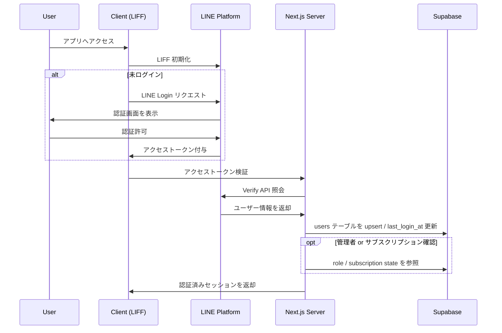
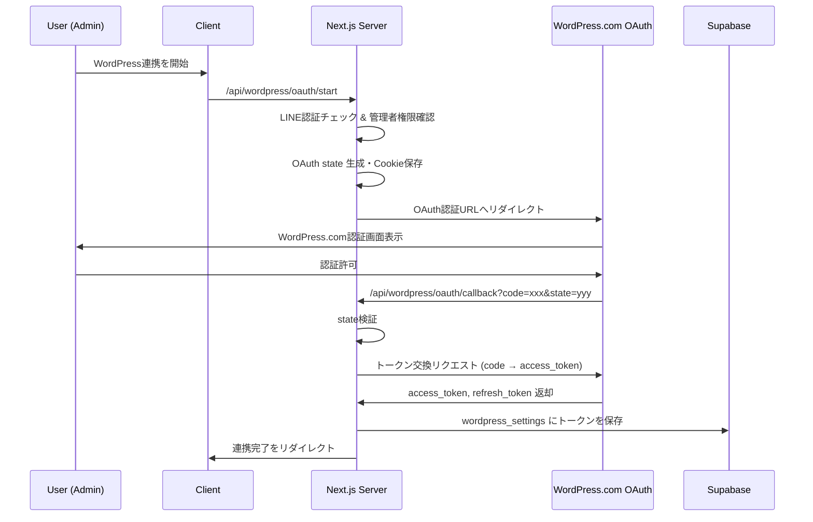
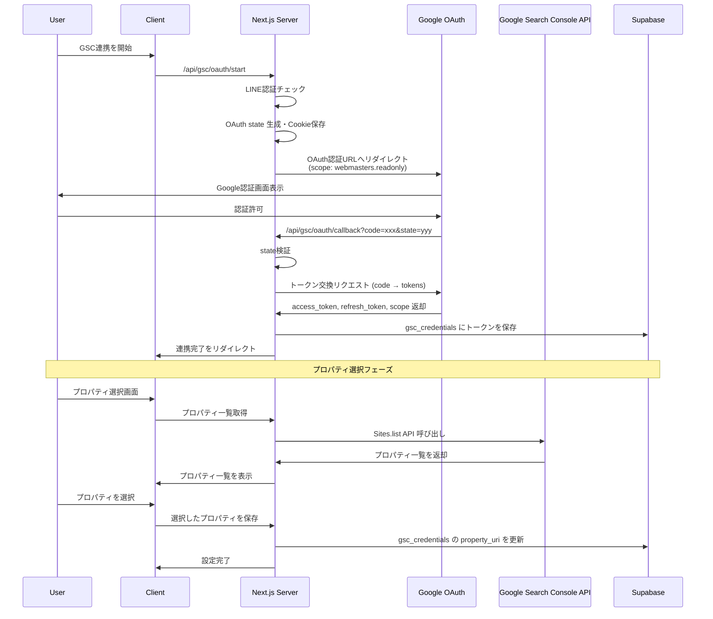
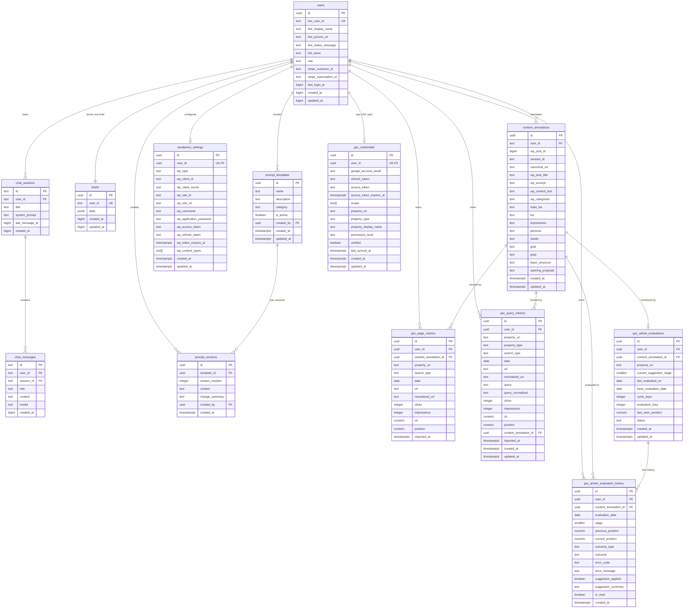

# GrowMate - AIマーケティング支援プラットフォーム

LINE LIFF を入り口に、業界特化のマーケティングコンテンツを一括生成・管理する SaaS アプリケーションです。Next.js 15 App Router を基盤に、マルチベンダー AI、WordPress 連携、Stripe サブスクリプション、Supabase による堅牢なデータ管理を統合しています。

## 🧭 プロダクト概要
- LIFF でログインしたユーザー向けに、広告／LP／ブログ制作を支援する AI ワークスペースを提供
- Anthropic Claude Sonnet 4.5 と OpenAI の Fine-tuned モデル `ft:gpt-4.1-nano-2025-04-14:personal::BZeCVPK2` を用途に応じて切り替え
- WordPress.com / 自社ホスティングを問わない投稿取得と、Supabase へのコンテンツ注釈保存
- Stripe を用いた有料プラン管理と、ロール／サブスクリプション連動による機能制御
- 管理者向けのプロンプトテンプレート編集・ユーザー権限管理 UI を内蔵

## 🚀 主な機能

### LINE LIFF 認証とユーザー管理
- LIFF v2.25 を利用したシームレスな LINE ログインと自動トークンリフレッシュ
- サーバーサイドの `authMiddleware` でアクセストークン検証・ロール判定を一元管理
- Supabase `users` テーブルにプロフィール・サブスクリプション ID・ロール・最終ログインを保存

### AI コンテンツ支援ワークスペース
- `app/chat` 配下の ChatLayout で、セッション管理・モデル選択・AI 応答ストリーミングを統合
- `MODEL_CONFIGS` に定義した 7 ステップのブログ作成フロー（ニーズ整理〜本文作成）と広告／LP テンプレートを提供
- `POST /api/chat/anthropic/stream` による SSE で Claude 応答をリアルタイム描画
- セッションサイドバーに検索バーを追加し、`search_chat_sessions` RPC（全文検索 + `pg_trgm` 類似検索）でタイトルや正規化済み WordPress URL を横断検索
- ステップ毎のプロンプト変数へ `content_annotations` と 事業者ブリーフ (`briefs`) をマージし、文脈の再利用を最小化

### キャンバス編集と選択範囲リライト
- TipTap 3 ベースの `CanvasPanel` に Markdown レンダリング／見出しアウトライン／バージョン履歴を実装
- `POST /api/chat/canvas/stream` で選択範囲と指示を送信し、Claude の Tool Use による全文差し替えを適用
- 選択テキストの履歴・プレビュー・Web 検索トリガー（Claude ツール `web_search_20250305`）をサポート

### WordPress 連携とコンテンツ注釈
- WordPress.com OAuth とセルフホスト版 Application Password の両対応（`app/setup/wordpress`）
- `WordPressService` が REST API の候補 URL を試行し、投稿情報を正規化
- `app/analytics` の一覧で投稿と Supabase `content_annotations` を突き合わせ、未紐付けの注釈も表示
- `AnnotationPanel` でセッション単位のメモ・キーワード・ペルソナ・PREP 等を保存し、ブログ生成時に再利用

### Google Search Console 連携
- `/setup/gsc` で OAuth 認証状態・接続アカウント・プロパティを可視化し、プロパティ選択や連携解除を実行
- `app/api/gsc/oauth/*` が Google OAuth 2.0 の開始／コールバックに対応し、Supabase `gsc_credentials` テーブルへリフレッシュトークンを保存
- GSC連携（状態確認・プロパティ取得・選択更新・接続解除）はサーバーアクション経由で処理（`src/components/GscSetupActions.ts` / `src/server/actions/gscDashboard.actions.ts` など）
- Search Console 日次指標は `gsc_page_metrics`、クエリ指標は `gsc_query_metrics` に保存し、WordPress 注釈 (`content_annotations`) と 1:N で紐付け可能（normalized_url でマッチング）。
- GSC インポートは 30 日単位で自動分割し、クエリ指標は 1,000 行 × 10 ページ = 最大 10,000 行を上限として取得。
- 記事ごとの順位評価と改善提案ステップを `gsc_article_evaluations` / `gsc_article_evaluation_history` で管理し、デフォルト30日間隔で「タイトル→書き出し→本文→ペルソナ」の順にエスカレーション。改善が確認できたらステージをリセット。
- 評価間隔は環境変数 `GSC_EVALUATION_INTERVAL_DAYS` で一括設定（未設定時は30日）。将来のユーザー別設定拡張を見込んでサーバー側で取得関数を用意。

### サブスクリプションと権限
- Stripe v17.7 で Checkout / Billing Portal / Subscription 状態確認を実装（`SubscriptionService`）
- `SubscriptionService` とカスタムフック `useSubscriptionStatus` で UI 側から有効プランを判定
- `authMiddleware` が `requiresSubscription` を返し、有料機能へアクセス制御を適用
- ユーザー権限（`trial` / `paid` / `admin` / `unavailable`）を Supabase 側で管理し、LIFF ログイン時に自動同期（`trial` はチャット送信が1日3回まで、`paid` は無制限）

### 管理者ダッシュボード
- `/admin` でプロンプトテンプレート、ユーザー情報の管理 UI を提供
- `/admin/prompts` からテンプレート編集とバージョン保存、暗黙パラメータ（content 系変数）説明を表示
- `/admin/users` ではロール切り替え後に `POST /api/auth/clear-cache` を呼び出し、キャッシュを即時無効化

### 事業者情報ブリーフ
- `/business-info` でサービス概要や 5W2H、決済方法などを入力し、`briefs` テーブルに JSON として保存
- ブリーフはプロンプトテンプレートの変数へ流用され、広告文や LP のコンテキストを自動補完

### セットアップ導線
- `/setup/wordpress` で WordPress 連携の初期設定を案内
- `/setup/gsc` で Google Search Console OAuth 連携とプロパティ選択を管理
- `/subscription` でプラン購入、`/analytics` で WordPress 投稿と注釈を照合

## 🏗️ システムアーキテクチャ


```mermaid
graph TB
  subgraph Client["Next.js 15 (App Router)"]
    LIFFProvider["LIFF Provider & Auth Hooks"]
    ChatUI["Chat Layout / Session Sidebar"]
    Canvas["CanvasPanel (TipTap)"]
    Annotation["AnnotationPanel"]
    Analytics["Analytics Table"]
    BusinessForm["Business Info Form"]
    AdminUI["Admin Dashboards"]
    GscSetup["GSC Setup Dashboard"]
    GscDashboard["GSC Analytics Dashboard"]
  end

  subgraph Server["Next.js Route Handlers & Server Actions"]
    AuthMiddleware["authMiddleware"]
    ChatStream["/api/chat/anthropic/stream"]
    CanvasStream["/api/chat/canvas/stream"]
    WordPressAPI["/api/wordpress/*"]
    AdminAPI["/api/admin/*"]
    SubscriptionAPI["/api/refresh, /api/user/*"]
    GscAPI["/api/gsc/*"]
    GscCron["/api/cron/gsc-evaluate"]
    ServerActions["server/actions/*"]
  end

  subgraph Data["Supabase PostgreSQL"]
    UsersTable["users"]
    SessionsTable["chat_sessions"]
    MessagesTable["chat_messages"]
    BriefsTable["briefs"]
    AnnotationsTable["content_annotations"]
    PromptsTable["prompt_templates"]
    VersionsTable["prompt_versions"]
    WordpressTable["wordpress_settings"]
    GscCredentials["gsc_credentials"]
    GscPageMetrics["gsc_page_metrics"]
    GscQueryMetrics["gsc_query_metrics"]
    GscEvaluations["gsc_article_evaluations"]
    GscHistory["gsc_article_evaluation_history"]
  end

  subgraph External["External Services"]
    LINE["LINE Platform (LIFF / Verify)"]
    Anthropic["Anthropic Claude"]
    OpenAI["OpenAI GPT-4.1 nano FT"]
    Stripe["Stripe Subscriptions"]
    WordPress["WordPress REST API"]
    GSC["Google Search Console API"]
  end

  LIFFProvider --> AuthMiddleware
  ChatUI --> ChatStream
  Canvas --> CanvasStream
  Annotation --> ServerActions
  Analytics --> WordPressAPI
  BusinessForm --> ServerActions
  AdminUI --> ServerActions
  GscSetup --> GscAPI
  GscDashboard --> GscAPI

  ServerActions --> UsersTable
  ServerActions --> BriefsTable
  ServerActions --> AnnotationsTable
  ChatStream --> MessagesTable
  ChatStream --> SessionsTable
  WordPressAPI --> WordpressTable
  AdminAPI --> PromptsTable
  AdminAPI --> VersionsTable
  GscAPI --> GscCredentials
  GscAPI --> GscPageMetrics
  GscAPI --> GscQueryMetrics
  GscAPI --> GscEvaluations
  GscCron --> GscEvaluations
  GscCron --> GscHistory

  AuthMiddleware --> LINE
  ChatStream --> Anthropic
  CanvasStream --> Anthropic
  ChatStream --> OpenAI
  SubscriptionAPI --> Stripe
  WordPressAPI --> WordPress
  GscAPI --> GSC
  GscCron --> GSC
```

## 🔄 認証フロー

### 1. LINE LIFF 認証フロー（基本認証）

**対象**: 全ユーザー
**目的**: アプリへの基本認証
**保存先**: `users` テーブル


```mermaid
sequenceDiagram
    participant U as User
    participant C as Client (LIFF)
    participant L as LINE Platform
    participant S as Next.js Server
    participant DB as Supabase

    U->>C: アプリへアクセス
    C->>L: LIFF 初期化
    alt 未ログイン
        C->>L: LINE Login リクエスト
        L->>U: 認証画面を表示
        U->>L: 認証許可
        L->>C: アクセストークン付与
    end
    C->>S: アクセストークン検証
    S->>L: Verify API 照会
    L->>S: ユーザー情報を返却
    S->>DB: users テーブルを upsert / last_login_at 更新
    opt 管理者 or サブスクリプション確認
        S->>DB: role / subscription state を参照
    end
    S->>C: 認証済みセッションを返却
```

### 2. WordPress OAuth 認証フロー

**対象**: 管理者のみ
**目的**: WordPress.com サイトとの連携（投稿取得・同期）
**保存先**: `wordpress_settings` テーブル
**必要な環境変数**: `WORDPRESS_COM_CLIENT_ID`, `WORDPRESS_COM_CLIENT_SECRET`, `WORDPRESS_COM_REDIRECT_URI`, `COOKIE_SECRET`


```mermaid
sequenceDiagram
    participant U as User (Admin)
    participant C as Client
    participant S as Next.js Server
    participant WP as WordPress.com OAuth
    participant DB as Supabase

    U->>C: WordPress連携を開始
    C->>S: /api/wordpress/oauth/start
    S->>S: LINE認証チェック & 管理者権限確認
    S->>S: OAuth state 生成・Cookie保存
    S->>WP: OAuth認証URLへリダイレクト
    WP->>U: WordPress.com認証画面表示
    U->>WP: 認証許可
    WP->>S: /api/wordpress/oauth/callback?code=xxx&state=yyy
    S->>S: state検証
    S->>WP: トークン交換リクエスト (code → access_token)
    WP->>S: access_token, refresh_token 返却
    S->>DB: wordpress_settings にトークンを保存
    S->>C: 連携完了をリダイレクト
```

### 3. Google Search Console OAuth 認証フロー

**対象**: 全ユーザー
**目的**: Google Search Console データの取得・記事評価
**保存先**: `gsc_credentials` テーブル
**必要な環境変数**: `GOOGLE_OAUTH_CLIENT_ID`, `GOOGLE_OAUTH_CLIENT_SECRET`, `GOOGLE_SEARCH_CONSOLE_REDIRECT_URI`, `COOKIE_SECRET`


```mermaid
sequenceDiagram
    participant U as User
    participant C as Client
    participant S as Next.js Server
    participant G as Google OAuth
    participant GSC as Google Search Console API
    participant DB as Supabase

    U->>C: GSC連携を開始
    C->>S: /api/gsc/oauth/start
    S->>S: LINE認証チェック
    S->>S: OAuth state 生成・Cookie保存
    S->>G: OAuth認証URLへリダイレクト<br/>(scope: webmasters.readonly)
    G->>U: Google認証画面表示
    U->>G: 認証許可
    G->>S: /api/gsc/oauth/callback?code=xxx&state=yyy
    S->>S: state検証
    S->>G: トークン交換リクエスト (code → tokens)
    G->>S: access_token, refresh_token, scope 返却
    S->>DB: gsc_credentials にトークンを保存
    S->>C: 連携完了をリダイレクト

    Note over U,DB: プロパティ選択フェーズ
    U->>C: プロパティ選択画面
    C->>S: プロパティ一覧取得
    S->>GSC: Sites.list API 呼び出し
    GSC->>S: プロパティ一覧を返却
    S->>C: プロパティ一覧を表示
    U->>C: プロパティを選択
    C->>S: 選択したプロパティを保存
    S->>DB: gsc_credentials の property_uri を更新
    S->>C: 設定完了
```

## 🛠️ 技術スタック
- **フロントエンド**: Next.js 15.5.7 (App Router), React 19.2.1, TypeScript 5.9.3, Tailwind CSS v4, Radix UI, shadcn/ui, lucide-react
- **エディタ**: TipTap 3.7.x + lowlight ハイライト、カスタム UI コンポーネント群
- **バックエンド**: Next.js Route Handlers & Server Actions, Supabase JS 2.75 (PostgreSQL + RLS)
- **AI**: Anthropic Claude Sonnet 4.5（SSE ストリーミング）, OpenAI Chat Completions（Fine-tuned モデル含む）
- **認証**: LINE LIFF v2.25.1, WordPress.com OAuth 2.0, Google OAuth 2.0 (Search Console), Vercel Edge Cookie ストア, 独自ミドルウェアによるロール判定
- **決済**: Stripe 17.7（Checkout / Billing Portal / Subscription API）
- **開発ツール**: TypeScript strict, ESLint 9, Prettier 3, tsc-watch, Husky, ngrok

## 📊 データベーススキーマ（主要テーブル）


```mermaid
erDiagram
    users {
        uuid id PK
        text line_user_id UK
        text line_display_name
        text line_picture_url
        text line_status_message
        text full_name
        text role
        text stripe_customer_id
        text stripe_subscription_id
        bigint last_login_at
        bigint created_at
        bigint updated_at
    }

    chat_sessions {
        text id PK
        text user_id FK
        text title
        text system_prompt
        bigint last_message_at
        bigint created_at
    }

    chat_messages {
        text id PK
        text user_id FK
        text session_id FK
        text role
        text content
        text model
        bigint created_at
    }

    briefs {
        uuid id PK
        text user_id UK
        jsonb data
        bigint created_at
        bigint updated_at
    }

    content_annotations {
        uuid id PK
        text user_id FK
        bigint wp_post_id
        text session_id
        text canonical_url
        text wp_post_title
        text wp_excerpt
        text wp_content_text
        text wp_categories
        text main_kw
        text kw
        text impressions
        text persona
        text needs
        text goal
        text prep
        text basic_structure
        text opening_proposal
        timestamptz created_at
        timestamptz updated_at
    }

    wordpress_settings {
        uuid id PK
        uuid user_id UK,FK
        text wp_type
        text wp_client_id
        text wp_client_secret
        text wp_site_id
        text wp_site_url
        text wp_username
        text wp_application_password
        text wp_access_token
        text wp_refresh_token
        timestamptz wp_token_expires_at
        text[] wp_content_types
        timestamptz created_at
        timestamptz updated_at
    }

    prompt_templates {
        uuid id PK
        text name
        text description
        text category
        boolean is_active
        uuid created_by FK
        timestamptz created_at
        timestamptz updated_at
    }

    prompt_versions {
        uuid id PK
        uuid template_id FK
        integer version_number
        text content
        text change_summary
        uuid created_by FK
        timestamptz created_at
    }

    gsc_credentials {
        uuid id PK
        uuid user_id UK,FK
        text google_account_email
        text refresh_token
        text access_token
        timestamptz access_token_expires_at
        text[] scope
        text property_uri
        text property_type
        text property_display_name
        text permission_level
        boolean verified
        timestamptz last_synced_at
        timestamptz created_at
        timestamptz updated_at
    }

    gsc_page_metrics {
        uuid id PK
        uuid user_id FK
        uuid content_annotation_id FK
        text property_uri
        text search_type
        date date
        text url
        text normalized_url
        integer clicks
        integer impressions
        numeric ctr
        numeric position
        timestamptz imported_at
    }

    gsc_query_metrics {
        uuid id PK
        uuid user_id FK
        text property_uri
        text property_type
        text search_type
        date date
        text url
        text normalized_url
        text query
        text query_normalized
        integer clicks
        integer impressions
        numeric ctr
        numeric position
        uuid content_annotation_id FK
        timestamptz imported_at
        timestamptz created_at
        timestamptz updated_at
    }

    gsc_article_evaluations {
        uuid id PK
        uuid user_id FK
        uuid content_annotation_id FK
        text property_uri
        smallint current_suggestion_stage
        date last_evaluated_on
        date base_evaluation_date
        integer cycle_days
        integer evaluation_hour
        numeric last_seen_position
        text status
        timestamptz created_at
        timestamptz updated_at
    }

    gsc_article_evaluation_history {
        uuid id PK
        uuid user_id FK
        uuid content_annotation_id FK
        date evaluation_date
        smallint stage
        numeric previous_position
        numeric current_position
        text outcome_type
        text outcome
        text error_code
        text error_message
        boolean suggestion_applied
        text suggestion_summary
        boolean is_read
        timestamptz created_at
    }

    users ||--o{ chat_sessions : owns
    chat_sessions ||--o{ chat_messages : contains
    users ||--|| briefs : "stores one brief"
    users ||--o{ content_annotations : annotates
    users ||--o| wordpress_settings : configures
    users ||--o| gsc_credentials : "has GSC auth"
    users ||--o{ gsc_page_metrics : owns
    users ||--o{ gsc_query_metrics : owns
    users ||--o{ gsc_article_evaluation_history : owns
    users ||--o{ prompt_templates : creates
    users ||--o{ prompt_versions : creates
    prompt_templates ||--o{ prompt_versions : "has versions"
    content_annotations ||--o| gsc_article_evaluations : "monitored by"
    content_annotations ||--o{ gsc_page_metrics : "tracked by"
    content_annotations ||--o{ gsc_query_metrics : "tracked by"
    content_annotations ||--o{ gsc_article_evaluation_history : "evaluated in"
    gsc_article_evaluations ||--o{ gsc_article_evaluation_history : "has history"
```

## 📋 環境変数（18 項目: 必須14項目、オプション4項目）

`src/env.ts` で厳格にバリデーションされるサーバー／クライアント環境変数です。`.env.local` を手動で用意してください。

| 種別 | 変数名 | 必須 | 用途 |
| ---- | ------ | ---- | ---- |
| Server | `DBPASS` | ✅ | Supabase からアクセスされる Postgres password |
| Server | `SUPABASE_SERVICE_ROLE` | ✅ | サーバーサイド特権操作用 Service Role キー |
| Server | `STRIPE_ENABLED` | 任意 | Stripe 機能の有効化フラグ（`true` / `false`） |
| Server | `STRIPE_SECRET_KEY` | ✅（Stripe 無効でもダミー値必須） | Stripe API 呼び出し用シークレット |
| Server | `STRIPE_PRICE_ID` | ✅（Stripe 無効でもダミー値必須） | サブスクリプションで使用する Price ID |
| Server | `OPENAI_API_KEY` | ✅ | Fine-tuned モデル利用時の OpenAI キー |
| Server | `ANTHROPIC_API_KEY` | ✅ | Claude ストリーミング用 API キー |
| Server | `LINE_CHANNEL_ID` | ✅ | LINE Login 用チャネル ID |
| Server | `LINE_CHANNEL_SECRET` | ✅ | LINE Login 用チャネルシークレット |
| Server | `GOOGLE_OAUTH_CLIENT_ID` | 任意（GSC 連携利用時は必須） | Google Search Console OAuth 用クライアント ID |
| Server | `GOOGLE_OAUTH_CLIENT_SECRET` | 任意（GSC 連携利用時は必須） | Google Search Console OAuth 用クライアントシークレット |
| Server | `GOOGLE_SEARCH_CONSOLE_REDIRECT_URI` | 任意（GSC 連携利用時は必須） | Google OAuth のリダイレクト先（`https://<host>/api/gsc/oauth/callback` など） |
| Server | `GSC_OAUTH_STATE_COOKIE_NAME` | 任意 | GSC OAuth state 用 Cookie 名（未設定時は `gsc_oauth_state`） |
| Client | `NEXT_PUBLIC_LIFF_ID` | ✅ | LIFF アプリ ID |
| Client | `NEXT_PUBLIC_LIFF_CHANNEL_ID` | ✅ | LIFF Channel ID |
| Client | `NEXT_PUBLIC_SUPABASE_URL` | ✅ | Supabase プロジェクト URL |
| Client | `NEXT_PUBLIC_SUPABASE_ANON_KEY` | ✅ | Supabase anon キー |
| Client | `NEXT_PUBLIC_SITE_URL` | ✅ | サイトの公開 URL |
| Client | `NEXT_PUBLIC_STRIPE_ENABLED` | 任意 | クライアント側での Stripe 有効化フラグ（未設定時は `STRIPE_ENABLED` を継承） |

### 追加で利用できる任意設定
- `WORDPRESS_COM_CLIENT_ID`, `WORDPRESS_COM_CLIENT_SECRET`, `WORDPRESS_COM_REDIRECT_URI`: WordPress.com OAuth 連携で必須
- `OAUTH_STATE_COOKIE_NAME`, `OAUTH_TOKEN_COOKIE_NAME`, `COOKIE_SECRET`: WordPress / Google Search Console OAuth のセキュアな Cookie 管理
- `GOOGLE_OAUTH_CLIENT_ID`, `GOOGLE_OAUTH_CLIENT_SECRET`, `GOOGLE_SEARCH_CONSOLE_REDIRECT_URI`: Google Search Console 連携を利用する場合のみ設定
- `GSC_EVALUATION_INTERVAL_DAYS`: GSC記事評価の実行間隔（日数）。未設定時は30日がデフォルト
- `FEATURE_RPC_V2`: `true` で新しい Supabase RPC 経路を有効化（`FEATURE_FLAGS.USE_RPC_V2`）

## 🚀 セットアップ手順

### 必要条件
- **Node.js**: 18 以上（推奨: 20.x LTS）
- **npm**: 9 以上
- **Supabase 接続情報**（管理者から取得）
- **LINE 接続情報**（管理者から取得）
- **Stripe アカウント**（サブスクリプション利用時）
- **ngrok アカウント**（LIFF ローカルテスト用、任意）

### 1. リポジトリのクローンと依存関係のインストール

```bash
# リポジトリをクローン
git clone <repository-url>
cd industry-specific-mc-training

# 依存関係をインストール
npm install
```

### 2. Supabase のセットアップ

#### 2.1 既存プロジェクトの接続情報を取得

**重要**: このプロジェクトは本番環境と開発環境でSupabaseプロジェクトを共有しています。新規にプロジェクトを作成する必要はありません。

1. プロジェクト管理者から以下の接続情報を取得してください：
   - **Project URL** (`https://xxxxx.supabase.co`)
   - **anon public key**
   - **service_role key**（秘密情報、サーバーサイド専用）
   - **Database Password**

2. これらの情報を `.env.local` ファイルに設定します（詳細は「5. 環境変数の設定」を参照）

#### 2.2 データベーススキーマについて

- データベースマイグレーションは既に本番環境に適用済みです
- ローカル開発では、既存のスキーマをそのまま使用します
- **ローカルでのマイグレーション適用は不要です**（`npx supabase db push` は実行しないでください）

**注意事項:**
- 本番データと同じデータベースを使用するため、データ操作には十分注意してください
- テスト用のデータ作成時は、自分のユーザーIDに紐付けて作成し、他のユーザーのデータを誤って変更・削除しないようにしてください
- スキーマ変更が必要な場合は、必ずプロジェクト管理者に相談してください

### 3. LINE の設定

**重要**: このプロジェクトは本番環境と開発環境でLINE Login ChannelおよびLIFFアプリを共有しています。新規に作成する必要はありません。

#### 3.1 既存のLINE接続情報を取得

プロジェクト管理者から以下の接続情報を取得してください：

- **LINE Channel ID**: LINE Login チャネルのチャネル ID
- **LINE Channel Secret**: LINE Login チャネルのチャネルシークレット
- **LIFF ID**: 既存のLIFFアプリのID（`<liff-id>` 形式）

これらの情報を `.env.local` ファイルに設定します（詳細は「5. 環境変数の設定」を参照）。

#### 3.2 LINE設定の注意事項

**注意事項:**
- 本番環境と同じLINE ChannelおよびLIFFアプリを使用します
- **LINE Developers Consoleでの設定変更は本番環境にも影響します**
- LIFF エンドポイント URL やコールバック URL の変更は行わないでください
- 設定変更が必要な場合は、必ずプロジェクト管理者に相談してください

### 4. Stripe の設定（サブスクリプション機能を使用する場合）

#### 4.1 Stripe アカウントの作成とキー取得
1. [Stripe Dashboard](https://dashboard.stripe.com/) にログイン
2. 「開発者」→「API キー」から以下を取得：
   - **シークレットキー**（`sk_test_...` または `sk_live_...`）

#### 4.2 サブスクリプション商品と Price ID の作成
1. Stripe Dashboard の「商品」→「商品を追加」
2. サブスクリプション商品を作成し、**Price ID** (`price_xxxxx`) をコピー

#### 4.3 Stripe を無効化する場合
- `STRIPE_ENABLED=false` を設定
- ただし、`STRIPE_SECRET_KEY` と `STRIPE_PRICE_ID` にはダミー値（例: `sk_test_dummy`）を設定する必要があります

### 5. 環境変数の設定

プロジェクトルートに `.env.local` ファイルを作成し、以下の環境変数を設定してください：

```bash
# ────────────────────────────────────────────────────────
# Supabase 設定
# ────────────────────────────────────────────────────────
DBPASS=your_supabase_database_password
SUPABASE_SERVICE_ROLE=your_supabase_service_role_key
NEXT_PUBLIC_SUPABASE_URL=https://xxxxx.supabase.co
NEXT_PUBLIC_SUPABASE_ANON_KEY=your_supabase_anon_key

# ────────────────────────────────────────────────────────
# LINE 設定
# ────────────────────────────────────────────────────────
LINE_CHANNEL_ID=your_line_channel_id
LINE_CHANNEL_SECRET=your_line_channel_secret
NEXT_PUBLIC_LIFF_ID=your_liff_id
NEXT_PUBLIC_LIFF_CHANNEL_ID=your_line_channel_id

# ────────────────────────────────────────────────────────
# Stripe 設定
# ────────────────────────────────────────────────────────
STRIPE_ENABLED=true  # Stripe を無効化する場合は false
STRIPE_SECRET_KEY=sk_test_xxxxx
STRIPE_PRICE_ID=price_xxxxx
NEXT_PUBLIC_STRIPE_ENABLED=true  # 省略時は STRIPE_ENABLED を継承

# ────────────────────────────────────────────────────────
# AI API キー
# ────────────────────────────────────────────────────────
ANTHROPIC_API_KEY=sk-ant-xxxxx
OPENAI_API_KEY=sk-proj-xxxxx

# ────────────────────────────────────────────────────────
# サイト URL
# ────────────────────────────────────────────────────────
NEXT_PUBLIC_SITE_URL=https://your-ngrok-url.ngrok.io  # ローカル開発時
# NEXT_PUBLIC_SITE_URL=https://your-domain.com  # 本番環境

# ────────────────────────────────────────────────────────
# WordPress.com OAuth 設定（任意）
# ────────────────────────────────────────────────────────
WORDPRESS_COM_CLIENT_ID=your_wordpress_com_client_id
WORDPRESS_COM_CLIENT_SECRET=your_wordpress_com_client_secret
WORDPRESS_COM_REDIRECT_URI=https://your-ngrok-url.ngrok.io/api/wordpress/oauth/callback
COOKIE_SECRET=your_random_32_char_secret_key  # openssl rand -hex 32 で生成
OAUTH_STATE_COOKIE_NAME=wp_oauth_state
OAUTH_TOKEN_COOKIE_NAME=wp_oauth_token

# ────────────────────────────────────────────────────────
# 機能フラグ（任意）
# ────────────────────────────────────────────────────────
FEATURE_RPC_V2=false  # 新しい Supabase RPC を有効化する場合は true
```

**重要**: `.env.local` は `.gitignore` に含まれています。本番環境では Vercel の環境変数設定を使用してください。

### 6. 開発サーバーの起動

```bash
# TypeScript の型チェック + Next.js 開発サーバーを起動
npm run dev
```

ブラウザで `http://localhost:3000` にアクセスしてアプリケーションを確認できます。

### 7. LIFF ローカル開発のための ngrok セットアップ（任意）

LIFF はHTTPS環境が必須のため、ローカル開発でLIFF機能をテストする場合は ngrok を使用します。

**重要**: 本番環境とLINE設定を共有しているため、通常のローカル開発ではngrokは不要です。LIFF認証が必要な機能を開発・テストする場合のみ使用してください。

#### 7.1 ngrok のセットアップ
1. [ngrok](https://ngrok.com/) にサインアップ
2. 無料プランでは固定サブドメインが使えないため、有料プランまたは起動毎の動的 URL を使用
3. `package.json` の ngrok スクリプトを環境に合わせて調整：
   ```json
   "ngrok": "ngrok http --region=jp --subdomain=your-subdomain 3000"
   ```

#### 7.2 ngrok の起動とテスト用設定

```bash
# 別ターミナルで ngrok を起動
npm run ngrok
```

ngrok が表示する HTTPS URL（例: `https://your-subdomain.ngrok.io`）を `.env.local` の `NEXT_PUBLIC_SITE_URL` に一時的に設定できます。

**注意**:
- LINE Developers Console の LIFF エンドポイント URL やコールバック URL は**本番設定のまま変更しないでください**
- ngrok URL での完全なLIFF動作確認は、本番設定との競合が発生するため推奨されません
- LIFF以外のAPI機能のテストには、ngrokなしでローカルホスト（http://localhost:3000）を使用してください

### 8. 動作確認と検証

#### 8.1 Lint チェック
```bash
npm run lint
```

#### 8.2 ビルドチェック
```bash
npm run build
npm run start
```

#### 8.3 データベース統計確認
```bash
npm run db:stats
```

#### 8.4 Vercel 統計確認（Vercel にデプロイ済みの場合）
```bash
npm run vercel:stats
```

### 9. 初期データのセットアップ

アプリケーションに初回ログインした後、以下の設定を行います：

1. **管理者ロールの付与**: Supabase の `users` テーブルで自分のユーザーの `role` を `admin` に変更
2. **事業者情報の登録**: `/business-info` で 5W2H などの基本情報を入力
3. **WordPress 連携**（任意）: `/setup/wordpress` で WordPress サイトを接続
4. **プロンプトテンプレートの確認**: `/admin/prompts` でデフォルトテンプレートを確認・編集

### ローカル開発のポイント
- `npm run lint` で ESLint + Next/Tailwind ルールを検証（Husky pre-commit でも自動実行）
- `npm run build` → `npm run start` で本番ビルドの健全性をチェック
- **Supabase スキーマ変更**: 本番環境と共有しているため、スキーマ変更は必ず管理者に相談してください。変更が必要な場合は `supabase/migrations/` に SQL を追加し、ロールバック手順をコメントに残します
- **データ操作の注意**: 本番データと同じDBを使用するため、テストデータは自分のユーザーIDに紐付けて作成し、他のユーザーデータを誤って変更・削除しないよう注意してください
- **LINE設定の注意**: 本番環境とLINE ChannelおよびLIFFアプリを共有しているため、LINE Developers Consoleでの設定変更は絶対に行わないでください。設定変更が必要な場合は必ず管理者に相談してください
- LIFF 機能のテストは本番環境で実施するか、管理者の指示に従ってください
- TypeScript strict モードが有効なため、型エラーを解決してから commit する
- コミット前に Husky が自動で lint を実行します（失敗時は commit がブロックされます）

## 📁 プロジェクト構成

```
├── app/
│   ├── chat/                # AI チャットワークスペース（Canvas / Annotation / Step UI）
│   ├── analytics/           # WordPress 投稿 + 注釈ダッシュボード
│   ├── business-info/       # 事業者情報フォーム（Server Components + Actions）
│   ├── setup/               # WordPress / GSC 等の初期セットアップ導線
│   ├── subscription/        # サブスクリプション購入ページ
│   ├── login/               # ログインページ
│   ├── home/                # パブリックホームページ（非認証可）
│   ├── privacy/             # プライバシーポリシー（非認証可）
│   ├── unauthorized/        # 未認可ユーザー向けページ
│   ├── unavailable/         # 利用不可ユーザー向けページ（role が unavailable の場合）
│   ├── wordpress-import/    # WordPress 記事の一括インポートページ
│   ├── gsc-dashboard/       # GSC ダッシュボードページ
│   ├── gsc-import/          # GSC データインポートページ
│   ├── admin/               # 管理者向け機能（プロンプト・ユーザー管理）
│   ├── api/                 # Route Handlers（chat, wordpress, admin, auth, user, line, gsc, cron）
│   └── layout.tsx など      # App Router ルートレイアウト
├── src/
│   ├── components/          # 再利用可能な UI（shadcn/ui, AnnotationFormFields 等）
│   ├── domain/              # フロント向けサービス層（ChatService / SubscriptionService）
│   ├── hooks/               # LIFF / サブスクリプション / UI ユーティリティ
│   ├── lib/                 # 定数・プロンプト管理・Supabase クライアント生成
│   ├── server/
│   │   ├── actions/         # Server Actions 経由のビジネスロジック
│   │   ├── middleware/      # 認証・ロール判定ミドルウェア
│   │   ├── services/        # 統合層（Stripe / WordPress / Supabase / LLM / GSC など）
│   │   │   ├── chatService.ts            # チャットセッション管理
│   │   │   ├── gscService.ts             # GSC 基本操作
│   │   │   ├── gscEvaluationService.ts   # GSC 記事評価処理
│   │   │   ├── gscSuggestionService.ts   # GSC 改善提案生成
│   │   │   ├── gscImportService.ts       # GSC データインポート
│   │   │   ├── analyticsContentService.ts # アナリティクスコンテンツ処理
│   │   │   ├── chatLimitService.ts       # チャット制限管理
│   │   │   └── ... その他サービス
│   │   ├── schemas/         # Zod バリデーションスキーマ
│   │   └── lib/             # サーバー専用ユーティリティ
│   └── types/               # 共通型定義（chat, prompt, annotation, wordpress 等）
├── scripts/                 # ユーティリティスクリプト（DB 統計・Vercel 統計）
├── claudedocs/              # プロジェクト分析レポート
├── supabase/migrations/     # データベースマイグレーション
└── config files             # eslint.config.mjs, next.config.ts, tailwind/postcss 設定
```

## 🔧 主な API エンドポイント

| エンドポイント | メソッド | 概要 | 認証 |
| -------------- | -------- | ---- | ---- |
| `/api/chat/anthropic/stream` | POST | Claude とのチャット SSE ストリーム | `Authorization: Bearer <LIFF>` |
| `/api/chat/canvas/stream` | POST | Canvas 編集リクエスト（選択範囲差し替え） | `Authorization: Bearer <LIFF>` |
| `/api/chat/canvas/load-wordpress` | POST | WordPress記事をCanvasに読み込み | `Authorization: Bearer <LIFF>` |
| `/api/refresh` | POST | LINE リフレッシュトークンからアクセストークン再発行 | Cookie (`line_refresh_token`) |
| `/api/user/current` | GET | ログインユーザーのプロファイル・ロール情報 | Cookie (`line_access_token`) |
| `/api/auth/check-role` | GET | ロールのサーバー検証 | Cookie |
| `/api/auth/clear-cache` | POST | Edge キャッシュクリア通知 | 任意 |
| `/api/auth/line-oauth-init` | GET | LINE OAuth state生成エンドポイント | Cookie |
| `/api/line/callback` | GET | LINE OAuth コールバック | 公開（state チェックあり） |
| `/api/wordpress/settings` | GET/POST | WordPress 設定の取得・保存（server action と共有） | Cookie |
| `/api/wordpress/status` | GET | WordPress 接続状況の確認 | Cookie |
| `/api/wordpress/posts` | GET | WordPress 投稿一覧の取得 | Cookie + WP 認証 |
| `/api/wordpress/test-connection` | POST | WordPress 接続テスト | Cookie |
| `/api/wordpress/oauth/start` | GET | WordPress.com OAuth リダイレクト開始 | 公開（環境変数必須） |
| `/api/wordpress/oauth/callback` | GET | WordPress.com OAuth コールバック | Cookie |
| `/api/admin/prompts` | GET | プロンプトテンプレート一覧（管理者専用） | Cookie + admin ロール |
| `/api/admin/prompts/[id]` | POST | テンプレート更新・バージョン生成 | Cookie + admin ロール |
| `/api/wordpress/bulk-import-posts` | POST | WordPress 記事の一括インポート | Bearer + admin ロール |
| `/api/gsc/status` | GET | GSC連携状態確認 | Cookie |
| `/api/gsc/oauth/start` | GET | GSC OAuth リダイレクト開始 | 公開（環境変数必須） |
| `/api/gsc/oauth/callback` | GET | GSC OAuth コールバック | Cookie |
| `/api/gsc/disconnect` | POST | GSC連携解除 | Cookie |
| `/api/gsc/properties` | GET | GSCプロパティ一覧取得 | Cookie |
| `/api/gsc/property` | POST | GSCプロパティ選択 | Cookie |
| `/api/gsc/dashboard` | GET | GSCダッシュボードデータ取得 | Cookie |
| `/api/gsc/import` | POST | GSCデータインポート | Cookie |
| `/api/gsc/evaluate` | POST | GSC記事評価の手動実行 | Cookie |
| `/api/gsc/evaluations` | GET | GSC評価履歴取得 | Cookie |
| `/api/cron/gsc-evaluate` | POST | GSC記事評価の定期実行（GitHub Actions などのスケジューラ経由で Bearer 認証） | Authorization ヘッダー |

### GSC 評価バッチ（GitHub Actions での実行例）
- Vercel 環境変数: `CRON_SECRET` を設定（Cronバッチ用の共有シークレット）
- GitHub Actions Secret: 同じ値の `CRON_SECRET` を登録
- ワークフロー: `.github/workflows/gsc-cron.yml` の `TARGET_URL` をデプロイ先ドメインに置き換える（例: `https://your-app.vercel.app/api/cron/gsc-evaluate`）
- 認証: GitHub Actions から `Authorization: Bearer <CRON_SECRET>` ヘッダー付きで呼び出し
- スケジュール: デフォルト毎時0分（`0 * * * *`）、`workflow_dispatch` で手動実行も可能

サーバーアクション (`src/server/actions/*`) では、ブリーフ保存・WordPress 投稿取得・注釈 upsert・Stripe セッション作成などを型安全に処理しています。

## 🛡️ セキュリティと運用の注意点
- Supabase では主要テーブルに RLS を適用済み（開発ポリシーが残る箇所は運用前に見直す）
- `authMiddleware` がロール・サブスクリプションを検証し、`requiresSubscription` でプレミアム機能を保護
- WordPress アプリケーションパスワードや OAuth トークンは HTTP-only Cookie に保存（本番では安全な KMS / Secrets 管理を推奨）
- SSE は 20 秒ごとの ping と 5 分アイドルタイムアウトで接続維持を調整
- `AnnotationPanel` の URL 正規化で内部／ローカルホストへの誤登録を防止

## 📱 デプロイと運用
- Vercel を想定（Edge Runtime と Node.js Runtime をルートごとに切り分け）
- デプロイ前チェック: `npm run lint` → `npm run build`
- 環境変数は Vercel Project Settings へ反映し、本番は Stripe 本番キー・WordPress 本番サイトに切り替え
- Supabase マイグレーションは `npx supabase db push` で同期、ロールバック手順（コメント）を常に更新

### GitHub Actions シークレット設定
週次レポート用のワークフローで使用するシークレットを GitHub Repository Settings → Secrets and variables → Actions で設定してください。

| シークレット名 | 用途 | 必須 |
| ------------- | ---- | ---- |
| `CI_WEBHOOK_URL` | CI ビルド結果通知用 Lark Webhook URL | 任意 |
| `DB_STATS_WEBHOOK_URL` | データベース統計レポート用 Lark Webhook URL | 任意 |
| `VERCEL_STATS_WEBHOOK_URL` | Vercel 統計レポート用 Lark Webhook URL | 任意 |
| `VERCEL_TOKEN` | Vercel API アクセストークン（Settings → Tokens で作成） | Vercel レポート用 |
| `VERCEL_PROJECT_ID` | Vercel プロジェクト ID（`prj_` で始まる） | Vercel レポート用 |
| `VERCEL_TEAM_ID` | Vercel チーム ID（`team_` で始まる、オプション） | Vercel レポート用（オプション） |

**Vercel API トークンの取得方法:**
1. Vercel Dashboard → Settings → Tokens
2. 「Create Token」をクリック
3. トークン名を入力し、スコープを設定（`Full Account` または `Project` スコープ）
4. 生成されたトークンを `VERCEL_TOKEN` シークレットに設定

**Vercel プロジェクト ID の取得方法:**
- Vercel Dashboard → プロジェクト → Settings → General の「Project ID」を確認
- または、`.vercel/project.json` ファイルの `projectId` フィールドを確認

## 🤝 コントリビューション
1. フィーチャーブランチを作成
2. 変更を実装し、`npm run lint` の結果を確認
3. 必要に応じて Supabase マイグレーションを追加し、ロールバック手順を明記
4. 変更内容を簡潔にまとめた PR を作成（ユーザー影響・環境変数・スクリーンショットを添付）

## 📄 ライセンス

このリポジトリは私的利用目的で運用されています。再配布や商用利用は事前相談のうえでお願いいたします。
