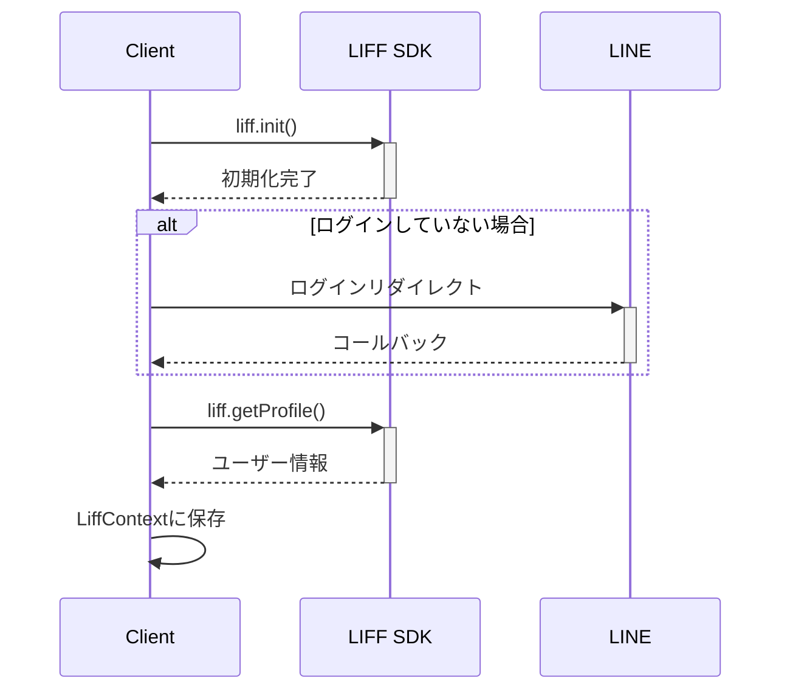

# LIFF-TEMPLATEプロジェクト構成ドキュメント

## 注意点

このサービスはLIFFの認証によってのみuserIdを信用します。

supabaseにはauthと掛け合わせた認証をしていないので
バックエンド側のadmin権限ベースでのみ
データを取得すると割り切っています。

なのでデータ取得の際は必ずuserIdベースのwhereなどで制限してください。

## プロジェクト概要

このプロジェクトは、LINE Front-end Framework (LIFF)を使用したNext.jsベースのアプリケーションです。ユーザーはLINEアカウントでログインし、サービスを利用できます。

## 技術スタック

- **フロントエンド**: Next.js 15.2.3 (React 19)
- **スタイリング**: TailwindCSS
- **認証**: LINE LIFF SDK
- **バックエンド**: Next.js Server Actions
- **データベース**: Supabase
- **支払い処理**: Stripe

## ディレクトリ構成

```
/
├── .git/                  # Gitリポジトリ
├── .next/                 # Next.jsビルドディレクトリ
├── .vscode/               # VSCode設定
├── app/                   # Next.js App Router（メイン）
│   ├── ad-form/           # LP作成フォーム機能
│   ├── admin/             # 管理機能
│   │   └── prompts/       # プロンプト管理
│   ├── api/               # API Routes
│   │   ├── line/          # LINE連携API
│   │   ├── wordpress/     # WordPress連携API
│   │   └── ...            # その他API
│   ├── business-info/     # ビジネス情報入力
│   ├── chat/              # チャット機能
│   ├── login/             # ログインページ
│   ├── setup/             # セットアップページ
│   ├── subscription/      # サブスクリプション機能
│   ├── globals.css        # グローバルCSS
│   ├── layout.tsx         # ルートレイアウト
│   └── page.tsx           # トップページ
├── data/                  # データファイル
├── node_modules/          # 依存ライブラリ
├── public/                # 静的ファイル
├── scripts/               # スクリプトファイル
├── src/                   # ソースコード（統合済み）
│   ├── components/        # Reactコンポーネント（統合）
│   │   ├── ui/            # shadcn/ui共通コンポーネント
│   │   ├── ClientLiffProvider.tsx  # LIFFプロバイダー
│   │   ├── Footer.tsx     # フッター
│   │   └── ...            # その他コンポーネント
│   ├── di/                # 依存性注入コンテナ
│   ├── domain/            # ドメインロジック
│   │   ├── errors/        # エラークラス
│   │   ├── interfaces/    # インターフェース
│   │   ├── models/        # ドメインモデル
│   │   └── services/      # ドメインサービス
│   ├── hooks/             # Reactフック
│   │   ├── useLiff.ts     # LIFF関連フック
│   │   └── ...            # その他フック
│   ├── lib/               # ユーティリティ関数
│   ├── server/            # サーバーサイドコード
│   │   ├── handler/       # リクエストハンドラー
│   │   │   └── actions/   # サーバーアクション
│   │   ├── middleware/    # ミドルウェア
│   │   └── services/      # ビジネスロジック
│   ├── types/             # 型定義
│   └── env.ts             # 環境変数の型定義
├── supabase/              # Supabase関連ファイル
│   └── migrations/        # データベースマイグレーション
├── .env.local             # 環境変数
├── .gitignore             # git除外設定
├── components.json        # shadcn/ui設定
├── eslint.config.mjs      # ESLint設定
├── next.config.ts         # Next.js設定
├── package-lock.json      # パッケージロックファイル
├── package.json           # パッケージ情報
├── postcss.config.mjs     # PostCSS設定
├── README.md              # プロジェクト説明
└── tsconfig.json          # TypeScript設定
```

## コンポーネント構成

### アプリケーションのレイヤー

1. **UI層**: `src/components/ui/` - shadcn/ui基本UIコンポーネント
2. **コンポーネント層**: `src/components/` - アプリケーション固有のコンポーネント
3. **ページ層**: `app/**/page.tsx` - App Routerページコンポーネント
4. **API層**: `app/api/` - Next.js Route Handlers
5. **ドメイン層**: `src/domain/` - ビジネスロジックとドメインモデル
6. **アクション層**: `src/server/handler/actions/` - サーバーアクション
7. **サービス層**: `src/server/services/` - 外部API連携とデータアクセス

## 処理の流れ

### LIFF初期化とログインフロー

1. `LiffProvider`が`useLiff`フックを使用してLIFFを初期化
2. ブラウザで開かれた場合、LINEログイン画面にリダイレクト
3. ログイン後、ユーザープロフィール情報を取得
4. ログインユーザー情報をLiffContextを通じてアプリ全体で共有



## リファクタリング後の重要な変更点

### ディレクトリ構造の統合（2025-07-24）

1. **App Router統一**: `app/`ディレクトリがメインのルーティング構造
2. **コンポーネント統合**: 全コンポーネントが`src/components/`に集約
3. **重複解消**: `src/app/`の重複ディレクトリを削除
4. **設定統一**: `components.json`のCSSパスを`app/globals.css`に修正

### ベストプラクティス準拠

- **Next.js 15 App Router**: 最新のルーティング構造に準拠
- **shadcn/ui統合**: UIコンポーネントライブラリの適切な設定
- **TypeScript設定**: パスマッピング（`@/*` → `./src/*`）の統一
- **ビルド最適化**: 重複ディレクトリ削除によるビルド効率向上

## 開発ルール

### コンポーネント設計

1. **単一責任の原則**: 各コンポーネントは1つの責任のみを持つ
2. **App Router活用**: ページコンポーネントは`app/`ディレクトリで管理
3. **コンポーネント統合**: 共通コンポーネントは`src/components/`で統一管理
4. **shadcn/ui活用**: UIコンポーネントは`src/components/ui/`のshadcn/uiを優先使用

### 命名規則

1. **コンポーネントファイル**: PascalCase (例: `Component.tsx`)
2. **ユーティリティ関数ファイル**: camelCase (例: `actions.ts`)
3. **ディレクトリ名**: camelCase (例: `features/`, `ui/`)

### スタイリング

1. **TailwindCSSを優先**: CSSファイルではなくTailwindのユーティリティクラスを使用
2. **Vuetifyのコンポーネント使用時**: CSSは最終手段として使用

### データフェッチ

1. **サーバーアクション使用**: データ操作はサーバーアクションで行う
2. **useTransitionによる最適化**: データ更新中の状態管理に利用

## LIFF利用方針

1. **liff.ready利用**: LIFF APIを使用する前に必ずawait liff.readyを使用
2. **isInClient()チェック**: LINEアプリ内/外での動作の違いに対応
3. **エラーハンドリング**: LIFF初期化エラーは明示的に処理

## バックエンド連携

1. **サーバーアクション**: データCRUD操作はサーバーアクションで実装
2. **認証情報の連携**: LIFFのアクセストークンを使用してバックエンドAPIを認証

## 環境変数

環境変数は`.env.local`ファイルで管理し、`env.ts`で型安全に定義
