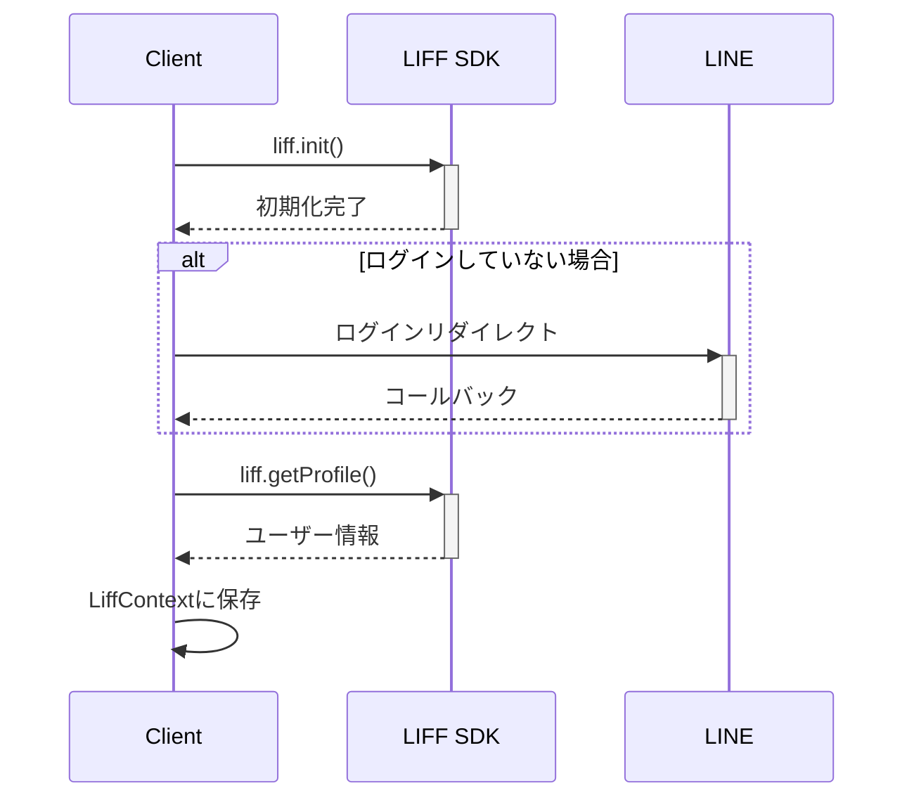

# LIFF-TEMPLATEプロジェクト構成ドキュメント

## プロジェクト概要

このプロジェクトは、LINE Front-end Framework (LIFF)を使用したNext.jsベースのアプリケーションです。ユーザーはLINEアカウントでログインし、サービスを利用できます。

## 技術スタック

- **フロントエンド**: Next.js 15.2.3 (React 19)
- **スタイリング**: TailwindCSS
- **認証**: LINE LIFF SDK
- **バックエンド**: Next.js Server Actions
- **データベース**: Supabase
- **支払い処理**: Stripe

## ディレクトリ構成

```
/
├── .git/                  # Gitリポジトリ
├── .next/                 # Next.jsビルドディレクトリ
├── .vscode/               # VSCode設定
├── data/                  # データファイル
├── node_modules/          # 依存ライブラリ
├── public/                # 静的ファイル
├── scripts/               # スクリプトファイル
├── src/                   # ソースコード
│   ├── app/               # Next.jsアプリケーションルーティング
│   │   ├── chat/          # チャット機能
│   │   ├── mypage/        # マイページ機能
│   │   ├── subscription/  # サブスクリプション機能
│   │   ├── globals.css    # グローバルCSS
│   │   ├── layout.tsx     # レイアウトコンポーネント
│   │   └── page.tsx       # トップページ
│   ├── components/        # Reactコンポーネント
│   │   ├── features/      # 機能単位のコンポーネント
│   │   ├── ui/            # 共通UIコンポーネント
│   │   ├── Footer.tsx     # フッターコンポーネント
│   │   └── LiffProvider.tsx  # LIFFコンテキストプロバイダー
│   ├── hooks/             # Reactフック
│   │   └── useLiff.ts     # LIFF関連のカスタムフック
│   ├── lib/               # ユーティリティ関数
│   ├── server/            # サーバーサイドコード
│   │   ├── handler/       # リクエストハンドラー
│   │   │   └── actions/   # サーバーアクション
│   │   └── services/      # ビジネスロジック
│   ├── types/             # 型定義
│   └── env.ts             # 環境変数の型定義
├── supabase/              # Supabase関連ファイル
├── .env.local             # 環境変数
├── .gitignore             # git除外設定
├── components.json        # コンポーネント設定
├── eslint.config.mjs      # ESLint設定
├── next.config.ts         # Next.js設定
├── package-lock.json      # パッケージロックファイル
├── package.json           # パッケージ情報
├── postcss.config.mjs     # PostCSS設定
├── README.md              # プロジェクト説明
└── tsconfig.json          # TypeScript設定
```

## コンポーネント構成

### アプリケーションのレイヤー

1. **UI層**: `src/components/ui/` - 再利用可能な基本的なUIコンポーネント
2. **機能層**: `src/components/features/` - 特定の機能に紐づいたコンポーネント
3. **ページ層**: `src/app/**/page.tsx` - ルーティングとページコンポーネント
4. **コンテキスト層**: `src/components/LiffProvider.tsx` - アプリケーション全体の状態管理
5. **アクション層**: `src/server/handler/actions/` - ハンドラーサーバーアクション
6. **サービス層**: `src/server/services/` - ビジネスロジック

## 処理の流れ

### LIFF初期化とログインフロー

1. `LiffProvider`が`useLiff`フックを使用してLIFFを初期化
2. ブラウザで開かれた場合、LINEログイン画面にリダイレクト
3. ログイン後、ユーザープロフィール情報を取得
4. ログインユーザー情報をLiffContextを通じてアプリ全体で共有



## 開発ルール

### コンポーネント設計

1. **単一責任の原則**: 各コンポーネントは1つの責任のみを持つ
2. **機能ごとのディレクトリ分割**: 関連するコンポーネントは同じディレクトリにまとめる
3. **Presentation/Container分離**: 表示とロジックを分離する

### 命名規則

1. **コンポーネントファイル**: PascalCase (例: `Component.tsx`)
2. **ユーティリティ関数ファイル**: camelCase (例: `actions.ts`)
3. **ディレクトリ名**: camelCase (例: `features/`, `ui/`)

### スタイリング

1. **TailwindCSSを優先**: CSSファイルではなくTailwindのユーティリティクラスを使用
2. **Vuetifyのコンポーネント使用時**: CSSは最終手段として使用

### データフェッチ

1. **サーバーアクション使用**: データ操作はサーバーアクションで行う
2. **useTransitionによる最適化**: データ更新中の状態管理に利用

## LIFF利用方針

1. **liff.ready利用**: LIFF APIを使用する前に必ずawait liff.readyを使用
2. **isInClient()チェック**: LINEアプリ内/外での動作の違いに対応
3. **エラーハンドリング**: LIFF初期化エラーは明示的に処理

## バックエンド連携

1. **サーバーアクション**: データCRUD操作はサーバーアクションで実装
2. **認証情報の連携**: LIFFのアクセストークンを使用してバックエンドAPIを認証

## 環境変数

環境変数は`.env.local`ファイルで管理し、`env.ts`で型安全に定義
